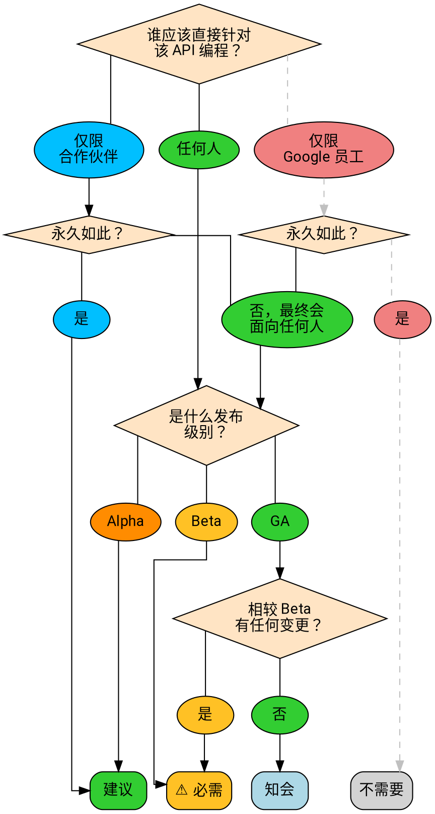

# API 设计评审常见问题

API 设计评审旨在确保整个 API 体系为用户提供简单、直观且一致的 API 体验。

## 我需要获得 API 设计批准吗？

**简要回答：** 如果你要发布一个用户现在或将来可以编程使用、质量级别达到 Beta 或 GA 的 API，通常就需要获得 API 设计批准。

API 设计评审的核心是确保我们为用户提供简单且一致的体验，因此只针对用户会直接编程使用的 API。

下面的流程图说明你的 API 是否需要经过设计评审流程：

### 谁应该直接针对该 API 编程？

“谁应该直接针对该 API 编程？”是一个比较复杂的问题。API 设计评审主要关注 API 的受众。这意味着我们关心谁被允许针对服务编写自己的 HTTP/gRPC 调用，以及谁能够查看文档。（我们**不**关心服务是否暴露在公共网络等问题。）

如果 API 的目标是让公众阅读文档并编写与服务交互的代码，就应进行设计评审。

以下情况**不需要**设计评审：

- API 永远只供 Google 员工或内部工具使用（例如 Pantheon）。
- API 永远只会由 Google 发布的可执行程序调用（即使可以从可执行程序中逆向推断出 API）。
- API 永远只会由单个客户或合同约定的一小组客户调用，且**永远不会**更广泛地提供。（此时仍建议进行设计评审，但不是必需的。）

### Alpha

对于 Alpha，API 设计评审是可选的，但建议进行。快速获得客户的初步反馈往往很有意义；发布 Alpha 可以收集数据，帮助确定一些易用性问题的最佳答案，因此跳过评审可能更快捷。另一方面，发布 Alpha 需要构建一个实现；如果 Beta 阶段的 API 设计评审提出问题，之后就需要投入工程工作来更新实现。由于 API 设计评审可以早于实现工作开始，我们建议 Alpha 也进行设计评审。

## 为什么设计评审很重要？

**简要回答：** 产品卓越。

设计评审流程旨在确保我们呈现给客户的 API **简单**、**直观**且**一致**。评审者会站在新手用户的角度审视 API，思考 API 提供的资源和操作，并尽力让 API 表面尽可能易于访问和扩展。

设计评审者不仅会评估你的 API，还会检查 API 是否与 Google 现有的 API 体系保持一致。许多客户会使用多个 API，因此我们的约定和命名选择与客户预期保持一致非常重要。

## 我应该期待什么？

### 评审流程需要多长时间？

评审者会尽力跟进所负责的评审并频繁提供反馈，以免造成不必要的延迟，但一般最好尽早开始评审流程，以防出现延误。

设计评审流程所需时间取决于底层 API 表面的规模和复杂度：

- 对现有 API 的增量变更通常需要几天。
- 小型 API 通常需要大约一周。
- 表面很大的全新 API 通常至少需要一周。在表面特别庞大的情况下（例如 Cloud AutoML），设计评审可能需要一个月或更长时间。

### 评审者如何审视我的 API？

API 评审者会努力以用户使用 API 的方式来审视你的 API，主要关注 API 表面及其面向用户的文档。理想情况下，评审者会提出用户会提出的设计问题，并推动 API 从一开始就减少这类问题。

### 什么是先例？

总体而言，我们希望 Google API 尽可能一致。客户学会第一个 Google API 后，应该更容易学习第二个（以及第三个，依此类推），因为我们持续使用相同的模式。

我们所说的**先例**，是指以前的 API 已经作出的决定；在类似情况下，这些决定通常应对较新的 API 具有约束力。最常见的例子是命名：我们有一份[标准字段][standard fields]列表，规定如何使用 `name`、`create_time` 等常用术语，也规定同一概念始终使用*同一个*名称。

先例同样适用于*模式*。所有 API 都应以相同方式实现分页。长时运行操作、导入导出等也一样。一旦某种模式建立起来，我们就希望在适用的地方以相同方式实现它。

## 我应该怎么做？

### 如果我的发布时间非常紧？

最好的做法是尽早参与设计评审。此外，要让评审者了解你的时间安排，使他们能够知悉情况，并尽力为你提供最好的服务。我们希望你尽可能按时发布。

对于时间敏感的 Alpha 发布，API **可以**在未获得设计评审批准的情况下发布。这类发布**必须**限制在一组已知用户之内。在这种情况下，评审者会向 API 团队提供记录，供后续阶段考虑。

**警告：** 在设计评审不完整的情况下发布 Alpha，**不会**使 API 的决定成为既定先例。API 晋级 Beta 时必须完成设计评审；如果存在问题，API 评审者会阻止 Beta 发布。

Alpha 之后的发布阶段都必须进行 API 设计评审，因为它会影响整体用户体验。你们团队的不一致影响的不只是你们自己的团队。

有时，产品卓越与工程投入或发布时间之间存在艰难取舍。这些是困难的业务决策，我们理解有时确实有必要这样做；不过，在选择绕过设计评审或忽视评审者反馈时，必须由总监或副总裁明确决定将这些其他因素置于产品卓越之上。

### 如何让评审更快？

一些建议：

- 尽早开始 API 评审，并频繁跟进。
- 事先运行 [API linter][]。（如果你在任何时候禁用了 linter，请解释原因。评审者经常发现，linter 被禁用正是因为它完成了自己的工作。）
- 确保每条消息、每个 RPC 和每个字段都有*有用的*注释。注释应使用有效的美式英语，并说明有意义的内容。
- 如果 API 评审者要求你解释某件事，请将解释添加到 *proto 注释*中，而不是代码评审对话中。这通常可以为你省去一轮往返。

### 如果我的一位 API 评审者没有响应？

通过 Chat 联系该评审者。如果没有结果，联系另一位评审者，由其协调处理。如果仍然没有结果，按照 [AIP-1][] 的规定升级处理。

### 如果我有设计问题？

首先可以查看 [API 风格指南][api style guide]、[AIP 索引][aip index]以及 Google 的其他公开 API。其他公开 API 尤其有价值；很可能有人已经遇到过与你的问题相关的情况。

### 如果我的问题没有在这些地方得到回答？

将问题发送到 api-design@google.com。

当你要寻求与 API 设计相关的具体问题的指导，并且清楚说明使用场景、提供示例时，这种方式通常最有效。

**注意：** 该邮件列表的成员几乎都是志愿者，他们大部分时间都在做其他工作。我们会尽力响应，但请耐心等待。

### 如果问题很复杂，在 CL 中迟迟没有进展？

在可行时，代码评审界面是解决问题的最佳方式；但有时问题复杂到无法在代码评审工具中解决。此时，请联系评审者并请求安排会议。通常，大多数问题可以在 30 分钟内讨论清楚。

发生这种情况时，请确保有人将讨论内容记录在 CL 中，以保留历史。

### 如果我的 API 需要违反某项标准？

请在 proto 的内部注释中清楚记录你正在违反某项 API 设计指导，并说明理由。该注释**必须**以 `aip.dev/not-precedent` 开头。

一般而言，违反设计指导的理由**应**符合 [AIP-200][] 列出的某个原因。如果不符合，请与 API 评审者共同确定正确做法。

### 如果评审者提出了以前已经解决的问题？

如果你当前的评审者与 API 之前阶段的评审者不同，就可能出现这种情况。通常，最好的做法是直接引用解决该问题的代码评审。评审者希望避免给你带来反复修改，因此通常会尊重之前的评审结果。这通常足以迅速解决问题。

偶尔，评审者可能认为之前的评审者犯了重大错误，纠正该错误很重要。在这种情况下，你和评审者应共同确定如何处理。

### 如果团队与评审者存在强烈分歧？

按照 [AIP-1][] 的规定升级处理。

## 我的 PA 或团队有特定指导吗？

Cloud PA 有专门的指导来确保 Cloud 内部的额外一致性，Cloud API 也有自己的评审者池。其他团队可能会采用类似（但不一定完全相同）的规则和系统。一些生产多个 API 的团队（例如机器学习团队）也可能有适用于该团队 API 的指导。

在所有情况下，我们都努力将这些指导作为 AIP 提供；更高的 AIP 编号留给特定 PA 和团队使用（参见 [AIP-2][]），这些 AIP 会列在 [AIP 索引][aip index]中。

[aip-1]: ./0001.md
[aip-2]: ./0002.md
[aip-200]: ./0200.md
[aip index]: /
[api linter]: https://github.com/googleapis/api-linter
[api style guide]: https://cloud.google.com/apis/design/
[standard fields]: https://cloud.google.com/apis/design/standard_fields

> 本文译自 [AIP-100 英文原文](./0100.md)。除非另有说明，正文内容采用 [CC BY 4.0](https://creativecommons.org/licenses/by/4.0/) 许可，代码示例采用 [Apache 2.0](https://www.apache.org/licenses/LICENSE-2.0) 许可。
