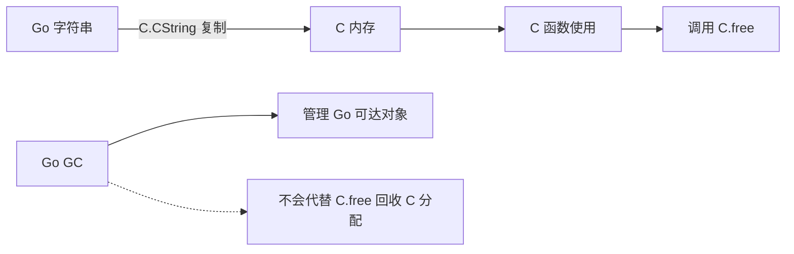

# 11.5. cgo、C 内存与跨平台构建

先修建议：[Unsafe、内存布局与指针约束](./unsafe)、[构建约束、编译器与链接器参数](./build-advanced)。

当 Go 程序确实需要调用现有 C 库时，cgo 建立跨语言编译与调用边界。先运行标量例子，再学习内存、指针与部署依赖；不要把“可以调用”误认为“没有额外资源成本”。

## cgo 最小实验 {#concept-1}

需要本机 C 编译器并启用 cgo，保存 main.go：

```go
package main

/*
#include <stdlib.h>
static int add(int a, int b) { return a + b; }
*/
import "C"

import "fmt"

func main() {
	result := C.add(C.int(2), C.int(3))
	fmt.Println(int(result)) // 5
}
```

C 的声明注释紧邻 import "C"。调用涉及 Go/C 类型转换、编译与链接，不能假设 `CGO_ENABLED=0` 后还能构建。这里只调用无外部状态的标量函数，复杂互操作应使用成熟绑定。

## 谁分配，谁释放 {#concept-2}



下面独立程序需要本机 C 编译器并启用 cgo：

```go
package main

/*
#include <stdlib.h>
#include <string.h>
*/
import "C"

import (
	"fmt"
	"unsafe"
)

func main() {
	text := C.CString("Go")
	defer C.free(unsafe.Pointer(text))
	fmt.Println(int(C.strlen(text))) // 2
}
```

CString 复制成 C 风格 NUL 结尾字符串，strlen 数字节而非 Unicode 码点。若输入含 NUL，C 字符串消费者可能在该处停止；二进制数据需要指针与明确长度，不能照搬字符串协议。

## C 内存与 Go 指针规则 {#concept-3}

C.CString 创建 C 内存，需要 C.free 释放；Go GC 不替它回收。C 分配可能不计入 Go heap profile，观察进程 RSS 与库侧指标。C 持有 Go 指针受到严格限制，尤其涉及包含其他 Go 指针的内存；某些固定寿命可使用 runtime.Pinner，但它不等于解除所有规则，按 cgo 文档逐条检查。

C 调用与回调可能影响线程与调度，外部库要求固定线程时了解 runtime.LockOSThread 和库自身约束。不要以每元素跨边界调用做高频数据处理，必要时批量减少调用开销并测量。

## 构建与动态库 {#concept-4}

交叉编译 cgo 需要目标平台的 C 工具链与库，不能只设 GOOS/GOARCH 就完成。链接时检查头文件、库搜索路径、静态/动态依赖与部署镜像。依赖安全修复同时关注 Go 与 C 库版本，不能只扫 go.mod。

## 动手练习与解题线索 {#lab}

1. 在支持的平台运行两份程序；关闭 CGO_ENABLED 时指出构建失败的真实原因。
2. 把 CString 输入改成中文，验证 strlen 数的是 UTF-8 字节数。
3. 给一段 C 返回内存写下分配者、释放函数和寿命，不靠 Go GC 猜测。
4. 为目标平台列出 C 编译器、头文件、动态库和部署镜像需求。

依据：[cgo 官方文档与指针规则](https://pkg.go.dev/cmd/cgo)。
