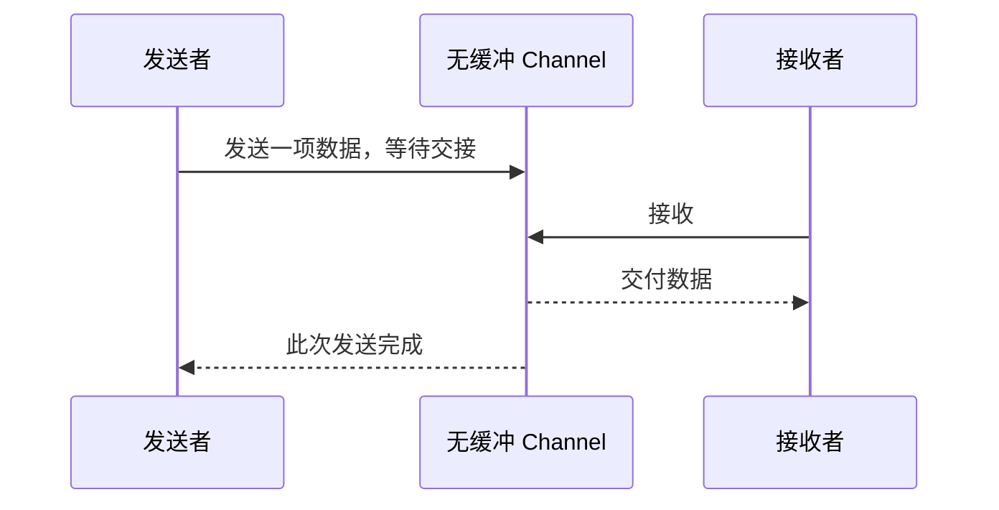

# 6.2. Channel、缓冲与 select

先修建议：[Goroutine 与任务生命周期](./concurrency)。

Channel 建立发送者与接收者间的通信与同步。它解决消息传递，不会自动修复任意共享状态，也不会自动限制你创建的 goroutine 数量。

## 一次通信同时建立数据交接与同步 {#concept-1}

无缓冲通道需要收发双方配对，带缓冲通道允许消息先排队。选择缓冲大小改变等待时机，不自动改变每条消息的意义或共享数据所有权。



完成交接不等于接收者已经做完全部业务处理。若要知道处理完成，需要另一个结果或完成协议；发送了带切片字段的消息，也不意味着底层数组已被深复制。下面先通过状态表判断阻塞，再讨论关闭与 select。

## 五种状态决定能否继续 {#concept-2}

| 操作 | 无缓冲 | 带缓冲 | nil | 已关闭 |
| --- | --- | --- | --- | --- |
| 发送 | 等接收配对 | 有空间可发送，满则等待 | 永久等待 | panic |
| 接收 | 等发送配对 | 有值则接收，空则等待 | 永久等待 | 先读剩余，再零值、ok=false |
| close | 表达不再发送 | 表达不再发送，剩余值可读 | panic | panic |

读已关闭 channel 必须检查 ok，否则在循环中不断收到零值，形成 CPU 忙循环。range 在关闭且排空后退出。关闭不是发给“某个接收者”的特殊消息，而是所有接收者都能观察到的状态。

```go
package main

import "fmt"

func main() {
	jobs := make(chan int, 2)
	jobs <- 10
	jobs <- 20
	close(jobs)
	for i := 0; i < 3; i++ {
		value, ok := <-jobs
		fmt.Println(value, ok)
	}
}
```

输出依次是 `10 true`、`20 true`、`0 false`。第三次读取已不会阻塞；继续发送则 panic。

## 方向类型表达谁拥有哪项操作 {#concept-3}

片段：`func produce(out chan<- Item)` 只允许发送，`func consume(in <-chan Item)` 只允许接收。双向 channel 可传给单向参数。关闭通常由能够证明不会再有发送的一方执行；多生产者时协调者等待所有生产者结束再 close。

接收方不随意关闭输入，这会让还在发送的生产者 panic。需要通知生产者退出时使用 Context 或专门的 done 信号。发送结构体值是浅复制；字段含切片时消息两端仍共享数组，必须约定发送后不再修改或显式复制。

## select 的就绪规则 {#concept-4}

```go
package main

import "fmt"

func main() {
	ready := make(chan int, 1)
	ready <- 7
	select {
	case value := <-ready:
		fmt.Println(value)
	default:
		fmt.Println("当前没有值")
	}
}
```

多个 case 同时就绪时选择是伪随机的，不按书写顺序给予优先级。default 让 select 在没有就绪操作时立即返回，放在无限循环里会忙等。select 没有 default 时等待；nil channel 的 case 永不就绪，可用于动态禁用分支，但未初始化 channel 更常是 bug。

已关闭 channel 总是接收就绪。处理多个输入时读到 ok=false 后将该局部 channel 设为 nil，避免一直选择它。如果数据与取消同时就绪，仍可能处理一条数据，不能把 select 当作取消的绝对优先保证。

## 缓冲只是排队能力 {#concept-5}

容量 100 允许至多 100 个消息暂存在队列，但调用方仍可能已经启动 100 万个阻塞发送的 goroutine。真正有界需要 worker 数、队列长度和入队取消三个条件。len(channel) 是瞬时观察，不能做无竞争的“先看还有空间再发送”，直接使用 select/发送协议。

## 学习实验与判定 {#lab}

1. 验证关闭带缓冲 channel 后读到三个结果的 ok 值。
2. 给两个输入的合并器处理关闭，将已结束输入禁用，避免零值忙循环。
3. 消费者提前退出时取消 Context，发送者必须随之退出；验证不依赖 sleep。

通过标准：能预测 nil、关闭、满与空时的行为；拥有清楚的关闭责任。参考：[Channel 与 select 规范](https://go.dev/ref/spec#Channel_types)。
