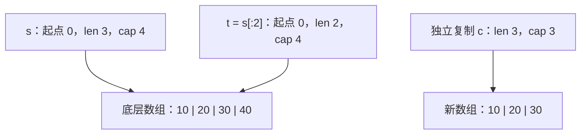
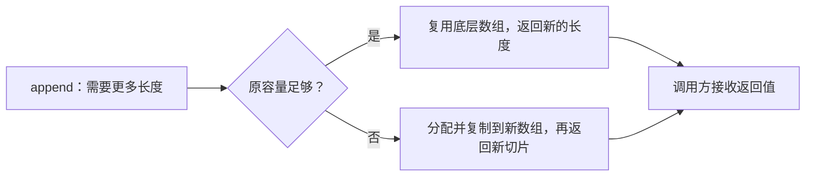

# 1.5. 数组、切片、容量与共享存储

先修建议：[变量、常量、iota 与作用域](./variables)、[基本类型、数值与类型转换](./basics)。

一个变量装的是整个数组，还是一段数组的描述？这个区别决定了赋值后谁会影响谁。先从固定长度数组开始，再引入切片；字符串的数据表示在下一节单独讨论。

## 数组是带长度的值 {#concept-1}

`[3]int` 表示三个 int，长度参与类型身份，所以它与 `[4]int` 不可直接互换。数组零值是各元素的零值；赋值、传参会复制整个数组，而不是自动得到对原数组的引用。

```go
package main

import "fmt"

func main() {
	a := [3]int{10, 20, 30}
	b := a
	b[0] = 99
	fmt.Println(a, b) // [10 20 30] [99 20 30]
}
```

先初始化 a，再把三个元素复制到 b，最后只改 b 的第零项。两者拥有不同存储。`[...]int{10,20,30}` 让编译器推导长度，结果仍是数组，不是切片。

## 切片是一段存储的描述 {#concept-2}

`[]int` 不把长度写进类型。可以把切片理解为“从哪开始、当前能访问多少、后面还有多少容量”三个信息；它本身不是整个元素数组。



这是语义模型，不承诺切片描述符在所有平台上的精确字节布局。`t := s[:2]` 复制描述信息，两者指向同一数组；改元素会彼此可见，改某个切片的长度不会自动修改另一个切片。

```go
package main

import "fmt"

func main() {
	s := []int{10, 20, 30, 40}
	t := s[:2]
	t[0] = 99
	fmt.Println(s, t)           // [99 20 30 40] [99 20]
	fmt.Println(len(t), cap(t)) // 2 4
}
```

索引必须小于 len，而非小于 cap；容量描述允许继续扩展或重切片的空间。`t[2]` 此时越界，但在满足范围后重新切到 `t[:3]` 可以看到第三个元素。

## make 的长度与容量分别做什么 {#concept-3}

| 表达式 | len | cap | 初始可访问元素 |
| --- | --- | --- | --- |
| `var s []int` | 0 | 0 | 无，s 为 nil。 |
| `make([]int, 3)` | 3 | 3 | 已存在三个零值。 |
| `make([]int, 0, 3)` | 0 | 3 | 无，预留空间但尚未增加元素。 |

`make([]int,3)` 之后 append 一个值，长度变成 4；它不会把第一个零值替换掉。已知要收集约 n 个结果时，使用长度 0、容量 n 的形式；已有 n 个位置需要按索引写入时，使用长度 n。

## append 可能共享，也可能换数组 {#concept-4}

```go
package main

import "fmt"

func main() {
	data := []int{1, 2, 3, 4}
	shared := data[:2]
	shared = append(shared, 99)
	fmt.Println(data) // [1 2 99 4]
	limited := data[:2:2]
	limited = append(limited, 88)
	fmt.Println(data, limited) // [1 2 99 4] [1 2 88]
}
```

第一次还有容量，99 写到原数组第三个位置。第二次用三索引切片把容量限制为 2，append 需要新的数组，88 不会覆盖 data 的尾部。三索引只约束追加复用，`limited[0]` 在追加前仍会影响原元素。



容量增长的具体倍率属于实现策略，不能写成“永远翻倍”的语言规则。始终接收 append 的返回值，正确性不能依赖一次运行恰好是否扩容。

## copy、Clone 与浅复制 {#concept-5}

`copy(dst,src)` 只复制两者长度较小的数量，不会自动延长 dst；同一底层数组上的重叠复制也受支持。`slices.Clone` 创建元素副本，但元素如果含指针、map 或切片，内部引用仍共享。

片段：`dst := make([]int,len(src)); copy(dst,src)` 用于独立复制。长期保存大数组的小片段可能让整个数组仍可达，确实只需要小片段时复制出来；内存保持机制见[内存管理](./memory)。

## 数组与切片如何转换 {#concept-6}

```go
package main

import "fmt"

func main() {
	a := [3]int{1, 2, 3}
	s := a[:]             // 共享数组 a
	copied := [3]int(s)   // Go 1.20+：复制数组值
	alias := (*[3]int)(s) // Go 1.17+：指向同一数组
	copied[0] = 8
	alias[1] = 9
	fmt.Println(a, copied) // [1 9 3] [8 2 3]
}
```

切片转长度 N 的数组值或数组指针，要求 len 至少为 N；cap 足够而 len 不够仍会 panic。nil 与非 nil 空切片都能 len、range、append，但 JSON 中可能分别为 null 和 []，接口结果需明确约定。

## 动手练习与解题线索 {#lab}

1. 在三个示例中逐行标出每个切片的 len/cap、指向哪个数组，再运行核对。
2. 把 `make([]int,0,3)` 换成 `make([]int,3)`，追加 7。预期长度分别为 1 和 4。
3. 写一个保留输入不变的追加函数，测试返回结果改变不会修改原元素；注意元素本身是否含引用。
4. 尝试把长度 2、容量 3 的切片转为 `[3]int`，说明为什么不符合转换条件。

完成后应能根据语义预测修改传播，而不是背诵“切片是引用类型”。依据：[数组与切片规范](https://go.dev/ref/spec#Slice_types)、[官方切片说明](https://go.dev/blog/slices-intro)、[slices](https://pkg.go.dev/slices)。
