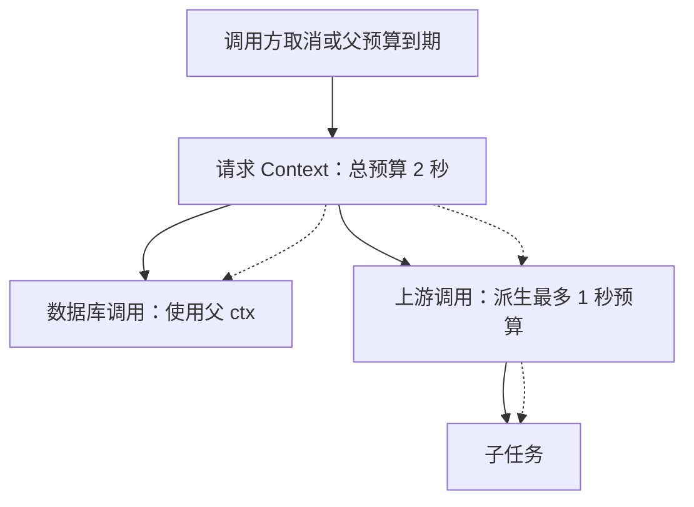

# 6.4. Context、截止时间与取消

先修建议：[Channel、缓冲与 select](./channels)、[错误模型、包装与恢复](./errors)。

## 取消像沿调用链传播的一份通知 {#concept-1}

请求结束后，数据库查询和上游调用也可能不再有意义。Context 把这个决定沿调用链传递，但实际工作必须观察通知并使用支持取消的操作，才会真正结束。



箭头表示派生与传递，虚线表示取消向下传播。子任务取消不反向取消父任务；换成 Background 会断掉原请求的预算关系。时间预算已消耗一部分后，下一层不能重新获得一份无限延长的总预算。

## Context 是协作取消 {#concept-2}

Context 通常作为第一个参数 `ctx context.Context`，从上层传入，不长期保存在业务结构体中，也不传 nil。它携带截止时间、取消信号和请求范围的少量元数据；业务参数使用显式参数，不能把所有内容塞进 Value。

```go
package main

import (
	"context"
	"fmt"
	"time"
)

func wait(ctx context.Context, d time.Duration) error {
	timer := time.NewTimer(d)
	defer timer.Stop()
	select {
	case <-timer.C:
		return nil
	case <-ctx.Done():
		return ctx.Err()
	}
}

func main() {
	ctx, cancel := context.WithTimeout(context.Background(), 20*time.Millisecond)
	defer cancel()
	fmt.Println(wait(ctx, time.Second)) // context deadline exceeded
}
```

调用 cancel 释放相关资源，即使正常完成也要调用。取消不会强杀 goroutine；循环要检查 ctx，阻塞操作要使用支持 Context 的 API。HTTP 请求、数据库查询等应传递同一请求的上下文，不在中途换成 Background 而丢失取消信息。详见 [context 文档](https://pkg.go.dev/context)。

## Channel 操作也要能退出 {#concept-3}

片段，假定 ctx、jobs 和 job 已存在：

```go
select {
case jobs <- job:
    // 工作已交接
case <-ctx.Done():
    return ctx.Err()
}
```

worker 接收同理。若处理函数本身永久阻塞且不观察取消，外围 select 无法替它清理。关闭 channel 与取消 Context 分工不同：关闭表达没有后续消息，取消表达当前工作不再需要继续。

## 复用 errgroup 汇总任务 {#concept-4}

多个相关 I/O 任务希望“一个失败就取消其他任务”时，使用 [golang.org/x/sync/errgroup](https://pkg.go.dev/golang.org/x/sync/errgroup)，不用自己拼接 WaitGroup、错误 channel 与 cancel。下面是片段，items、fetch、ctx 来自调用方：

```go
g, groupCtx := errgroup.WithContext(ctx)
g.SetLimit(4)
for _, item := range items {
    item := item
    g.Go(func() error {
        return fetch(groupCtx, item)
    })
}
if err := g.Wait(); err != nil {
    return err
}
```

引入前执行 `go get golang.org/x/sync@具体版本`，选择与项目 Go 基线兼容的发布版本，提交后续项目中的 go.mod/go.sum。SetLimit 限制活动任务数，Go 在满额时会阻塞；这不等于带取消的任务队列。任务必须观察 groupCtx 才能及时退出，Wait 不会强制终止它们。

groupCtx 在首个错误或 Wait 返回时取消，不能在 Wait 后继续拿它执行其他工作。对输出切片可以让不同任务写不同索引，并在 Wait 后读取；map 或同一元素的并发写仍需要同步。

## 超时预算与常见错误 {#concept-5}

调用链共享总预算，不给每一层无限叠加同样超时。客户端断连取消了请求后，数据库和上游调用也应停止；需要独立执行的后台任务明确建立自己的生命周期与截止时间，不偷用已经结束的请求上下文。

CPU 循环定期观察 Done，长期后台任务由服务生命周期 Context 管理。不要起一个额外 goroutine 只为把任意阻塞函数包装成“有超时”，这通常会留下仍在执行的任务。

## 取消原因、超时和父子关系的实验 {#concept-6}

```go
package main

import (
	"context"
	"errors"
	"fmt"
)

func main() {
	parent, cancel := context.WithCancelCause(context.Background())
	child, stop := context.WithCancel(parent)
	defer stop()
	reason := errors.New("用户取消批次")
	cancel(reason)
	<-child.Done()
	fmt.Println(child.Err())          // context canceled
	fmt.Println(context.Cause(child)) // 用户取消批次
}
```

Err 表达 canceled 或 deadline exceeded，Cause 可携带更具体原因。子 Context 被取消不取消父 Context；父取消会向子传播。Done 关闭是广播信号，多接收者都能观察到。Value 沿父链查找，键用自定义不可导出类型避免冲突，仅保存请求 ID 等少量请求范围数据。

## 总预算怎样计算 {#concept-7}

用户给请求 2 秒预算，业务先查数据库花 0.8 秒，再调用外部服务，剩余只有约 1.2 秒。后者从请求 ctx 派生自己的最多 1 秒预算，比重新 Background + 2 秒更可控。最早截止时间生效，客户端 Timeout 与 Context 也不能用来让总操作无限增长。

重试退避等待也使用 timer + ctx.Done，不能直接 time.Sleep 忽略取消。cancel 在创建后 defer，资源与 goroutine 退出仍由实际操作观察信号保证。把阻塞函数扔进 goroutine 后外围超时返回，未取消的操作依然执行，是常见泄漏来源。

## 请求工作与后台工作分开建生命周期 {#concept-8}

请求结束后继续必要工作，应有明确任务队列、幂等 ID、持久化和服务级取消策略。Context.WithoutCancel 可剥离父取消，但不附带 deadline，不能把它当可靠后台执行系统。本地学习先用服务级 Context，生产任务按真实交付保证复用队列方案。

## 练习与验收 {#lab}

1. 让一个 worker 故意返回错误，确认其他 worker 停止接收任务。
2. 测试调用前已经取消、执行中取消与正常完成。
3. 为并发抓取增加上限，记录最大活动任务数验证限流。

验收：取消传播到真正执行工作的地方，错误被等待方收到，没有永久阻塞的发送。
