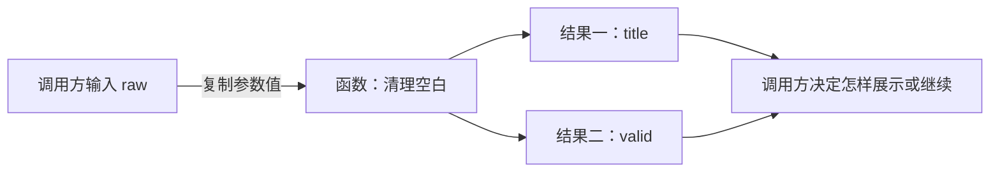
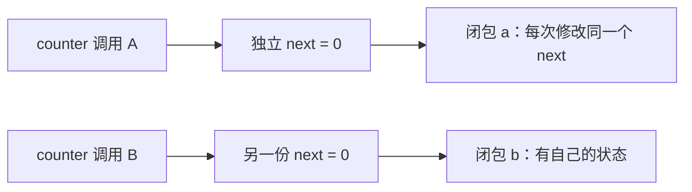

# 1.10. 函数、闭包与调用语义

先修建议：[条件、循环与控制转移](./control-flow)、[数组、切片、容量与共享存储](./collections)。

函数把一次完整操作变成“输入哪些值、得到什么结果”。先学参数和返回值，再学函数值、闭包与清理顺序；指针的对象修改放到下一节解释。

## 参数、返回值与调用过程 {#concept-1}

```go
package main

import (
	"fmt"
	"strings"
)

func cleanTitle(raw string) (string, bool) {
	title := strings.TrimSpace(raw)
	return title, title != ""
}

func main() {
	title, valid := cleanTitle("  学习 Go  ")
	fmt.Println(title, valid) // 学习 Go true
}
```

raw 收到调用方字符串值的复制；函数先清理空白，再同时返回新文本与是否非空。调用方分别接收两个值，不把字符串是否为空藏在打印或全局变量里。没有 return 值的函数只完成操作；有返回值时各分支需返回匹配数量与类型。



参数始终按值复制，不代表所有底层内容都会深复制：数组复制元素，切片复制描述，指针复制地址。先根据参数真正的类型判断共享；对象地址与重新绑定的区别见[指针](./pointers)。

## 函数值、匿名函数与高阶操作 {#concept-2}

```go
package main

import "fmt"

func apply(values []int, transform func(int) int) []int {
	result := make([]int, len(values))
	for i, value := range values {
		result[i] = transform(value)
	}
	return result
}

func main() {
	squared := apply([]int{1, 2, 3}, func(n int) int { return n * n })
	fmt.Println(squared) // [1 4 9]
}
```

函数也有类型，可以作为参数。匿名函数省去只使用一次的命名，apply 负责遍历而 transform 负责转换。本例建立独立结果，不修改输入；若要原地修改，需要明确说明并测试。复杂业务分支优先具名函数，不把所有操作都绕进回调。

## 可变参数与共享切片 {#concept-3}

```go
package main

import "fmt"

func mark(values ...int) {
	if len(values) > 0 {
		values[0] = 99
	}
}

func main() {
	items := []int{1, 2}
	mark(items...)
	fmt.Println(items) // [99 2]：展开后的底层存储共享
}
```

可变参数在函数中是切片，调用 `mark(1,2)` 与 `mark(items...)` 的共享关系不同。只读接口不应偷偷修改可变参数；需要原地修改在命名和文档中表达。空可变参数必须与空切片一样可处理。

## 闭包是状态，不只是匿名语法 {#concept-4}

```go
package main

import "fmt"

func counter() func() int {
	next := 0
	return func() int { next++; return next }
}

func main() {
	a, b := counter(), counter()
	fmt.Println(a(), a(), b()) // 1 2 1
}
```

同一个返回闭包共享同一捕获变量，不同工厂调用各有独立状态；多 goroutine 调用 a 仍会发生竞争。返回闭包延长捕获变量生命周期。匿名函数适合局部一次性操作，复杂条件与多个调用点改为具名函数，避免回调层层嵌套。

## 闭包的状态寿命 {#concept-5}



上面的 1、2、1 来自两份独立状态。闭包捕获变量，不是把变量永远冻结成创建那一刻的数字；共享调用同一个闭包仍需考虑同步。返回闭包会延长状态的可达寿命，这一点在后续内存单元继续解释。

## defer 的执行顺序 {#concept-6}

```go
package main

import "fmt"

func main() {
	value := 1
	defer fmt.Println("参数立即求值:", value)
	defer func() { fmt.Println("闭包执行时读取:", value) }()
	value = 2
	fmt.Println("函数主体结束")
}
```

输出顺序是主体、闭包 2、参数 1。defer 在所属函数返回时执行，后注册的先执行，调用参数在注册时求值。打开文件后先检查错误，再 `defer file.Close()`。循环中不断 defer 会把资源保留到整个函数结束，逐项处理可拆成一个负责完整生命周期的辅助函数。

`os.Exit` 不执行 defer。因此 CLI 把主要工作放进返回退出码的 `run`，最后在 main 调用 os.Exit；清理逻辑放在 run 内。

## 命名返回值与 defer 的交互 {#concept-7}

```go
package main

import "fmt"

func named() (result int) {
	defer func() { result++ }()
	return 10
}
func unnamed() int {
	result := 10
	defer func() { result++ }()
	return result
}
func main() { fmt.Println(named(), unnamed()) } // 11 10
```

return 先设置返回值，再执行 defer。命名返回变量可在 defer 修改；普通局部变量不是已经确定的返回值。命名返回在处理 Write/Close 两个失败原因时有用，但隐藏修改会降低可读性，优先用显式返回与少量清理逻辑。

## 正常返回与清理的先后 {#concept-8}


defer 的参数在登记时求值，闭包里的变量在执行时读取。命名返回值是可被 defer 修改的返回变量，普通局部变量不自动等同于返回槽位。文件和其他资源登记清理前先确认创建成功；os.Exit 不执行这些 defer。

## 动手练习与解题线索 {#lab}

1. 给 cleanTitle 测试空串、纯空白与中文标题，断言两个返回值。
2. 将 apply 改成原地修改，测试输入是否改变，再说明哪个契约更合适。
3. 对 defer 例子逐行预测输出；把闭包改为显式传参后观察值的变化。
4. 创建两个 counter，再把同一闭包赋给另一个变量，说明哪几次调用共享状态。

依据：[函数与调用规范](https://go.dev/ref/spec#Function_types)、[defer 说明](https://go.dev/blog/defer-panic-and-recover)。
