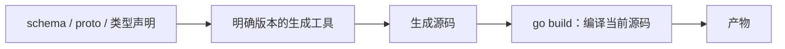

# 10.3. 代码生成与构建约束

先修建议：[包、模块、依赖与发布](./modules)。

生成与构建约束分别回答“源码怎样产生”和“哪些源码参与当前构建”。go build 不自动运行 go generate；标签也不是运行时开关。

## 生成不是编译时自动发生的步骤 {#concept-1}

生成器以一个输入定义为依据产出源码，编译器再编译这些源码。go generate 与 go build 分开执行，修改 schema 或 proto 后只 build 可能仍使用旧产物。



把输入、工具版本、命令参数和输出路径写清楚，才能重复生成并审查差异。生成器输出随机排序或本机路径时，每次都可能产生无意义变化；测试可检查同一输入得到相同内容。

## go generate 是显式命令 {#concept-2}

生成指令通常写在源码注释，例如：

```go
//go:generate stringer -type=State
```

执行 `go generate ./...` 才会运行，工具 stringer 必须可用且版本确定。指令并非完整 shell 表达式，需 shell 行为时显式调用并考虑跨平台；生成器可执行任意命令，因此先审查你要运行的生成指令和来源。

生成流程清单：输入源→生成工具及版本→参数→产物→校验差异。Protobuf、SQL 绑定或类型枚举复用已有生成器，不为一个项目造通用代码生成框架。生成文件加 `Code generated ... DO NOT EDIT.` 约定，修改输入后重新生成。

## 不依赖外部工具的生成实验 {#concept-3}

目录：

```text
gen-demo/
  go.mod
  schema.txt
  generate.go
  cmd/gen/main.go
  schema_generated.go     # 命令生成
```

schema.txt 写一行 `task-v1`，generate.go：

```go
package demo

//go:generate go run ./cmd/gen
```

cmd/gen/main.go：

```go
package main

import (
	"fmt"
	"os"
	"strconv"
	"strings"
)

func main() {
	input, err := os.ReadFile("schema.txt")
	if err != nil {
		panic(err)
	}
	name := strings.TrimSpace(string(input))
	code := fmt.Sprintf("// Code generated by cmd/gen; DO NOT EDIT.\npackage demo\n\nconst Schema = %s\n", strconv.Quote(name))
	if err := os.WriteFile("schema_generated.go", []byte(code), 0644); err != nil {
		panic(err)
	}
}
```

在根目录运行 go generate .，生成 Schema 常量。修改 schema.txt 后只 go build，常量仍来自旧产物；重新 generate 才更新。这个实验演示显式流程，真实工程优先成熟生成器。CI 可重新生成后检查差异，不把机器时间或随机顺序写进产物，否则每次都变化。

## build tags 与平台文件 {#concept-4}

文件首部写以下内容，并与 package 之间留空行：

```go
//go:build integration

package demo
```

默认构建不包含该文件，`go test -tags=integration ./...` 才包含。表达式支持 `&&`、`||`、`!`；给可替换实现写互补标签，避免两份同名函数一起参与或全部被排除。`_linux.go`、`_windows.go`、`_amd64.go` 等文件名提供平台/架构约束。

片段的 integration 标签通常用于需要外部数据库的测试，不表示这些测试可以永远跳过。发布流程明确何时跑集成测试。runtime.GOOS 只在运行时选择分支，无法让导入的 Windows 专属包在 Linux 编译时自动消失。

## 学习实验与判定 {#lab}

1. 跑生成实验，比较改输入前后“不生成直接 build”与“先生成再 build”的结果。
2. 写 integration 标签测试，验证默认与带标签执行的测试列表。
3. 用两个平台文件各实现 platformName，交叉构建确认仅选中一个。
4. 固定生成工具版本，同一输入生成两次内容完全一致。

通过标准：生成命令可复现、标签分支都可构建，生成文件不靠人工修补。参考：[go generate](https://go.dev/blog/generate)、[构建约束](https://pkg.go.dev/cmd/go#hdr-Build_constraints)。
