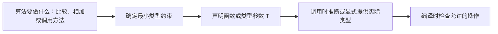

# 3.1. 泛型函数、泛型类型与约束

先修建议：[接口、断言与动态类型](./interfaces)、[Map、集合与逗号 ok](./maps)。

## 把类型参数放回算法中理解 {#concept-1}

泛型不是让一个函数接收所有值，而是让同一套运算在一组满足约束的类型上复用。Unique 需要把 T 当 map 键，所以约束是 comparable；如果只存值而不比较，所需约束可能更小。



行为接口描述如何合作，类型参数保留每次实例化的具体类型。比如 Sender 关心 Send 方法，Set[UserID] 关心元素始终为 UserID；将两者分工明确，比先造一个通用框架更容易理解。

## 重复来自类型时才考虑泛型 {#concept-2}

接口抽象行为，泛型复用对多种类型执行相同操作的算法。容器查找、排序与集合操作适合泛型；HTTP 请求流程、业务规则与存储事务通常先使用具体类型和小接口。

```go
package main

import (
	"fmt"
	"slices"
)

func Unique[T comparable](values []T) []T {
	seen := make(map[T]struct{}, len(values))
	result := make([]T, 0, len(values))
	for _, value := range values {
		if _, ok := seen[value]; ok {
			continue
		}
		seen[value] = struct{}{}
		result = append(result, value)
	}
	return result
}

func main() {
	names := Unique([]string{"Go", "Rust", "Go"})
	fmt.Println(names)                        // [Go Rust]
	fmt.Println(slices.Contains(names, "Go")) // true
}
```

`T` 是类型参数，`comparable` 约束使它可用作 map 键。调用通常自动推断类型。空输入得到空结果且顺序按第一次出现保留，算法平均时间复杂度 O(n)，额外空间 O(n)。这是练习算法，实际需求先看标准库是否已有直接可用操作。

## 约束与类型集合 {#concept-3}

片段：`type Number interface { ~int | ~int64 | ~float64 }`。`~int` 包括底层类型为 int 的命名类型；没有 `~` 时只包含精确的 int 类型。约束应只要求实现算法必需的能力，不把所有数字都随意纳入，尤其注意溢出、NaN 与精度。

`any` 不允许对任意值直接执行加法、排序等操作。含类型集合的约束接口主要用于类型参数约束，不能像普通行为接口一样到处当作变量类型。Go 的普通方法不能自行声明新的类型参数；可使用泛型类型上的方法，或独立泛型函数。

## 复用标准库 {#concept-4}

- `slices.Sort`、`SortFunc`：原地排序；需要保留原输入时先 Clone。
- `slices.Contains`、`Index`：线性查找，不适合对大集合高频查找。
- `slices.Equal`：元素比较；nil 与空切片被视为相等。
- `maps.Clone`：浅复制 map，不产生并发保护。
- `cmp.Compare`：实现排序比较时表达有序关系。

示例以 Go 1.22 为基线，因此不依赖后来引入的迭代器 API。查询标准库时注意对应 API 的版本标记。

## 泛型类型：保持元素类型的集合 {#concept-5}

```go
package main

import "fmt"

type Set[T comparable] map[T]struct{}

func (s Set[T]) Has(value T) bool { _, ok := s[value]; return ok }
func (s Set[T]) Add(value T)      { s[value] = struct{}{} }

type UserID int64

func main() {
	ids := make(Set[UserID])
	ids.Add(UserID(7))
	fmt.Println(ids.Has(7), ids.Has(8)) // true false
}
```

与 map[any]struct{} 相比，Set[UserID] 静态限制元素集合，混入 string 会编译失败。nil 集合 Add 会 panic，这个类型的构造契约是先 make；如果要求零值可用，可用封装结构体并在 Add 时初始化，但要解释增加的状态与接收者需求。

## 类型约束和运行时接口分工 {#concept-6}

片段：`type Integer interface { ~int | ~int64 }`，以 Integer 约束的泛型函数能使用该集合共有的操作。行为接口要求方法，类型约束可以规定底层类型；含类型项的接口不能当普通运行时变量。不能写一个任意 T 的加法，再指望运行时判断它是否为数字。

泛型类型实例化通常显式写 Set[UserID]，函数参数可以帮助推断 T。推断失败时显式指定类型参数；不要让类型参数只出现在返回值并期望编译器从调用方目标类型自动猜出来。方法不能引入独立新类型参数，把此类操作写为泛型函数。

## 数据结构复杂度与选择 {#concept-7}

去重保序用 map 记录已见值 + result 切片，平均 O(n)；排序后去重 O(n log n) 但可复用已有排序数据。comparable 不保证业务相等语义，指针按地址、NaN 不自等；需要业务键时先提取稳定 key，再使用集合。泛型不能消除这些语义决定。

## 练习与验收 {#lab}

1. 给 Unique 添加整数与自定义 UserID 的测试。
2. 用 SortFunc 按任务标题长度排序，同长按标题排序。
3. 判断“发送通知”“切片去重”“保存订单”分别适合接口还是泛型。

验收：能解释每个约束的必要性，选型来自真实复用需求。参考：[官方泛型教程](https://go.dev/doc/tutorial/generics)、[slices](https://pkg.go.dev/slices)、[maps](https://pkg.go.dev/maps)。
