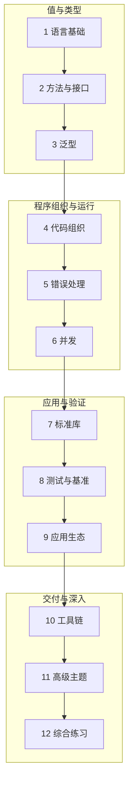

这门课程从一个小程序出发，先理解值和类型，再学习如何组织代码、处理失败、管理并发，最后进入标准库、应用生态与高级主题。讲解用自己的中文组织，语义与 API 以 [Go 官方文档](https://go.dev/doc/)为依据。

课程主线逐项核对 [roadmap.sh Go](https://roadmap.sh/golang)及其[官方路线图](https://roadmap.sh/pdfs/roadmaps/golang.pdf)，按原图的知识层级组织为 **12 个单元、47 节课程**。最后一个单元是综合练习与延伸；HTTP 客户端也是明确标注的应用扩展。资料核对日期：2026-10-09。

## 先看课程怎样连起来

这张图表达建议学习路径，不代表各知识只能等前一个单元全部读完才使用。测试可以从第一个函数开始；生态里的框架是可选分支，按需要选择一种实现。

## 每节课怎样使用

先读解释和图示，预测示例输出；把代码运行起来，再改变输入验证边界，最后完成带解题线索的练习。每节的先修链接帮助查缺补漏，路线对照页可跳到原主题对应的正文小节。

| 代码形式 | 运行方式 |
| --- | --- |
| 独立完整程序 | 含 package main 与入口，保存为单独 main.go，在已初始化模块内 go run .；一次只保留一个入口。 |
| 测试文件 | 保存到所示 _test.go 文件，用 go test；Fuzz 和 Benchmark 另有命令。 |
| 多文件实验 | 按文件名一起保存，例如构建标签、插件与生成实验，不能把每块都放成互不相关程序。 |
| 片段 | 依赖上下文中的变量、导入或已生成类型；文中说明条件，不将它当完整入口直接运行。 |

基础示例使用 Go 1.22+ 语法，安装时选官方受支持的稳定工具链。第三方库、cgo、插件和生成器各注明依赖或平台要求；运行时的新 API 应检查最低版本。

## 1. 语言基础

认识值、容器与控制流，先能解释顺序程序的每一步。

| 课程 | 本节要理解的事情 |
| --- | --- |
| [1.1. Go 的定位、历史与运行模型](./introduction) | 为什么选择 Go；历史、编译模型与学习实验。 |
| [1.2. 安装环境、Hello World 与文档入口](./toolchain) | 从一个小程序看清包、模块与编译运行，建立工具链环境。 |
| [1.3. 变量、常量、iota 与作用域](./variables) | 解释零值、短声明、常量表达式和变量遮蔽。 |
| [1.4. 基本类型、数值与类型转换](./basics) | 掌握整数、浮点、复数、布尔、rune 与转换边界。 |
| [1.5. 数组、切片、容量与共享存储](./collections) | 通过底层数组图解与逐步实验理解复制、扩容和转换。 |
| [1.6. 字符串、字节、rune 与 Unicode](./strings) | 将文本的字节表示、码点遍历与字面量形式区分清楚。 |
| [1.7. Map、集合与逗号 ok](./maps) | 键的可比较性、读写、删除、排序与集合运算。 |
| [1.8. 结构体、字段标签与组合](./types) | 字段建模、JSON、组合与方法提升的真实语义。 |
| [1.9. 条件、循环与控制转移](./control-flow) | 理解 switch、range、break、continue 与 goto 的边界。 |
| [1.10. 函数、闭包与调用语义](./functions) | 多返回值、可变参数、命名返回与闭包捕获。 |
| [1.11. 指针、别名与内存概览](./pointers) | 用实验解释结构体、map、切片的值复制和共享。 |

## 2. 方法与接口

把数据上的操作与使用方需要的行为区分开。

| 课程 | 本节要理解的事情 |
| --- | --- |
| [2.1. 方法集、值与指针接收者](./methods) | 区分普通调用的自动取地址和接口方法集。 |
| [2.2. 接口、断言与动态类型](./interfaces) | 隐式实现、嵌入、空接口、类型断言和 type switch。 |

## 3. 泛型

仅在相同算法需要跨类型复用时引入类型参数。

| 课程 | 本节要理解的事情 |
| --- | --- |
| [3.1. 泛型函数、泛型类型与约束](./generics) | 类型集合、推断、底层类型与通用容器设计。 |

## 4. 代码组织

把包、模块、依赖版本与发布过程连成一条完整链路。

| 课程 | 本节要理解的事情 |
| --- | --- |
| [4.1. 包、模块、依赖与发布](./modules) | 导入规则、MVS、vendor、工作区与版本发布。 |

## 5. 错误处理

让失败成为可识别的返回结果，而不是隐蔽的控制流。

| 课程 | 本节要理解的事情 |
| --- | --- |
| [5.1. 错误模型、包装与恢复](./errors) | 错误链、自定义类型、哨兵、panic、recover 与堆栈。 |

## 6. 并发

先管理任务寿命，再理解通信、同步、取消和并发模式。

| 课程 | 本节要理解的事情 |
| --- | --- |
| [6.1. Goroutine 与任务生命周期](./concurrency) | 调度、启动、等待、泄漏与并发规模。 |
| [6.2. Channel、缓冲与 select](./channels) | 发送接收、关闭、缓冲、方向类型与 select 行为。 |
| [6.3. Mutex、WaitGroup 与同步](./synchronization) | 保护不变量、等待、Once、Cond、原子与竞态检测。 |
| [6.4. Context、截止时间与取消](./context) | 传播预算、原因、请求元数据与相关任务取消。 |
| [6.5. Worker Pool、Fan-in 与 Pipeline](./patterns) | 完整有界流水线、关闭协调、错误与取消验收。 |

## 7. 标准库

围绕输入、解析、资源、时间和输出学习通用工具。

| 课程 | 本节要理解的事情 |
| --- | --- |
| [7.1. 文件、流式 I/O 与 JSON](./io) | Read/Write 契约、扫描、限额、解码和数据边界。 |
| [7.2. flag、time、regexp 与 embed](./standard-library) | 参数、时间、正则与编译期资源的具体使用。 |

## 8. 测试与基准

把行为写成断言，再用可复现测量回答性能问题。

| 课程 | 本节要理解的事情 |
| --- | --- |
| [8.1. 表驱动、替身与 HTTP 测试](./testing) | 隔离、Mock/Stub、httptest、覆盖率与 Fuzz。 |
| [8.2. Benchmark 与分配实验](./benchmarking) | 可信计时、输入规模、分配统计与结果比较。 |

## 9. 应用生态

逐项认识路线中的成熟方案，按实际职责选择实现。

| 课程 | 本节要理解的事情 |
| --- | --- |
| [9.1. CLI 与终端界面生态](./cli) | Cobra、urfave/cli 与 Bubble Tea 的接口和选型。 |
| [9.2. HTTP 服务与 Web 框架](./web) | 请求边界与 Gin、Echo、Fiber、Beego 的差异。 |
| [9.3. gRPC 与 Protocol Buffers](./ecosystem) | 契约、生成、状态码、Deadline 与流式 RPC。 |
| [9.4. pgx、SQL、连接池与 GORM](./databases) | 数据库查询、事务、约束、迁移和 ORM 边界。 |
| [9.5. 结构化日志、slog、Zap 与 Zerolog](./logging) | 把事件、字段、等级和输出责任组织成可检索日志。 |
| [9.6. WebSocket、Melody 与 Centrifugo](./realtime) | 以连接生命周期、授权和背压解释实时通信方案。 |
| [9.7. HTTP 客户端、超时与重试](./http) | 服务章节的延伸：连接复用、有限重试与本地验证。 |

## 10. 工具链与工具

掌握构建、质量、生成、诊断和部署的完整工作流。

| 课程 | 本节要理解的事情 |
| --- | --- |
| [10.1. go 命令与工具工作流](./commands) | 区分运行、构建、安装、依赖整理、缓存与文档查询。 |
| [10.2. 静态分析、Linter 与漏洞检查](./quality) | vet、goimports、revive、Staticcheck、golangci-lint 和 govulncheck。 |
| [10.3. 代码生成与构建约束](./generation) | go generate、工具版本、build tags 与平台文件。 |
| [10.4. pprof、Trace 与调试](./performance) | 按现象选择 Profile、Trace、Delve 和 race。 |
| [10.5. 可执行文件、交叉编译与部署](./deployment) | 平台矩阵、链接参数、配置与运行生命周期。 |

## 11. 高级主题

在理解类型与运行时后，学习动态能力和平台边界。

| 课程 | 本节要理解的事情 |
| --- | --- |
| [11.1. 逃逸、GC 与内存预算](./memory) | 存活集、分配速率、逃逸实验、GOGC 与 GOMEMLIMIT。 |
| [11.2. 反射、类型检查与动态赋值](./reflection) | Type/Value、可寻址、可设置、Kind 与 Tag 遍历。 |
| [11.3. Unsafe、内存布局与指针约束](./unsafe) | 理解布局观察与不安全转换的边界，优先保持安全语义。 |
| [11.4. 构建约束、编译器与链接器参数](./build-advanced) | 理解条件编译、优化诊断和产物信息的分工。 |
| [11.5. cgo、C 内存与跨平台构建](./cgo) | 把 Go/C 调用、内存所有权、链接与工具链条件说清楚。 |
| [11.6. 插件与动态加载](./plugins) | buildmode=plugin、ABI 限制与进程通信替代方案。 |

## 12. 综合练习与延伸

用项目回顾主线，相关路线与课程只作为后续学习入口。

| 课程 | 本节要理解的事情 |
| --- | --- |
| [12.1. 实战：日志统计 CLI](./project-cli) | 完整源码、合成输入、错误路径与升级任务。 |
| [12.2. 实战：任务管理 API](./project-api) | 完整源码、CRUD、分页、同步与数据库升级任务。 |
| [12.3. 综合实验、数据集与交付](./projects) | 贯穿路线的实验清单、输入数据和验收规范。 |
| [12.4. 课程、开源练习与学习方向](./resources) | 课程对应章节、资料版本与后续路线入口。 |

## 从练习走向项目

日志 CLI 把输入、容器、错误与测试连接起来；任务 API 把请求、共享状态、响应与关闭连接起来。项目使用合成数据，内存 API 重启清空；持久化、授权和实时事件在后续任务中扩展。

- <a href="/go/data/logs-valid.jsonl" download>有效日志</a>与<a href="/go/data/logs-invalid.jsonl" download>错误日志</a>：运行统计并检查错误行号、输出与退出码。
- [任务请求数据](/go/data/task-requests.json)：按请求契约验证字段、状态与响应。
- [基准实验规模](/go/data/benchmark-sizes.json)与[本次实际测量](/go/data/join-benchmark.json)：对照输入、测量条件与图表。

完整来源与正文对应关系见[路线逐项对照](./roadmap)，课程与练习资源见[延伸资料](./resources)。[课程数据](/go/curriculum.json)保存单元、先修、正文锚点、官方依据和样本，后续可继续扩展课时与解答。
