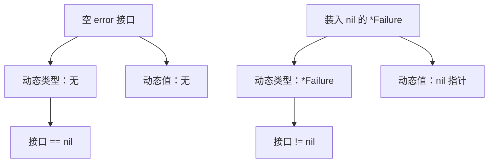

# 2.2. 接口、断言与动态类型

先修建议：[方法集、值与指针接收者](./methods)。

接口描述使用方需要的行为，动态值则携带具体类型。理解这两层，才能设计可替换依赖，并正确处理 nil、断言和运行时错误。

## 接口值的两部分信息 {#concept-1}

接口表达允许调用的行为；放入具体值之后，它还携带动态类型和动态值。判断 nil 时要同时考虑这两部分，不只检查底层指针是不是空。



图是帮助推理的概念模型，不规定接口的内部 ABI。小接口用于描述使用方真正需要的操作，any 则表示暂时不限制动态类型；它们虽然都叫接口，提供的静态信息不一样。

## 用一个小接口替换真实 I/O {#concept-2}

```go
package main

import (
	"fmt"
	"io"
	"strings"
)

func countBytes(r io.Reader) (int64, error) {
	return io.Copy(io.Discard, r)
}

func main() {
	n, err := countBytes(strings.NewReader("中文"))
	fmt.Println(n, err) // 6 <nil>
}
```

调用者只需要 Reader，不依赖 os.File 的所有方法；测试可传字符串 Reader。接口让依赖满足行为，不是要求实现类型继承同一父类。函数通常接收所需的小接口，构造函数可返回具体类型，避免导出宽而难演进的接口。

## 嵌入接口与行为交集 {#concept-3}

片段：

```go
type ReadCloser interface {
    io.Reader
    io.Closer
}
```

实现者必须同时具备 Read 和 Close。接口嵌入用于合并契约，重复方法须签名一致。约束接口中的类型集合属于泛型话题，不应拿来当普通运行时值接口。

## 动态类型、any、断言与 type switch {#concept-4}

```go
package main

import "fmt"

func describe(v any) string {
	switch value := v.(type) {
	case nil:
		return "没有动态值"
	case string:
		return fmt.Sprintf("文本 %q", value)
	case int:
		return fmt.Sprintf("整数 %d", value)
	default:
		return fmt.Sprintf("其他类型 %T", value)
	}
}

func main() {
	var v any = "Go"
	text, ok := v.(string)
	fmt.Println(text, ok) // Go true
	_, ok = v.(int)
	fmt.Println(ok) // false
	fmt.Println(describe(v))
}
```

单值断言 `v.(T)` 在不匹配时 panic，双值形式返回 ok。断言要求动态类型满足规则，不能把它当数值转换。any 等于 interface{}，降低静态约束，读取时需恢复类型信息。普通业务数据优先具名结构体；JSON 的任意值可能编码为 float64 等类型，数字精度需求用 Decoder.UseNumber 或具名字段处理。

## nil 与比较的两个坑 {#concept-5}

```go
package main

import "fmt"

type Failure struct{}

func (*Failure) Error() string { return "失败" }

func main() {
	var p *Failure
	var err error = p
	fmt.Println(p == nil, err == nil) // true false
	var empty error
	fmt.Println(empty == nil) // true
}
```

接口只有动态类型和动态值都为空时才是 nil。成功路径返回 `nil`，不要返回某个 nil 具体错误指针。接口比较还要求动态值可比较；两个装有切片的 any 参与 `==` 会 panic，不能因为静态类型是接口就认为总能比较。

## 为什么接口应该由使用方定义 {#concept-6}

业务只调用 `Find(ctx, id)` 时，不必导入含 Save/Delete/List/Begin 的整个存储接口。小接口能让测试替身实现最小行为，新增实现不必改业务依赖。只有真实替换边界时才抽象接口，领域数据类型、纯计算与一个私有函数无需“为了测试”套一层接口。

## 学习实验与判定 {#lab}

1. 使用 bytes.Reader、strings.Reader 与自定义失败 Reader 测试同一个消费函数。
2. 对 any 的 string、int、nil、*Failure 四种值作断言，记录动态类型和值。
3. 为调用者定义两方法接口，让内存存储与数据库存储都符合编译断言。

通过标准：能解释接口替换和 nil 陷阱；接口规模对应使用者需求。参考：[接口规范](https://go.dev/ref/spec#Interface_types)、[Effective Go 接口](https://go.dev/doc/effective_go#interfaces_and_types)。
