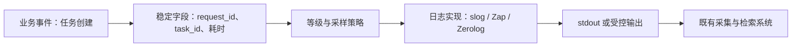

# 9.5. 结构化日志、slog、Zap 与 Zerolog

先修建议：[文件、流式 I/O 与 JSON](./io)、[HTTP 服务与 Web 框架](./web)。

任务创建成功、调用耗时、数据库失败都可以成为日志事件。日志先回答“发生了什么、与哪次请求有关”，再考虑选择哪个实现。slog 的基本用法在标准库单元出现，这里比较 roadmap 的 Zap 与 Zerolog，并组织完整日志责任。

## 事件、上下文与输出 {#concept-1}



事件名保持稳定，字段保存具体值。把 task_id 拼进自由文本虽能读懂，却不便稳定检索。请求 ID 串起一次调用的多条日志，任务 ID 指向业务对象，二者不是同一概念。

## 标准库起点：结构化记录 {#concept-2}

```go
package main

import (
	"log/slog"
	"os"
)

func main() {
	logger := slog.New(slog.NewJSONHandler(os.Stdout, nil))
	request := logger.With("request_id", "demo-001", "component", "tasks")
	request.Info("任务创建", "task_id", 7, "duration_ms", 12)
}
```

输出含 time、level、msg 与附加字段。测试解析 JSON 后断言字段，时间由运行产生，不对整行写死。日志通常输出到平台可采集的位置，不在业务代码里重写日志传输系统。

## Zap 与 Zerolog 的具体使用 {#concept-3}

| 方案 | API 示例 | 注意 |
| --- | --- | --- |
| [Zap](https://github.com/uber-go/zap) | logger.Info("任务创建", zap.Int("task_id", id)) | 类型字段；生产配置、采样与输出策略按项目决定。 |
| [Zerolog](https://github.com/rs/zerolog) | logger.Info().Int("task_id", id).Msg("任务创建") | 链式事件需以 Msg 等完成，不共享修改事件对象。 |
| [slog](https://pkg.go.dev/log/slog) | logger.Info("任务创建", "task_id", id) | 标准库 Handler 模型，检查键值配对。 |

Zap 片段：

```go
logger, err := zap.NewProduction()
if err != nil { return err }
defer func() { _ = logger.Sync() }()
logger.Info("任务创建", zap.Int("task_id", id))
```

输出目标的 Sync 语义依环境而异，处理策略与部署系统一致。不是为了“零分配”宣传就换日志库，用真实负载比较成本。与团队已有体系一致时选一个主方案，通过边界替换，避免同一请求被多套 logger 重复记录。

## 等级来自处理语义 {#concept-4}

| 情况 | 如何记录 | 理由 |
| --- | --- | --- |
| 正常关键事件 | Info | 便于业务与运行排查。 |
| 外部输入校验失败 | 按需求统计或低等级 | 可预期失败不一定是服务故障。 |
| 可恢复依赖失败 / 降级 | Warn 或项目约定等级 | 需要观察趋势与后续恢复。 |
| 操作无法完成 | Error，带关联 ID 和必要错误 | 入口决定处理结果，避免层层重复打印。 |
| 高量细节 | Debug 或采样 | 控制成本并保留有用信息。 |

等级不是严格行业统一表，项目需要固定约定。日志不能无条件包含密码、token、Cookie 或完整请求体。指标标签与日志字段也不同：高基数任务 ID 可用于日志检索，不适合作为无限增长的指标标签。

## 动手练习与解题线索 {#lab}

1. 为任务 API 添加 request_id、状态与耗时，用 JSON 解码检查字段和类型。
2. 让一次数据库错误逐层返回，在入口只记录一次，确认关联 ID 能串起请求。
3. 用项目真实规模比较日志开销，再决定是否由 slog 换成 Zap/Zerolog。

依据：[slog](https://pkg.go.dev/log/slog)、[Zap](https://github.com/uber-go/zap)、[Zerolog](https://github.com/rs/zerolog)。
