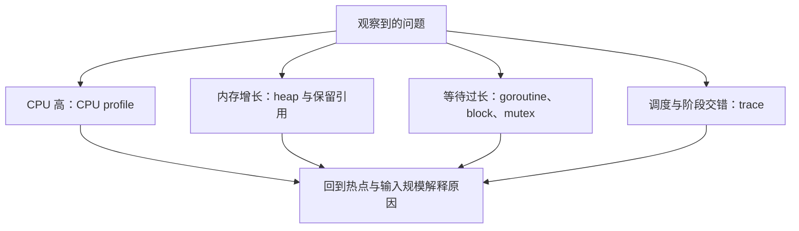

# 10.4. pprof、Trace 与调试

先修建议：[Benchmark 与分配实验](./benchmarking)、[Worker Pool、Fan-in 与 Pipeline](./patterns)。

## 先从现象选择观测工具 {#concept-1}

高 CPU、低 CPU 但慢、内存持续增长和任务不退出，需要不同证据。先记录负载与发生窗口，再选采样，而不是对任何性能问题都先加缓存或换并发模型。



Profile 是某段负载下的证据，不是一份通用代码评分。优化后用相同输入复测，同时保留行为测试；局部微基准的改善还要回到整服务的真实请求验证。

## 从可复现问题开始 {#concept-2}

先记录输入规模、并发数、硬件、Go 版本、延迟和错误率，再构造稳定基线。功能错误先缩小输入、读取堆栈并用 Delve 设置断点；数据竞争先跑 race；慢请求再用 profile 判断 CPU、分配、锁还是外部等待。

| 工具 | 回答的问题 |
| --- | --- |
| 单元与回归测试 | 行为是否正确，修改是否引入回归？ |
| Delve | 当前变量和调用栈是什么？ |
| Benchmark | 固定操作的耗时和分配是多少？ |
| CPU / heap pprof | CPU 时间与内存分配集中在哪里？ |
| goroutine profile | 哪些任务仍在等待、是否积累？ |
| mutex / block profile | 锁与同步等待的代价在哪里？ |
| go tool trace | 调度、系统调用与 GC 如何交错？ |

工具说明参见 [Go Diagnostics](https://go.dev/doc/diagnostics)、[Delve](https://github.com/go-delve/delve)。

## 可运行的 Benchmark {#concept-3}

独立目录保存为 `join_test.go`：

```go
package join

import (
	"strings"
	"testing"
)

var joined string

func BenchmarkJoin(b *testing.B) {
	parts := []string{"Go", "Rust", "Python"}
	b.ReportAllocs()
	for i := 0; i < b.N; i++ {
		joined = strings.Join(parts, ",")
	}
}
```

```sh
go test -run '^$' -bench . -benchmem -count=5 .
go test -run '^$' -bench . -cpuprofile cpu.out -memprofile mem.out .
go tool pprof cpu.out
```

外部变量使结果被使用，降低编译器删去无用工作的风险。准备数据放在计时路径之外，输入要代表真实负载。比较优化前后时保持平台、工具链和数据一致，多次测量，不能拿一次波动作为结论。Benchmark 更适合局部操作，整服务吞吐和尾延迟另做负载测试。

## 逃逸、内存与 GC {#concept-4}

局部变量不必一定在栈上，编译器依据生命周期决定存放位置；`go build -gcflags='-m' ./...` 可观察逃逸分析信息。逃逸不是天然错误，避免为了消除一条诊断而牺牲接口可读性。

GC 主要代价与分配速率、存活对象和指针扫描有关。先减少不必要的中间对象、限制队列与缓存增长，通常比直接调 GC 参数更可靠。GOGC、GOMEMLIMIT 等应在负载与内存约束明确后测量使用，不能保证进程绝不超过某个内存值。详见 [Go GC 指南](https://go.dev/doc/gc-guide)。

反射用于编码、工具与框架，业务优先静态类型；unsafe 与 cgo 需要更严格的内存、线程和平台知识，放在确有必要时学习。sync.Pool 用于复用临时对象，池内容可以被回收，不能当作持久缓存。

## 在线诊断要有边界 {#concept-5}

pprof HTTP 端点放到受控管理地址或认证网关，不直接公开；profile 可能包含内部路径和请求信息。采样设置有成本，先在测试或灰度环境验证，再安排生产采集。

## 从 Profile 到修复的具体链路 {#concept-6}

假设服务 CPU 高但延迟正常：先看 CPU profile 的 flat/cum 热点，确定时间在计算、编码还是 GC。假设 CPU 低但请求慢：看数据库等待、goroutine/block profile 和外部调用时间，不在本地字符串函数上盲目优化。

```sh
go test -run '^$' -bench . -cpuprofile cpu.out -memprofile heap.out .
go tool pprof -top cpu.out
go tool pprof -sample_index=alloc_space -top heap.out
go tool pprof -sample_index=inuse_space -top heap.out
```

alloc_space 显示累计分配，inuse_space 看样本记录时保留，热点含义不同。cum 包含下游调用，不把某个包装函数的 cum 当它自身全部工作。优化前后保持输入规模与采样条件，先回归行为再比性能。

## Trace 的调度与等待实验 {#concept-7}

```sh
go test -trace trace.out ./...
go tool trace trace.out
```

trace 展示 goroutine 调度、阻塞、网络/系统调用、GC 等时间关系。记录只覆盖采样时段，需要包含问题发生窗口。trace/profile 文件可能包含内部信息，存储与共享遵循项目要求；本地实验使用合成输入。

对 worker pool 看任务是否集中阻塞在一个结果 channel；对锁看是否在临界区等待外部调用；对泄漏看请求结束后 goroutine 数是否持续增长。runtime/trace 区域与任务可帮助标记业务阶段，但插桩命名与采样成本要受控。

## Delve 与错误重现 {#concept-8}

调试器适合停止在具体状态、看变量和调用栈；日志适合长期线上观察。构造稳定失败输入，断点放在错误产生附近，查看当前 ctx deadline、锁状态与对象值。race 构建改变运行代价，race 下的性能数据不直接作为生产吞吐基线。

诊断记录应包括现象、负载、假设、证据、修改和复测。没有测量依据的“少用指针更快”“用 channel 替换所有锁”不作为性能结论。

## 练习与验收 {#lab}

1. 比较循环字符串拼接与 strings.Builder，测试真实大小而非一个常量。
2. 制造未结束 goroutine，查看 profile 并修复结束条件。
3. 优化一处热点，写下前后指标及输入，保持功能测试通过。

验收：每次优化都有可复现基线和收益证据，不把微基准等同于用户请求性能。
