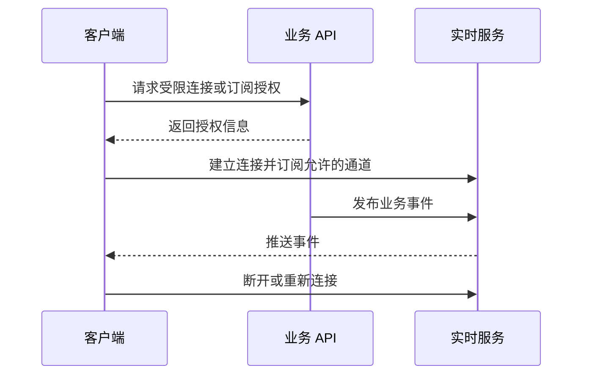
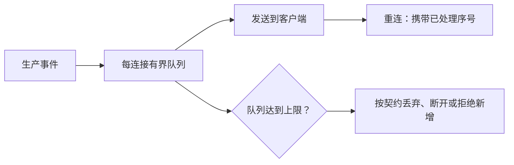

# 9.6. WebSocket、Melody 与 Centrifugo

先修建议：[HTTP 服务与 Web 框架](./web)、[Channel、缓冲与 select](./channels)、[Context、截止时间与取消](./context)。

HTTP 请求通常对应一次响应；实时连接可能持续很久。学习实时通信时，先明确谁可以连接、订阅什么、断线后怎样恢复，以及慢客户端会消耗多少资源，再选择 Melody 或 Centrifugo。

## 一个连接的完整路径 {#concept-1}

授权信息只开放必要通道，不把后端 API key 放到浏览器。事件推送不是一次 HTTP handler 返回就结束，连接仍需心跳、关闭、队列和回收策略。

## WebSocket：连接是一段生命周期 {#concept-2}

一个连接包含认证、升级、订阅、收发、心跳、断开和清理。HTTP handler 返回不意味着 WebSocket 已关闭。慢消费者需要发送队列上限、丢弃或断开策略；广播给每个客户端不应阻塞整个服务。请求 Origin 校验、消息大小与频率、重连游标都必须定义。

### Melody：进程内会话管理

[Melody](https://github.com/olahol/melody)封装 WebSocket 会话与广播。典型片段 `m := melody.New()`，HTTP 路由里 `m.HandleRequest(w,r)`，消息回调 `m.HandleMessage(...)`。认证与授权必须在升级前或连接握手协议中完成；回调收到的任意消息不能直接广播给所有用户，先确认房间与归属。

单进程会话列表不等于跨实例广播；多个实例需要共享消息层与连接分布策略。不要因 API 很短就省略断开、慢连接和资源检查。

### Centrifugo：独立实时服务

[Centrifugo](https://github.com/centrifugal/centrifugo)把客户端连接、通道订阅与多实例实时分发移到独立服务。业务 API 生成受限连接/订阅授权，后端发布事件，客户端订阅允许的通道。签名 secret 只在服务端，权限和 token 到期策略明确，HTTP API key 不放进浏览器。

它与 npm 中的 [Centrifuge 客户端](https://www.npmjs.com/package/centrifuge)配合时，npm 包负责浏览器连接，不替代 Go 服务端。Go 教材不会因提到 npm 就用 JavaScript 库重写 Go 能力。消息顺序、恢复窗口与重放按实际配置验证，不能假设实时通信天然保证所有事件送达。

## 背压和恢复要怎样设计 {#concept-3}

不能用一个无限切片缓存所有待推送消息。选择丢弃意味着客户端可能需要重新拉取快照；选择断开需要重连退避；选择拒绝需要向发布方反馈。业务事件带序号或游标才能讨论“从哪里恢复”，仅 reconnect 不保证补回所有遗漏消息。

单进程 Melody 与独立 Centrifugo 的职责不同：前者便于应用内连接管理，后者承接独立实时服务与多实例分发。都需要按实际通道授权和配置验证，不因为用了成熟库就自动保证业务送达和顺序。

## 动手练习与解题线索 {#lab}

1. 建两个用户、两个私有任务通道，A 不能订阅 B 的事件。
2. 模拟一个一直不读消息的客户端，队列上限应生效，其他客户端仍能接收。
3. 在第 n 条后断开，说明重连后是补事件还是重取快照，并测试对应契约。

依据：[Melody](https://github.com/olahol/melody)、[Centrifugo](https://centrifugal.dev/docs/getting-started/introduction)、[官方 JavaScript 客户端](https://github.com/centrifugal/centrifuge-js)。
