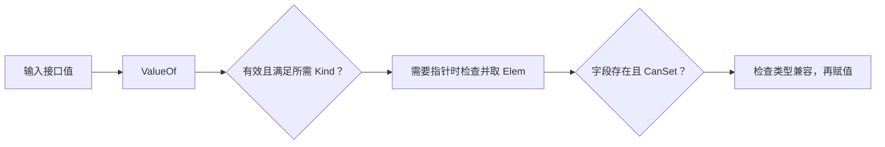

# 11.2. 反射、类型检查与动态赋值

先修建议：[接口、断言与动态类型](./interfaces)、[结构体、字段标签与组合](./types)。

反射让程序在运行时检查类型和值，适合通用编码、校验和工具。它降低静态保证，学习时先掌握可寻址、可设置和类型匹配，而非直接写万能 ORM。

## 动态检查从 Type 与 Value 开始 {#concept-1}

Type 描述类型身份，Kind 描述类别，Value 承载一个可被检查的运行时值。Value 是否有效、可寻址、可设置，是三个不同判断；操作前按顺序检查，才能把动态失败变成明确错误。



普通值的复制通常不能被反射直接修改；通过有效指针取得对象也不能随意改未导出字段。业务已知字段和行为时优先静态字段访问或接口，反射留给真正需要运行时类型检查的通用边界。

## Type 与 Kind 不一样 {#concept-2}

Type 是具体类型身份，Kind 是底层类别。`type UserID int64` 的 Type 名称是 UserID，Kind 是 Int64；匿名结构体可能无名字但仍有 Struct kind。反射处理 nil 时先判断 Value.IsValid，reflect.TypeOf(nil) 没有类型，不能直接调用它的方法。

## 可运行的字段更新实验 {#concept-3}

```go
package main

import (
	"fmt"
	"reflect"
)

type Config struct {
	Port   int `json:"port"`
	secret string
}

func main() {
	c := Config{Port: 8080}
	copyValue := reflect.ValueOf(c)
	fmt.Println(copyValue.FieldByName("Port").CanSet()) // false：值复制不可设置
	value := reflect.ValueOf(&c).Elem()
	field := value.FieldByName("Port")
	if field.CanSet() && field.Kind() == reflect.Int {
		field.SetInt(9090)
	}
	fmt.Println(c.Port)                               // 9090
	fmt.Println(value.FieldByName("secret").CanSet()) // false：不可导出字段
	typ := value.Type()
	for i := 0; i < typ.NumField(); i++ {
		fmt.Println(typ.Field(i).Name, typ.Field(i).Tag.Get("json"))
	}
}
```

通过指针 Elem 得到可寻址值，导出字段才可设置。非存在字段返回 invalid Value，先检查再操作；类型不匹配直接 Set 会 panic。Tag 是约定文本，json 标签可含选项，不能只取全部文本当字段名。

## 一条通用赋值链应检查什么 {#concept-4}

1. 输入不是 nil，Value 有效。
2. 是否要求指针，Elem 前 Kind 与 IsNil 满足条件。
3. 目标字段存在、可设置；源类型是否 AssignableTo。
4. 如果允许转换，检查 ConvertibleTo 并验证数值范围，转换可能丢信息。
5. 返回具体字段错误，不把所有失败转成泛化 panic。

动态类型检查成本、缓存策略和可读性都要计入设计。业务 Task 更新通常直接 `task.Title = title` 更清楚；有多类型同算法用泛型；确实类型直到运行时才知道再用反射。Go 编码库的成熟实现值得研究，但不从一段反射实验扩展出自制序列化框架。

## 方法调用与接口 {#concept-5}

反射能发现方法并 Call，但参数数量、类型、导出性和方法集都要匹配，错误常变成 runtime panic。若使用方已知行为，先用接口，不必用方法名字符串模拟动态派发。调用第三方反射 API 时限制可调用集合，不能把外部输入直接映射任意方法。

## 学习实验与判定 {#lab}

1. 对 Config 值、*Config、nil 和 typed nil 分别检查 Type/Kind/IsValid。
2. 把 Port 值改成 string，不能直接 SetInt，返回可诊断错误。
3. 遍历 JSON tag，处理 `-`、空标签与 `omitempty`，明确并非完整编码器。
4. 比较直接字段访问与反射的 Benchmark，只在真实通用需求下选择反射。

通过标准：不会绕过未导出字段或盲目 Elem/Set，每个动态失败有明确边界。参考：[反射三定律](https://go.dev/blog/laws-of-reflection)、[reflect](https://pkg.go.dev/reflect)。
