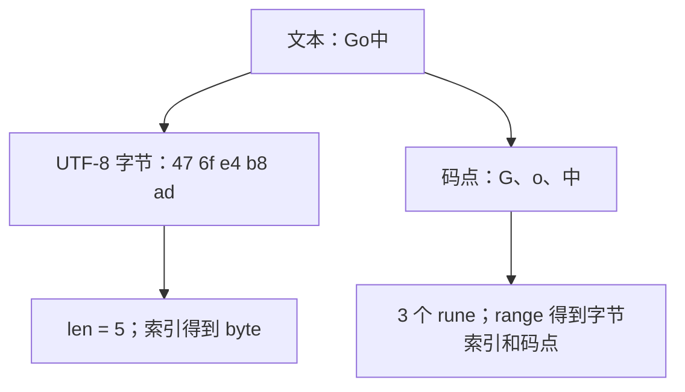

# 1.6. 字符串、字节、rune 与 Unicode

先修建议：[基本类型、数值与类型转换](./basics)、[数组、切片、容量与共享存储](./collections)。

程序读取的是字节，用户看到的是文本。这两种视角经常不一致：一个中文码点通常用多个 UTF-8 字节表示，一个用户看到的字形又可能由多个码点组成。处理字符串前先确定你要数或切的是什么。

## string、byte 与 rune 的三种视角 {#concept-1}



string 是不可变字节序列，内容不保证一定是有效 UTF-8。byte 是 uint8 别名；rune 是 int32 别名，用来表示 Unicode 码点。rune 不等于用户看到的完整字符，例如组合音标或某些 emoji 序列可包含多个 rune。

```go
package main

import (
	"fmt"
	"unicode/utf8"
)

func main() {
	text := "Go中"
	fmt.Println(len(text), utf8.RuneCountInString(text)) // 5 3
	fmt.Printf("% x\n", []byte(text))                    // 47 6f e4 b8 ad
	for index, r := range text {
		fmt.Printf("%d %U %c\n", index, r, r)
	}
}
```

range 的索引是 0、1、2；最后的“中”从第 2 个字节开始，占 3 字节。后面再添加“文”时，它的索引是 5，不是 3。按字节切在码点中间可能得到无效 UTF-8，`utf8.ValidString` 可检测。

## 两种字面量只是书写方式不同 {#concept-2}

```go
package main

import "fmt"

func main() {
	escaped := "Go\n语言"
	raw := `Go\n语言`
	fmt.Printf("%q\n%q\n", escaped, raw)
}
```

双引号解释转义，第一行含真实换行；反引号保留反斜线和 n，第二行没有换行。两者最终类型都是 string，raw 不代表“文本不会被其他层处理”：正则引擎、JSON 或 shell 的规则仍由各自工具解释。

| 写法 / 操作 | 用途 | 容易混淆的地方 |
| --- | --- | --- |
| `"\n"` | 一个换行 | 不是两个可见字符。 |
| 反引号原始串 | 路径、正则、多行模板 | 不能直接包含反引号本身；回车有规范规定的处理。 |
| `string(65)` | 用码点构造字符串 A | 不是数字文本 "65"。 |
| `strconv.Itoa(65)` | 整数格式化成十进制文本 | 与码点转换是不同任务。 |
| `[]byte(s)` | 按字节处理 | 修改转换后的字节不改变原 string。 |
| `[]rune(s)` | 按码点处理 | 仍不自动实现字形或语言分词。 |

## 修改文本：先选择单位 {#concept-3}

```go
package main

import "fmt"

func main() {
	original := "中文"
	runes := []rune(original)
	runes[0] = '英'
	fmt.Println(original, string(runes)) // 中文 英文
}
```

字符串不能原地赋值 `original[0] = ...`。本例转为 rune 切片，改变码点后生成新字符串，原文本不变。处理二进制内容使用 []byte，做大小写、空白与分词优先用 strings/unicode 或适合语言的成熟方案，不按“中文固定三字节”自己截断。

## 搜索、清理和构建的分工 {#concept-4}

strings.TrimSpace 去除 Unicode 空白，Fields 按空白分词，不是中文语言分词。Contains、Index 按字符串内容查找，索引单位仍是字节。正则用于明确模式，JSON/CSV 用专用解析器。

大量循环拼接会重复复制已有字符串，先考虑 strings.Join 或 strings.Builder，再用[基准实验](./benchmarking)测量。Builder 使用后不复制它；并发修改仍需同步，工具不会替你建立所有权。

## 动手练习与解题线索 {#lab}

1. 对 "Go中文" 断言字节数 8、码点数 4，并记录 range 的索引 0、1、2、5。
2. 用一个组合音标字符串说明“码点数”等于“可见字形数”的假设为什么不可靠。
3. 写按码点限制标题长度的校验，测试空白、中文、英文和边界值；说明它不做 Unicode 规范化。
4. 将 string(65) 和 strconv.Itoa(65) 的结果写成测试。

依据：[官方字符串与 Unicode 说明](https://go.dev/blog/strings)、[string 规范](https://go.dev/ref/spec#String_types)、[unicode/utf8](https://pkg.go.dev/unicode/utf8)。
