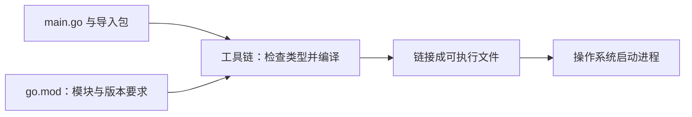

# 1.2. 安装环境、Hello World 与文档入口

先修建议：[Go 的定位、历史与运行模型](./introduction)。

先让一个最小程序在本机运行。环境、源码、模块和可执行文件分别是什么，运行一次就能看见；完整命令工作流在[工具链单元](./commands)集中学习。

## 安装与确认环境 {#concept-1}

从 [Go 官方安装页](https://go.dev/doc/install)选择操作系统和处理器架构对应的稳定版本。升级时按官方说明处理旧安装目录，不要把新文件叠加到旧目录。编辑器可使用 VS Code 的 Go 扩展与 gopls，也可使用 GoLand。

```sh
go version
go env GOROOT GOPATH GOMOD GOPROXY
```

`GOROOT` 是工具链安装位置，通常不需要手动设置；`GOPATH` 仍保存下载缓存和安装的工具，但模块项目不必放在其中。`GOMOD` 帮助判断当前命令是否处于正确模块。代理负责下载模块，校验服务用于验证公共模块内容；网络失败先检查代理和连接，避免通过关闭校验解决。

## 创建第一个模块 {#concept-2}

```sh
mkdir go-study
cd go-study
go mod init example.com/go-study
```

将下面代码保存为 `main.go`：

```go
package main

import "fmt"

func main() {
	fmt.Println("你好，Go")
}
```

```sh
go fmt ./...
go run .
go build -o hello .
./hello
```

预期两次输出都是 `你好，Go`。Windows 使用 `go build -o hello.exe .` 和 `./hello.exe`。`example.com/go-study` 是本地教学模块路径，不会创建网站；实际发布时改为可访问的仓库路径。

一个目录通常是一个包，模块可以包含多个包；`package main` 与 `func main()` 组成程序入口。import 引入包，大写开头的名字可被其他包访问。未使用的 import 与局部变量会导致编译失败。

## 编译与运行的数据流 {#concept-3}



go run 临时编译并启动，go build 产生可以稍后运行的文件。你改的是源文件，不是已经生成的可执行文件；重新 build 后才更新产物。GOROOT 指向工具链，GOPATH 主要仍用于缓存与工具安装，模块项目不必住在 GOPATH 中。

## 查资料也有明确入口 {#concept-4}

遇到“这个函数怎么用”查 pkg.go.dev 或 go doc；遇到“这个语法是否合法”查语言规范；遇到“命令参数怎样配置”查 go help。先确认 Go 版本和模块目录，再根据错误文件与行号缩小问题。

## 动手练习与解题线索 {#lab}

1. 从空目录初始化模块、运行程序、构建二进制，并各记录一条输出。
2. 修改源码后不重新构建，直接运行旧产物，解释结果为什么没有变化。
3. 故意增加未使用的 import，读懂编译错误后修复。
4. 用 go doc 查询 strings.TrimSpace，说明它与搜索一篇任意博客的区别。

依据：[官方入门教程](https://go.dev/doc/tutorial/getting-started)、[工具链选择](https://go.dev/doc/toolchain)。
