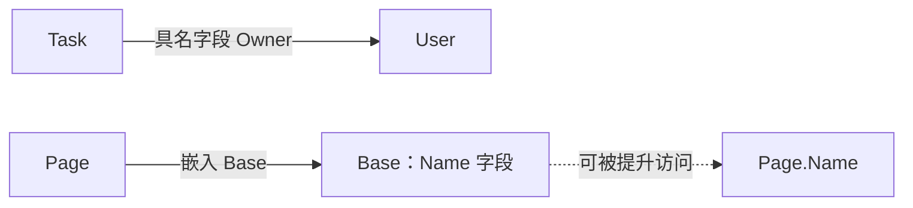

# 1.8. 结构体、字段标签与组合

先修建议：[基本类型、数值与类型转换](./basics)、[Map、集合与逗号 ok](./maps)。

任务的 ID、标题、完成状态属于同一个数据对象，使用结构体能让字段关系清楚。先把数据模型定义好，再学习方法和接口；本节只集中讨论字段、标签、组合与值语义。

## 用字段表达一份数据 {#concept-1}

```go
package main

import "fmt"

type Task struct {
	ID    int
	Title string
	Done  bool
}

func main() {
	task := Task{ID: 1, Title: "学习 Go"}
	copied := task
	copied.Done = true
	fmt.Println(task.Done, copied.Done) // false true
}
```

省略 Done 时使用 bool 的零值 false。结构体赋值复制字段，本例都为值，修改副本不会改原对象。字段如果是切片、map 或指针，其字段值被复制后仍可能指向共享数据，和前面切片的浅复制规则一致。

具名字段字面量易读，新增字段不改变已有含义。跨包只可访问导出字段，名称首字母大写的字段用于公开 API。字段名之外还有不变量：比如标题不能为空，类型定义本身不会自动保证它。

## Tag 给工具读，不改变字段类型 {#concept-2}

```go
package main

import (
	"encoding/json"
	"fmt"
)

type Task struct {
	ID    int    `json:"id"`
	Title string `json:"title"`
	Done  bool   `json:"done,omitempty"`
	note  string
}

func main() {
	encoded, err := json.Marshal(Task{ID: 1, Title: "Go", note: "内部备注"})
	if err != nil {
		panic(err)
	}
	fmt.Println(string(encoded)) // {"id":1,"title":"Go"}
}
```

json 标签控制 JSON 字段名，omitempty 使 false 等空值被省略；未导出的 note 不编码。客户端若要求 done 总存在，删除 omitempty。Tag 是元数据，错误标签不会自动改变 Go 编译类型，编码时的真实行为还要测试。

## 缺失、零值和 null 是不同问题 {#concept-3}

| 输入含义 | bool 字段 | *bool 字段 |
| --- | --- | --- |
| 未提供 done | 通常得到 false | 通常为 nil。 |
| 明确提供 false | false | 指向 false 的非 nil 指针。 |
| 提供 null | 通常不能单靠最终值区分 | 解码到新对象时通常为 nil。 |

指针能表达“未给值”和“给了 false”，却不能单独保留“缺失”和“显式 null”的全部区别。需要三态更新时使用存在性模型或自定义解码，不以同一个 bool 假装记录了三种输入。完整替换与局部更新的契约在 [HTTP 服务](./web)继续学习。

## 具名组合与嵌入 {#concept-4}



具名字段表达包含关系：`task.Owner.Name`。嵌入让某些字段和方法被提升：`page.Name` 可以访问内嵌 Base.Name。它并未把两个类型变成传统继承关系，也不产生自动的动态覆盖。

```go
package main

import "fmt"

type Base struct{ Name string }
type Page struct {
	Base
	Title string
}

func main() {
	page := Page{Base: Base{Name: "Go"}, Title: "课程"}
	page.Name = "Go 基础"
	fmt.Println(page.Name, page.Base.Name) // Go 基础 Go 基础
}
```

初始化字面量仍要写 Base，不能直接写提升字段。多个内嵌字段若提升同名成员可能产生歧义，此时用完整访问路径。需要控制暴露范围和依赖时，具名组合通常更直观。

## 比较、标签和布局的边界 {#concept-5}

结构体的全部字段可比较时才支持 ==；含切片的结构体不能直接比较，含指针字段则比较地址。业务等价应说明是 ID 相同还是全部业务字段相同。

内存布局可有对齐空隙，Tag 不为你定义 wire format。传输用 JSON、Protobuf 或 encoding/binary，不把结构体内存直接发到网络。方法集与接口规则放在[方法](./methods)和[接口](./interfaces)中独立学习。

## 动手练习与解题线索 {#lab}

1. 给 Task 加 Tags []string，证明结构体复制后修改 Tags 元素会影响另一份值；再复制 Tags 解除共享。
2. 对 JSON 的空标题、false、内部字段和 omitempty 写精确结果断言。
3. 用具名 Owner 与嵌入 Base 各建模型，说明哪些访问被提升，哪些需要完整路径。
4. 判断含 []string、*User、int 的三种结构体是否可比较，并解释比较含义。

依据：[结构体规范](https://go.dev/ref/spec#Struct_types)、[JSON 字段规则](https://pkg.go.dev/encoding/json#Marshal)。
