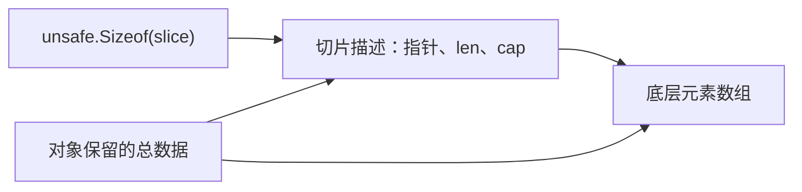

# 11.3. Unsafe、内存布局与指针约束

先修建议：[逃逸、GC 与内存预算](./memory)、[指针、别名与内存概览](./pointers)。

常规类型系统阻止许多无效访问；unsafe 允许越过其中一些保护。学习顺序是先观察对象布局，再理解可达性、寿命和转换规则。只有明确必要且经过测量的边界才考虑不安全操作。

## unsafe 观察浅层布局 {#concept-1}

```go
package main

import (
	"fmt"
	"unsafe"
)

type Layout struct {
	Flag  bool
	Count int64
	Code  byte
}

func main() {
	var v Layout
	fmt.Println("size", unsafe.Sizeof(v))
	fmt.Println("align", unsafe.Alignof(v))
	fmt.Println("count offset", unsafe.Offsetof(v.Count))
	fmt.Println("slice header", unsafe.Sizeof([]byte{}))
}
```

具体数值依平台 ABI、字段布局与架构而定，不做跨平台固定断言。Sizeof 包含结构体 padding，只测切片/字符串描述符，不包含背后数据。学习输出用于解释对齐与浅层大小，不用于把内存块直接作为网络协议。

## 浅层大小不等于全部内存 {#concept-2}



Sizeof 只观察图左侧描述信息的大小，不能据此得知右侧数组的总内存。结构体大小可包含字段对齐空隙；二进制协议要显式定义编码，不能把观察到的布局当跨平台契约。

## Pointer 与 uintptr 的关键区别 {#concept-3}

unsafe.Pointer 是可指向对象的特殊指针值，uintptr 是整数，不保证对象仍可达，也不随地址变化更新。把指针转整数保存后再恢复可能违背生命周期规则；即使在某次运行有效，也不能认为受 Go 兼容承诺保护。

合法转换须严格遵循 [unsafe 文档](https://pkg.go.dev/unsafe)中的模式。不要手工构造反射字符串/切片头来制造零复制视图，持有方修改和生命周期容易破坏不可变字符串语义。先复用 bytes、strings、encoding/binary 与成熟解析库，有测量且无法满足需求再审查 unsafe。

`go test -race` 与 `-gcflags=all=-d=checkptr=2` 可辅助查部分问题，不是内存安全证明。将 unsafe 封装在极小边界，写清对象寿命、对齐、长度和所有权，覆盖目标平台。

## 先把需求转成安全操作 {#concept-4}

| 需求 | 先考虑 | unsafe 前必须回答 |
| --- | --- | --- |
| 解码整数或协议字段 | encoding/binary | 字节序、长度、对齐与越界由谁保证？ |
| 切片 / 文本转换 | 普通转换、bytes、strings | 谁会修改共享存储，视图活多久？ |
| 查看布局 | Sizeof、Alignof、Offsetof | 结果在哪个目标平台成立？ |
| 与 C 库交互 | 成熟绑定与 cgo | Go/C 哪一方分配、保留与释放内存？ |

不要把“这次执行没有崩溃”当作正确性证明。将 unsafe 局限在小范围，公开接口尽量保持安全值与明确所有权；相关互操作继续看 [cgo](./cgo)。

## 动手练习与解题线索 {#lab}

1. 比较含相同字段、排列不同的两个结构体大小，解释空隙而非假定固定结果。
2. 给切片分配较大数组，再测 Sizeof，说明为什么浅层大小没有等比例增长。
3. 用安全的 encoding/binary 实现一个字段读取，测量后再判断是否真的需要 unsafe。

依据：[unsafe 官方规则](https://pkg.go.dev/unsafe)、[语言规范的内存布局操作](https://go.dev/ref/spec#Package_unsafe)。
