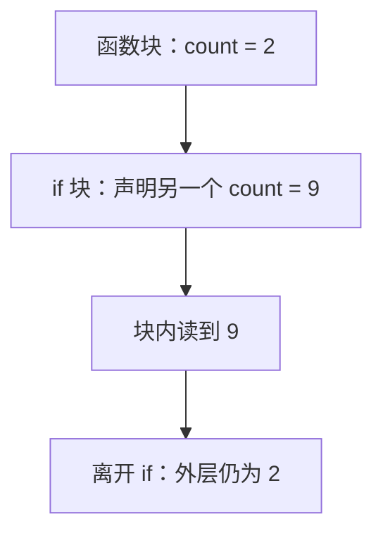

# 1.3. 变量、常量、iota 与作用域

先修建议：[安装环境、Hello World 与文档入口](./toolchain)。

本章研究声明、绑定与作用域。先预测每个程序输出，再执行；能够写出 `:=` 还不够，必须知道它修改了哪个名字。

## 用名字、值和作用域理解声明 {#concept-1}

变量名是当前作用域里指向一个值的名字。内层声明同名变量时，创建的是另一份绑定；离开内层后，外层名字重新可见。阅读代码时先标出块边界，再判断某次赋值真正改变哪一份值。



iota 表达的是 const 块内的声明序号，位标志只是其一个用途。判断常量是否能赋给某个类型，要看数值能否表示；判断输入是否合理，还需业务规则。下面的声明和权限实验分别验证这些问题，不能用“声明成功”替代有效性判断。

## var 与短声明的区别 {#concept-2}

```go
package main

import "fmt"

func main() {
	var count int
	count, err := 2, error(nil) // count 已存在，err 是新变量
	fmt.Println(count, err)     // 2 <nil>
	if count := 9; count > 0 {
		fmt.Println(count) // 9：内部块新名字
	}
	fmt.Println(count) // 2
}
```

`var` 可在包级和函数内使用，可指定类型并省略初始化。`:=` 只在函数中使用，同一作用域至少有一个非空白新变量；已存在的名字必须来自同一块且类型兼容。内层块的同名声明产生新绑定，不能因为文本一样就视为同一个变量。

`var reader io.Reader` 声明了接口；`reader := strings.NewReader("Go")` 推断具体指针类型，后续可赋值集合不一样。选择声明方式不仅是风格，也决定变量的静态类型。

## 零值不是“未定义” {#concept-3}

| 类型 | 零值 | 可以直接做什么 |
| --- | --- | --- |
| 数值 / bool / string | 0 / false / "" | 计算、比较、拼接。 |
| 数组 / 结构体 | 每个元素或字段的零值 | 访问、赋值，是否有效由业务约束决定。 |
| 切片 | nil | len、range、append，不可访问不存在的元素。 |
| map | nil | 查找、len、range；写入必须初始化。 |
| channel | nil | 收发永久阻塞；close 会 panic。 |
| 指针 | nil | 可比较，不可解引用。 |

设计 `Counter` 的零值可用，能减少构造函数；但数据库连接和必填配置显然不能靠零值变成有效对象。不要用“零值可用”掩盖业务校验。

## const 与 iota：编译期表达式 {#concept-4}

```go
package main

import "fmt"

type Permission uint8

const (
	Read Permission = 1 << iota
	Write
	Execute
)

const (
	KiB = 1 << (10 * (iota + 1))
	MiB
	GiB
)

func main() {
	perms := Read | Write
	fmt.Println(Read, Write, Execute)                // 1 2 4
	fmt.Println(perms&Read != 0, perms&Execute != 0) // true false
	fmt.Println(KiB, MiB, GiB)                       // 1024 1048576 1073741824
}
```

iota 在每个 const 块从 0 开始，按声明行递增，省略表达式时沿用前一行的表达式。跳过一行用 `_`。这是生成位标志的方便方式，不是防止非法值的枚举类型：`Permission(255)` 仍可构造，需要校验。

无类型常量能在使用点适配可表示的类型；`const n = 1<<100` 可作为高精度常量存在，却不能赋给 int64。常量只能来自常量表达式，不能把时间、文件读取或普通函数调用的结果声明成 const。计量单位优先具名常量，让转换含义明确。

## 错误变量遮蔽的诊断 {#concept-5}

片段展示常见问题：

```go
var err error
if shouldRead {
    data, err := readFile(path) // 新块：这里的 err 遮蔽外层 err
    if err != nil { return err }
    use(data)
}
return err
```

在此例中及时 return 错误仍是正确行为；如果省略内部错误检查，只在最后看外层 err，就会漏报。修复可以使用局部名并立即处理，或提前声明 data 再用 `=`。不要为了“统一 err”让变量生命周期无谓增长。

## 学习实验与判定 {#lab}

1. 把第一例内层 `:=` 改成 `=`，先声明所需变量，预测外层输出是否变为 9。
2. 定义权限组合的校验：拒绝 Read、Write、Execute 以外的位，测试 0、7、8、255。
3. 制造 const 溢出和无新变量的短声明，解释编译器拒绝的是哪条规则。

通过标准：能指出每次声明的作用域和静态类型，区分常量计算、运行时值与业务有效性。参考：[变量与常量规范](https://go.dev/ref/spec#Declarations_and_scope)。
