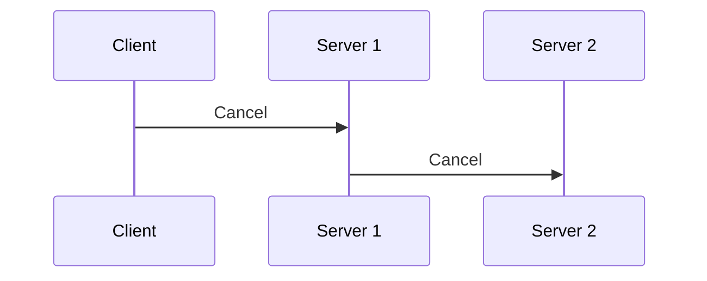
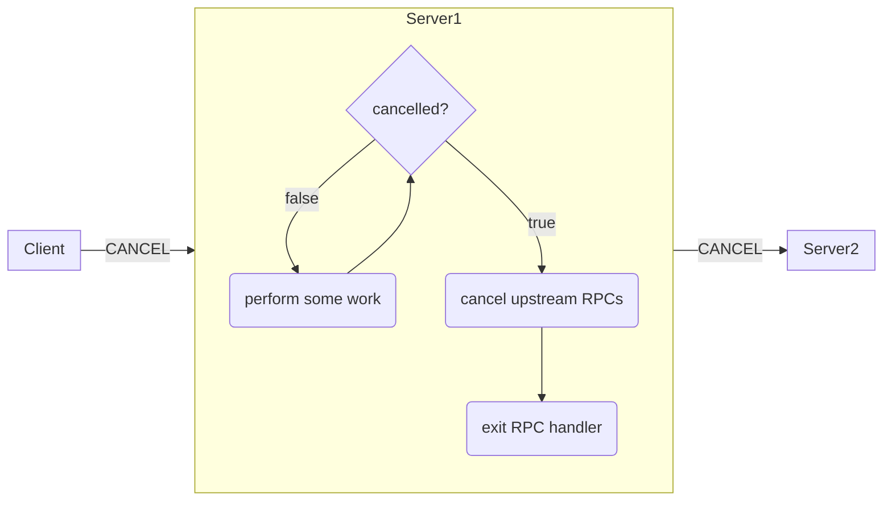

### 概述

当 gRPC 客户端不再对 RPC 调用的结果感兴趣时，它可能会_取消_以向服务端发出停止兴趣的信号。 [截止时间](https://grpc.io/docs/guides/deadlines/) 过期和 I/O 错误也会触发取消。  当 RPC 被取消时，服务端应该停止任何正在进行的计算并结束其一侧的流。通常，服务端也是上游服务端的客户端，因此取消操作理想情况下应该传播到系统中由于原始客户端 RPC 调用而启动的所有正在进行的计算。

客户端可能会出于多种原因取消 RPC。它请求的数据可能已变得无关紧要，或者客户端的作者可能希望成为服务端的好公民并节省计算资源。

### 取消客户端的 RPC 调用

客户端通过调用调用对象上的方法或在某些语言中调用随附的上下文对象上的方法来取消 RPC 调用。虽然 gRPC 客户端不会向服务端提供有关取消原因的其他详细信息，但取消 API 调用会采用描述原因的字符串，这将导致客户端异常和/或包含所提供原因的日志。当服务端收到 RPC 取消的通知时，应用程序提供的服务端处理程序可能正忙于处理该请求。 gRPC 库通常没有中断应用程序提供的服务端处理程序的机制，因此服务端处理程序必须与 gRPC 库协调以确保请求的本地处理停止。  因此，如果 RPC 寿命较长，则其服务端处理程序必须定期检查它所服务的 RPC 是否已被取消，如果已取消，则停止处理。  有些语言还支持自动取消任何传出的 RPC，而在其他语言中，服务端处理程序的作者对此负责。

### 语言支持

|语言|例子|笔记|
|----------|----------------|----------------------------------|
|Java|[示例](https://github.com/grpc/grpc-java/tree/master/examples/src/main/java/io/grpc/examples/cancellation)|自动取消传出的 RPC|
|Go|[示例](https://github.com/grpc/grpc-go/tree/master/examples/features/cancellation)|自动取消传出的 RPC|
|C++|[示例](https://github.com/grpc/grpc/tree/master/examples/cpp/cancellation)|自动取消传出的 RPC|
|Python|[示例](https://github.com/grpc/grpc/tree/master/examples/python/cancellation)||
