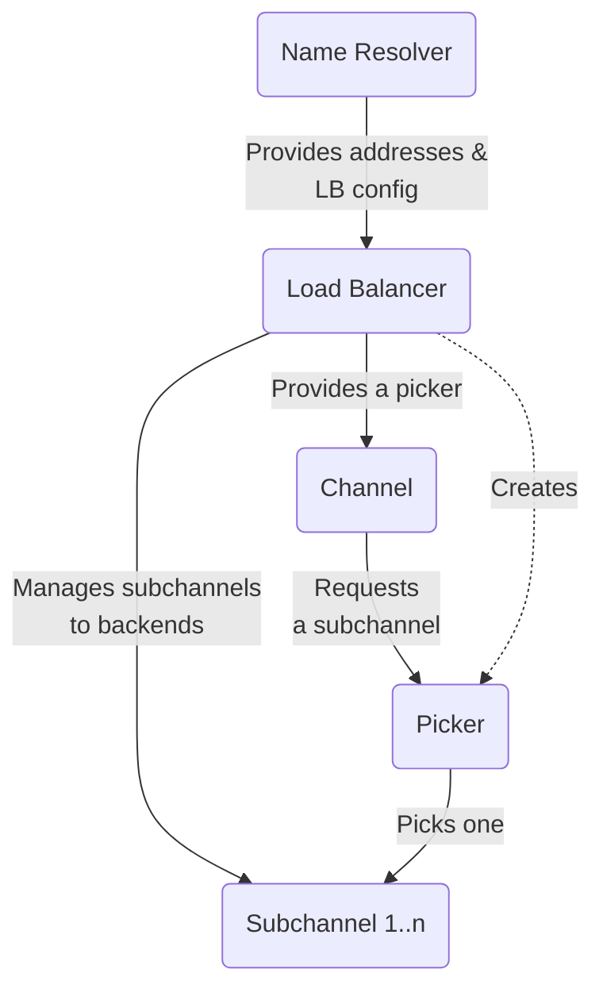

### 概述

gRPC 的关键功能之一是负载均衡，它允许将来自客户端的请求分布在多个服务端上。这有助于防止任何一台服务端过载，并允许系统通过添加更多服务端来扩展。

gRPC 负载均衡策略由名称解析器提供服务端 IP 地址列表。该策略负责维护与服务端的连接（子通道）并在发送 RPC 时选择要使用的连接。

### 实施你自己的策略

默认情况下，将使用 `pick_first` 策略。该策略实际上不执行负载均衡，只是尝试从名称解析器获取的每个地址并使用它可以连接到的第一个地址。通过更新 gRPC 服务配置，您还可以切换到使用 `round_robin`，它连接到它获取的每个地址，并通过每个 RPC 的连接后端进行轮换。还有一些其他可用的负载均衡策略，但具体设置因语言而异。如果内置策略不能满足您的需求，您还可以实施自己的自定义策略。

这涉及以您正在使用的语言实现负载均衡器接口。在高层次上，您必须：

- 在负载均衡器注册表中注册您的实现，以便它可以
从服务配置中引用
- 解析您的实现的 JSON 配置对象。这可以让您的
使用您选择支持的任意 JSON 在服务配置中配置负载均衡器
- 管理与哪些后端保持连接
- 实现一个 `picker` ，它将在发生异常时选择连接到哪个后端
RPC 已制作完成。请注意，这需要是一个快速操作，因为它位于 RPC 调用路径上
- 要启用负载均衡器，请在服务配置中进行配置

确切的步骤因语言而异，请参阅语言支持部分以获取您所用语言的一些具体示例。

### 后端指标

如果您的负载均衡策略需要有关后端服务端的实时信息怎么办？为此，您可以依靠后端指标。您可以在带内、后端 RPC 响应中提供指标，也可以在带外作为来自后端的单独 RPC 提供指标。提供了 CPU 和内存利用率等标准指标，但您也可以实现自己的自定义指标。

有关这方面的更多信息，请参阅[自定义后端指标指南](https://grpc.io/docs/guides/custom-backend-metrics/)。

### 服务网格

如果您有一个服务网格设置，其中中央控制平面正在协调微服务的配置，则您无法直接通过服务配置来配置自定义负载均衡器。但控制平面用于与 gRPC 客户端通信的 xDS 协议提供了支持来执行此操作。请参阅您的控制平面文档以确定如何支持自定义负载均衡配置。

有关更多详细信息，请参阅 gRPC [提案 A52](https://github.com/grpc/proposal/blob/master/A52-xds-custom-lb-policies.md)。

### 语言支持

|语言|例子|笔记|
|----------|----------------|----------------------------------|
|Java|[Java 示例]|                                  |
|Go|[Go 示例]|                                  |
|C++|                |尚不支持|

[Java 示例]: https://github.com/grpc/grpc-java/tree/master/examples/src/main/java/io/grpc/examples/customloadbalance 
[Go 示例]: https://github.com/grpc/grpc-go/tree/master/examples/features/customloadbalancer
