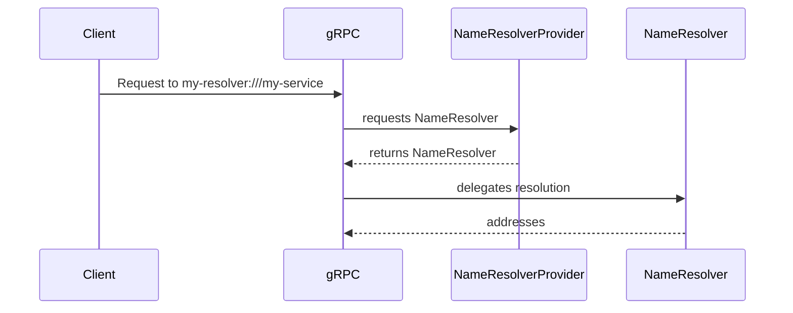

### 概述

名称解析从根本上讲是关于服务发现。发送 gRPC 请求时，客户端必须确定服务名称的 IP 地址。名称解析通常被认为与 [DNS](https://www.ietf.org/rfc/rfc1035.txt) 相同。但实际上，DNS 通常会通过扩展进行增强或完全替换以启用名称解析。

使用 gRPC 客户端发出请求时，默认情况下使用 DNS 名称解析。然而，可以使用各种其他名称解析机制：

|旋转变压器|例子|笔记|
|-|-|-|
|域名系统|`grpc.io:50051`|默认情况下，采用 DNS。|
|域名系统|`dns:///grpc.io:50051`|额外的斜杠用于提供权限|
|Unix 域套接字|`unix:///run/containerd/containerd.sock`|
|xDS|`xds:///wallet.grpcwallet.io`||
|IPv4|`ipv4:198.51.100.123:50051`|仅支持某些语言|
如果您习惯了HTTP的双斜杠，例如`https://grpc.io`，上面的三斜杠（`///`）可能看起来很陌生。这些_目标字符串_遵循 [RFC-3986](https://datatracker.ietf.org/doc/html/rfc3986) URI 的格式。前两个斜杠之后、第三个斜杠之前（如果有第三个斜杠）的字符串是_authority_。权限字符串标识包含所有资源的 URI 的服务端。对于传统的 HTTP 请求，URI 的权限是请求将发送到的服务端。在其他情况下，权限将是名称解析服务端的身份，而资源本身位于其他服务端上。某些名称解析器不需要权限。在这种情况下，权限字符串留空，导致连续三个斜杠。
多种语言支持允许用户定义自己的名称解析器的接口，以便您可以定义如何解析任何给定的名称。注册后，当目标字符串以 `my-resolver:` 开头时，将选择具有 _scheme_ `my-resolver` 的名称解析器。例如，对 `my-resolver:///my-service` 的请求现在将使用 `my-resolver` 名称解析器实现。

### 自定义名称解析器

每当您想要增强或替换 DNS 以进行服务发现时，您都可以考虑使用自定义名称解析器。例如，过去曾使用此接口使用[Apache Zookeeper](https://zookeeper.apache.org/)来查找服务名称。  它还被用来直接与 Kubernetes API 服务端交互，以基于无头服务资源进行服务查找。

使用自定义名称解析器而不是标准 DNS 可能特别有用的原因之一是该接口是_reactive_。在标准 DNS 中，客户端在连接开始时查找特定服务的地址，并在连接的生命周期内保持与该地址的连接。然而，自定义名称解析器可能是基于手表的。也就是说，它们可以随着时间的推移从名称服务端接收更新，从而智能地响应后端故障以及后端扩展和后端缩减。

此外，自定义名称解析器可以为客户端连接提供_服务配置_。服务配置是一个 JSON 对象，它定义任意配置，指定如何将流量路由到特定服务并在特定服务之间进行负载均衡。从最基本的角度来说，这可以用于指定诸如特定服务应该使用循环负载均衡策略而不是首先选择之类的事情。然而，当自定义名称解析器与任意服务配置和[_自定义负载均衡策略_](https://grpc.io/docs/guides/custom-load-balancing/)结合使用时，可能会构建非常复杂的流量管理系统，例如xDS。

#### 目标字符串的生命周期

虽然自定义名称解析器的确切接口因语言而异，但总体结构是相同的。客户端将_名称解析器提供者_的实现注册到靠近进程启动的进程全局注册表。 gRPC 库将使用用于自定义名称解析器的目标字符串来调用名称解析器提供程序。给定该目标字符串，名称解析器提供程序将返回名称解析器的实例，该实例将与客户端连接交互以根据目标字符串引导请求。

### 语言支持

|语言|例子|
|----------|----------------|
|Java|[示例](https://github.com/grpc/grpc-java/tree/master/examples/src/main/java/io/grpc/examples/nameresolve)|
|Go|[示例](https://github.com/grpc/grpc-go/tree/master/examples/features/name_resolving)|
|C++|不支持|
|Python|不支持|
