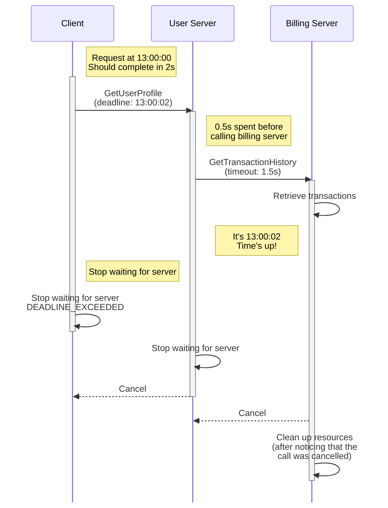

### 概述

截止时间用于指定客户端不愿意等待服务端响应的时间点。这个简单的想法对于构建健壮的分布式系统非常重要。客户端不会不必要地等待，服务端知道何时放弃处理请求，这将提高系统的资源利用率和延迟。

请注意，虽然某些语言 API 具有 __deadline__ 的概念，但其他语言 API 则使用 __timeout__ 的概念。当 API 要求截止时间时，您需要提供一个调用不应超过的时间点。超时是调用可以持续的最长时间。通过将超时添加到应用程序开始调用时的当前时间，可以将超时转换为截止时间。为简单起见，我们在本文档中仅提及截止时间。

### 客户的截止时间

默认情况下，gRPC 不设置截止时间，这意味着客户端可能会永远有效地等待响应。为了避免这种情况，您应该始终明确地为您的客户设定一个现实的截止时间。为了确定适当的截止时间，您最好根据您对系统的了解（网络延迟、服务端处理时间等）进行有根据的猜测，并通过一些负载测试进行验证。

如果服务端在处理请求时超过了截止时间，客户端将放弃并导致 RPC 失败，状态为 `DEADLINE_EXCEEDED`。

### 服务端上的截止时间

服务端可能会在不切实际的短期限内从客户端接收 RPC，这不会给服务端足够的时间来及时响应。这将导致服务端浪费宝贵的资源，并且在最坏的情况下，服务端崩溃。 gRPC 服务端通过在客户端设置的截止时间过后自动取消调用（`CANCELLED` 状态）来处理这种情况。

请注意，服务端应用程序负责停止它为服务 RPC 而产生的任何活动。如果您的应用程序正在运行长时间运行的进程，您应该定期检查启动它的 RPC 是否已被取消，如果是，则停止处理。

#### 截止时间传播

您的服务端可能需要调用另一台服务端来生成响应。在这些情况下，您的服务端也充当客户端，您可能希望遵守原始客户端设置的截止时间。一些 gRPC 实现支持自动将截止时间从传入 RPC 传播到传出 RPC。在某些语言中，需要显式启用此行为（例如 C++），而在其他语言中，则默认启用此行为（例如 Java 和 Go）。使用此功能可以让您避免手动添加每个传出 RPC 的截止时间的容易出错的方法。

由于截止时间是设定的时间点，因此将其按原样传播到服务端可能会出现问题，因为两个服务端上的时钟可能不同步。为了解决这个问题，gRPC 将截止时间转换为超时，并从中扣除已经过去的时间。这可以保护您的系统免受任何时钟偏差问题的影响。

### 语言支持

|语言|例子|
|----------|------------------|
|Java|[Java 示例]|
|Go|[Go 示例]|
|C++|[C++ 示例]|
|Python|[Python 示例]|

[Java 示例]: https://github.com/grpc/grpc-java/tree/master/examples/src/main/java/io/grpc/examples/deadline

[Go 示例]: https://github.com/grpc/grpc-go/tree/master/examples/features/deadline

[C++ 示例]: https://github.com/grpc/grpc/tree/master/examples/cpp/deadline

[Python 示例]: https://github.com/grpc/grpc/tree/master/examples/python/timeout

### 其他资源

- [截止时间博客文章](https://grpc.io/blog/deadlines/)
