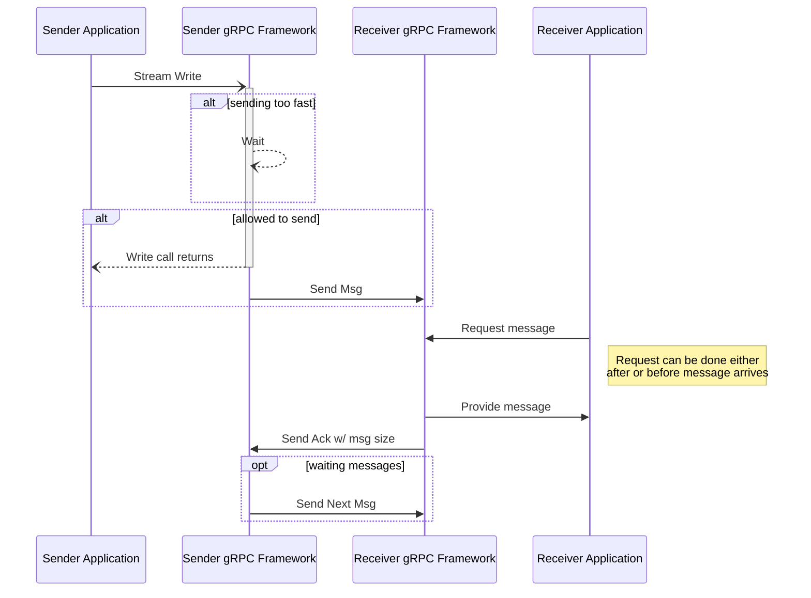

### 概述

流量控制是一种确保消息接收者不会被快速发送者淹没的机制。  流量控制可防止数据丢失、提高性能并提高可靠性。  它适用于流式 RPC，与一元 RPC 无关。  默认情况下，gRPC 会为您处理与流控制的交互，但某些语言允许您覆盖默认行为并采取显式控制。

gRPC 利用底层传输来检测何时可以安全地发送更多数据。当接收端读取数据时，会向发送方返回一个确认，让其知道接收方有更多容量。

根据需要，gRPC 框架将在从写入调用返回之前等待。  在 gRPC 中，当将值写入流时，并不意味着它已通过网络发出。相反，它已被传递到框架，该框架现在将处理缓冲它并通过网络将其发送到操作系统的具体细节。
从服务端写入客户端的流程与客户端写入服务端时的流程相同

如果客户端和服务端都进行同步读取或使用手动流控制，并且都尝试进行大量写入而不进行任何读取，则可能会出现死锁。
### 语言支持

|语言|例子| 
|----------|------------------|
|Java|[Java 示例][]|

[Java Example]: https://github.com/grpc/grpc-java/tree/master/examples/src/main/java/io/grpc/examples/manualflowcontrol
