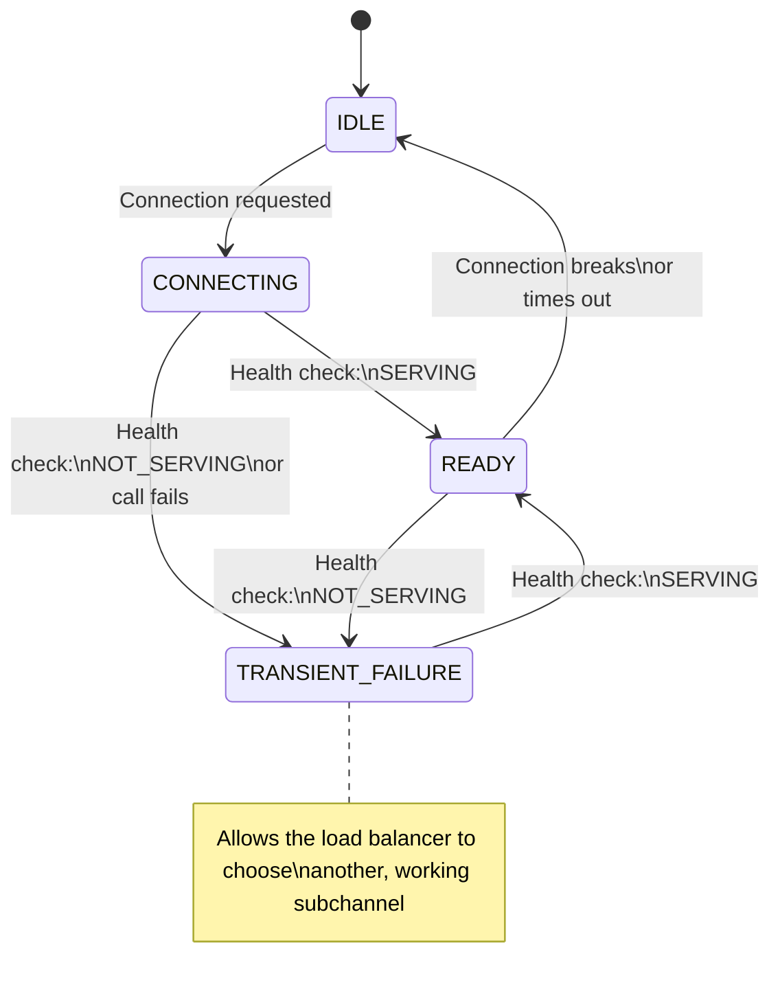

### 概述

gRPC 指定了一个标准服务 API ([health/v1])，用于对 gRPC 服务端执行运行状况检查调用。提供了此服务的实现，但您有责任更新您的服务的健康状态。

在客户端，您可以让客户端自动与后端的健康服务进行通信。这使得客户可以避免被认为不健康的服务。

### 服务端健康服务

gRPC服务端上的健康检查服务支持两种操作模式：

- 对 `Check` rpc 端点的一元调用
- 对于集中监控或负载均衡解决方案很有用，但确实
无法扩展以支持一组 gRPC 客户端不断进行运行状况检查
- 使用 `Watch` rpc 端点流式传输运行状况更新
- 由 gRPC 客户端中的客户端健康检查功能使用

在服务端上启用健康检查服务涉及以下步骤：

1、使用提供的健康检查库创建健康检查服务
2. 将健康检查服务添加到您的服务端。
3. 当您的一项服务运行状况良好时，通知健康检查库
变化。
- `NOT_SERVING` 如果您的服务目前无法接受请求
- `SERVING`（如果您的服务已开放）
- 如果您不关心个别服务的健康状况，您可以使用
一个空字符串（“”）来表示整个服务端的健康状况。
4. 确保通知健康检查库有关服务端关闭的信息，以便
它可以通知所有连接的客户端。

确切的详细信息因语言而异，请参阅下面的**语言支持**部分。


### 启用客户端健康检查

通过修改通道的 [service config]，可以将 gRPC 客户端配置为对其连接的服务端执行运行状况检查。例如。监控您将使用的 `foo` 服务的运行状况（JSON 格式）：

```json
{
  "healthCheckConfig": {
    "serviceName": "foo"
  }
}
```

请注意，如果您的服务端报告空字符串（“”）服务的运行状况，表示整个服务端的运行状况，您也可以在此处使用空字符串。

启用运行状况检查会改变调用服务端的一些行为：

- 客户端将另外调用 `Watch` RPC 进行健康检查
连接建立时的服务
- 如果调用失败，将重试（使用指数退避），除非
调用失败，状态为未实现，在这种情况下，运行状况检查将被禁用。
- 在健康检查服务发送健康信息之前，不会发送请求
被调用服务的状态
- 如果健康的服务变得不健康，客户端将不再发送
对该服务的请求
- 如果服务稍后恢复正常，调用将恢复
- 某些负载均衡策略可以选择禁用健康检查，如果
该功能对策略没有意义（例如 `pick_first` 会这样做）

更具体地说，子通道的状态（表示与服务端的物理连接）根据其所连接的服务的运行状况经历这些状态。




同样，有关如何启用客户端运行状况检查的具体信息因语言而异，请参阅**语言支持**部分中的示例。

### 语言支持

|语言|例子| 
|----------|------------------|
|Java|[Java 示例]|
|Go|[Go 示例]|
|Python|[Python 示例]|
|C++|[C++ 示例]|


[health/v1]:https://github.com/grpc/grpc-proto/blob/master/grpc/health/v1/health.proto
[service config]:https://github.com/grpc/grpc/blob/master/doc/service_config.md
[Java example]:https://github.com/grpc/grpc-java/tree/master/examples/src/main/java/io/grpc/examples/healthservice
[Go example]:https://github.com/grpc/grpc-go/tree/master/examples/features/health
[Python example]:https://github.com/grpc/grpc/tree/master/examples/python/health_checking
[C++ example]:https://github.com/grpc/grpc/tree/master/examples/cpp/health
