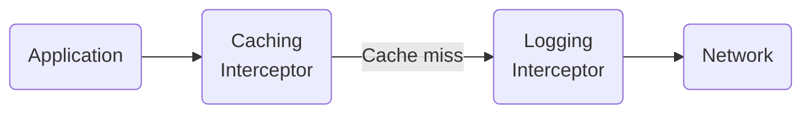
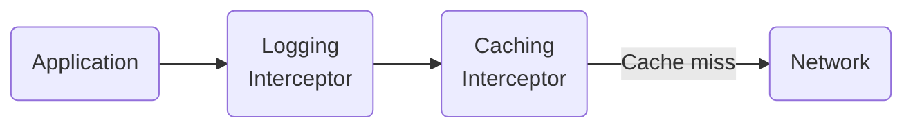

### 概述

制作gRPC服务的核心是实现RPC方法。但某些功能独立于正在运行的方法，并且应适用于所有或大多数 RPC。拦截器非常适合这项任务。

### 何时使用拦截器

您可能已经熟悉拦截器的概念，但可能习惯称它们为“过滤器”或“中间件”。拦截器非常适合实现不特定于单个 RPC 方法的逻辑。它们也很容易在不同的客户端或服务端之间共享。拦截器是扩展 gRPC 的一种重要且常用的方式。您可能会发现您想要的一些功能已经可以作为更广泛的 gRPC 生态系统中的拦截器使用。

拦截器的一些示例用例是：

* [元数据](https://grpc.io/docs/guides/metadata/) 处理
* 日志记录
* 故障注入
* 缓存
* 指标
* 策略执行
* 服务端验证
* 服务端授权
虽然客户端认证可以通过拦截器完成，但 gRPC 提供了更适合该任务的专用“调用凭据”API。有关客户端认证的详细信息，请参阅[认证指南](https://grpc.io/docs/guides/auth/)。
### 如何使用拦截器

构建 gRPC 通道或服务端时可以添加拦截器。然后为该通道或服务端上的每个 RPC 调用拦截器。客户端拦截器 API 与服务端拦截器 API 不同，因此拦截器可以是“客户端拦截器”或“服务端拦截器”。

拦截器本质上是每次调用的；它们对于管理 TCP 连接、配置 TCP 端口或配置 TLS 没有用处。虽然它们是大多数定制的正确工具，但它们并不能用于所有用途。

#### 拦截命令

当使用多个拦截器时，它们的顺序很重要。您需要确保了解 gRPC 实现执行它们的顺序。将拦截器视为位于应用程序和网络之间的线路是很有用的。一些拦截器将“更接近网络”，并且对发送的内容有更多的控制，而其他拦截器将“更接近应用程序”，可以更好地了解应用程序的行为。

假设您有两个客户端拦截器：一个缓存拦截器和一个日志记录拦截器。它们应该按什么顺序排列？您可能希望日志拦截器更靠近网络，以更好地监视应用程序的通信并忽略缓存的 RPC：

或者您可能希望它更接近应用程序以了解应用程序的行为并查看它正在加载哪些信息：

您只需更改拦截器的顺序即可在这些选项之间进行选择。

### 语言支持

|语言|例子|
|----------|------------------|
|C++|[C++ 示例]|
|Go|[Go 示例]|
|Java|[Java 示例]|
|Python|[Python 示例]|

[C++ 示例]: https://github.com/grpc/grpc/tree/master/examples/cpp/interceptors
[Go 示例]: https://github.com/grpc/grpc-go/tree/master/examples/features/interceptor
[Java 示例]: https://github.com/grpc/grpc-java/tree/master/examples/src/main/java/io/grpc/examples/header
[Python 示例]: https://github.com/grpc/grpc/tree/master/examples/python/interceptors
