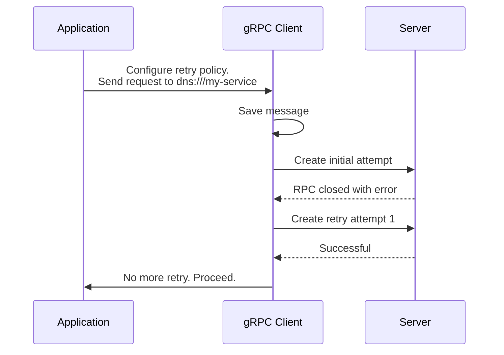

### 概述

重试是使服务更加可靠的关键模式。通过重新尝试失败的操作，应用程序可以克服网络或服务端故障等临时问题。这对于现代云应用程序处理不可避免的瞬态故障至关重要。

对于最佳实践，应用程序应该了解哪些失败的操作适合重试，定义重试延迟的指数退避参数，确定重试尝试的次数，并监视重试指标。


### gRPC 客户端重试的工作原理

gRPC 的内置重试逻辑会保存潜在重试的调用历史记录并监视 RPC 事件。即使没有配置重试策略，gRPC 仍然会保存调用的历史记录，以防需要执行透明重试（在后面的部分中讨论）。请注意，“重试”意味着用新调用替换失败的调用，并在新创建的调用上重播调用历史记录。

如果满足某些条件 - RPC 关闭并显示与重试策略的可重试状态码匹配的失败状态码，并且保持在重试尝试限制内 - gRPC 将在指数退避延迟后创建新的重试流。

gRPC 还支持其他功能，例如重试限制和服务端推回。有关更多详细信息，请参阅[客户端重试的 gRFC]。

一旦收到响应头，就提交 RPC。不会再尝试重试，gRPC 将 RPC 移交给应用程序。

下图显示了 gRPC 重试内部的架构概述。




### 重试配置
默认情况下启用重试，但没有默认的重试策略。如果没有重试策略，gRPC 在大多数情况下无法安全地重试 RPC。仅重试由于低级别竞争而失败的 RPC，并且仅当 gRPC 确定 RPC 尚未被服务端处理时。这称为“透明重试”。您可以配置重试策略，以允许 gRPC 在更多情况下、更积极地重试 RPC。您还可以在创建通道时完全禁用重试，这会禁用透明重试和任何配置的重试策略。
失败可能发生在不同的阶段。即使没有明确的重试策略，gRPC 也可以执行透明的重试。这些重试的程度取决于失败发生的时间：
* 当 RPC 从未离开客户端时，gRPC 可能会进行无限的透明重试。
* 当 RPC 到达 gRPC 服务端库时，gRPC 执行单次透明重试，但从未被服务端应用程序逻辑看到。请注意这种类型的重试，因为它会增加网络负载。
您可以通过关注 gRPC 支持的关键步骤和配置来优化应用程序的重试功能。
* 最大重试次数
* 指数退避
* 可重试的状态码集

重试可通过 [gRPC Service Config] 以每个方法的粒度进行配置。   该配置包含以下旋钮：

```
"retryPolicy": {
  "maxAttempts": 4,
  "initialBackoff": "0.1s",
  "maxBackoff": "1s",
  "backoffMultiplier": 2,
  "retryableStatusCodes": [
    "UNAVAILABLE"
  ]
}
```

退避延迟采用正负 20% 的抖动，以避免大量客户端同时对服务端造成影响。  在上面的示例配置中，`initialBackoff` 设置为 100ms，因此第一次尝试后的实际退避延迟将是 `[80ms, 120ms]` 范围内的随机时间段。

gRPC 支持油门限制，防止因重试而导致服务端过载。以下是重试节流配置的示例：

```
"retryThrottling": {
  "maxTokens": 10,
  "tokenRatio": 0.1
}
```

对于每个服务端，gRPC 客户端都会跟踪 `token_count`（最初设置为 `maxTokens`）。失败的 RPC 将计数减 1，成功的 RPC 将计数增加 `tokenRatio`。  如果 `token_count` 低于 `maxTokens` 的一半，则重试将暂停，直到计数恢复。

此外，请求对冲是重试的补充功能，并且可以进行类似的配置。更多详情请参见【套期保值指南】。

### 重试可观察性

gRPC 支持在启用重试功能时公开 OpenCensus 和 OpenTelemetry 指标。以下是可用的 OpenTelemetry 重试尝试统计信息的示例：
* `grpc.client.attempt.started`
* `grpc.client.attempt.duration`
* `grpc.client.attempt.sent_total_compressed_message_size`
* `grpc.client.attempt.rcvd_total_compressed_message_size`

每个校准级别的指标：
* `grpc.client.call.duration`

和服务端指标：
* `grpc.server.call.started`
* `grpc.server.call.sent_total_compressed_message_size`
* `grpc.server.call.rcvd_total_compressed_message_size`
* `grpc.server.call.duration`

在 [gRFC for Otel 指标]、[gRFC for retry status] 中查找深入的指标和跟踪信息以及配置说明。


### 语言指南和示例

|语言|例子|文档|
|----------|------------------|----------------------|
|C++|[C++ 示例]|                      |
|Go|[Go 示例]| 		                 |
|Java|[Java 示例]|[Java 文档]|
|Python|[Python 示例]|                      | 


### 其他资源

* [客户端重试的gRFC]
* [重试状态的gRFC]
*【套期保值指南】
* [gRPC服务配置]
* [酒店指标的 gRFC]

[gRFC for client side retry]: https://github.com/grpc/proposal/blob/master/A6-client-retries.md  
[gRFC for retry status]:https://github.com/grpc/proposal/blob/master/A45-retry-stats.md
[C++ 示例]: https://github.com/grpc/grpc/tree/master/examples/cpp/retry
[Go 示例]: https://github.com/grpc/grpc-go/tree/master/examples/features/retry
[Java 示例]: https://github.com/grpc/grpc-java/tree/master/examples/src/main/java/io/grpc/examples/retrying
[Python 示例]: https://github.com/grpc/grpc/tree/master/examples/python/retry
[Java Documentation]: https://grpc.github.io/grpc-java/javadoc/io/grpc/ManagedChannelBuilder.html#enableRetry()
[请求对冲指南](https://grpc.io/docs/guides/request-hedging/)
[gRPC 服务配置](https://grpc.io/docs/guides/service-config)
[gRFC for Otel metrics]:https://github.com/grpc/proposal/blob/master/A66-otel-stats.md
