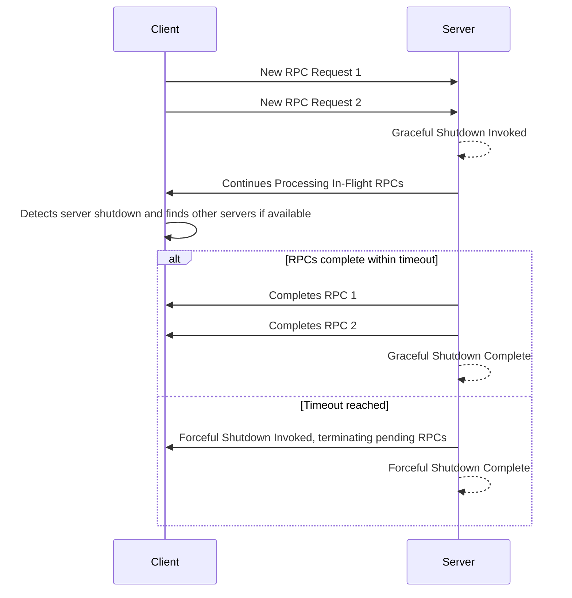
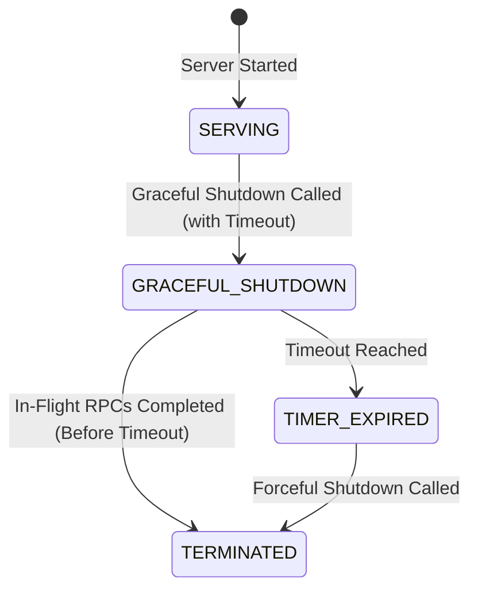

### 概述

gRPC 服务端通常需要正常关闭，以确保正在进行的 RPC 在合理的时间范围内完成，并且不再接受新的 RPC。 “优雅关闭功能”促进了这一过程，允许服务端平稳过渡，而不会突然终止活动连接。

当调用“Graceful shutdown 函数”时，服务端立即通知所有客户端停止发送新的 RPC。然后，在客户端收到该通知后，服务端将停止接受新的 RPC。允许进行中的 RPC 继续进行，直到完成或达到指定的截止时间。一旦所有活动的 RPC 完成或截止时间到期，服务端将完全关闭。

由于正常关闭有助于防止客户端遇到 RPC 故障，因此应尽可能使用它。  但是，gRPC 还提供了强制关闭机制，该机制将立即导致服务端停止服务并关闭所有连接，从而导致任何正在进行的 RPC 失败。

### 如何优雅地关闭服务端

“正常关机功能”的具体实现因您所使用的编程语言而异。然而，一般模式包括：

- 通过调用“Graceful shutdown
gRPC 服务端对象上的“函数”。此函数会阻塞，直到所有当前正在运行的 RPC 完成。这可确保允许进行中的请求完成处理。
- 指定超时期限以限制正在进行的 RPC 允许的时间
结束。使用计时器机制（取决于您的语言）在服务端对象上单独调用“强制关闭函数”以在预定义的持续时间后触发强制关闭是至关重要的。这充当了安全网的作用，确保即使某些正在进行的 RPC 没有在合理的时间范围内完成，服务端最终也会关闭。这可以防止无限期阻塞。

下面显示了正常关闭过程中发生的事件的顺序。当调用服务端的正常关闭时，正在进行的 RPC 会继续处理，但新的 RPC 会被拒绝。如果某些正在进行的 RPC 未及时完成，服务端将被强制关闭。

以下是基于状态的视图

### 语言支持

|语言|例子|
|----------|------------------|
|C++|                  |
|Go|[Go 示例]|
|Java|[Java 示例]|
|Python|                  |

[Go 示例]: https://github.com/grpc/grpc-go/tree/master/examples/features/gracefulstop
[Java 示例]: https://github.com/grpc/grpc-java/tree/master/examples/example-hostname/src/main/java/io/grpc/examples/hostname
