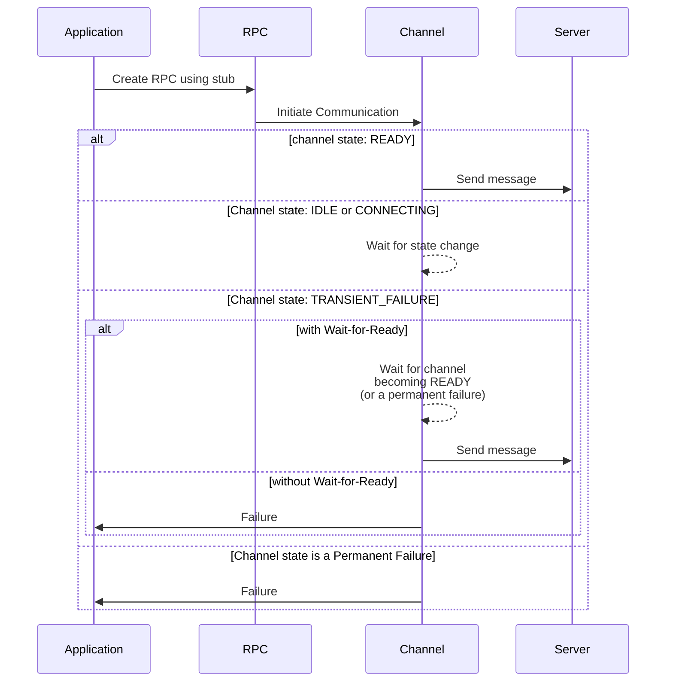
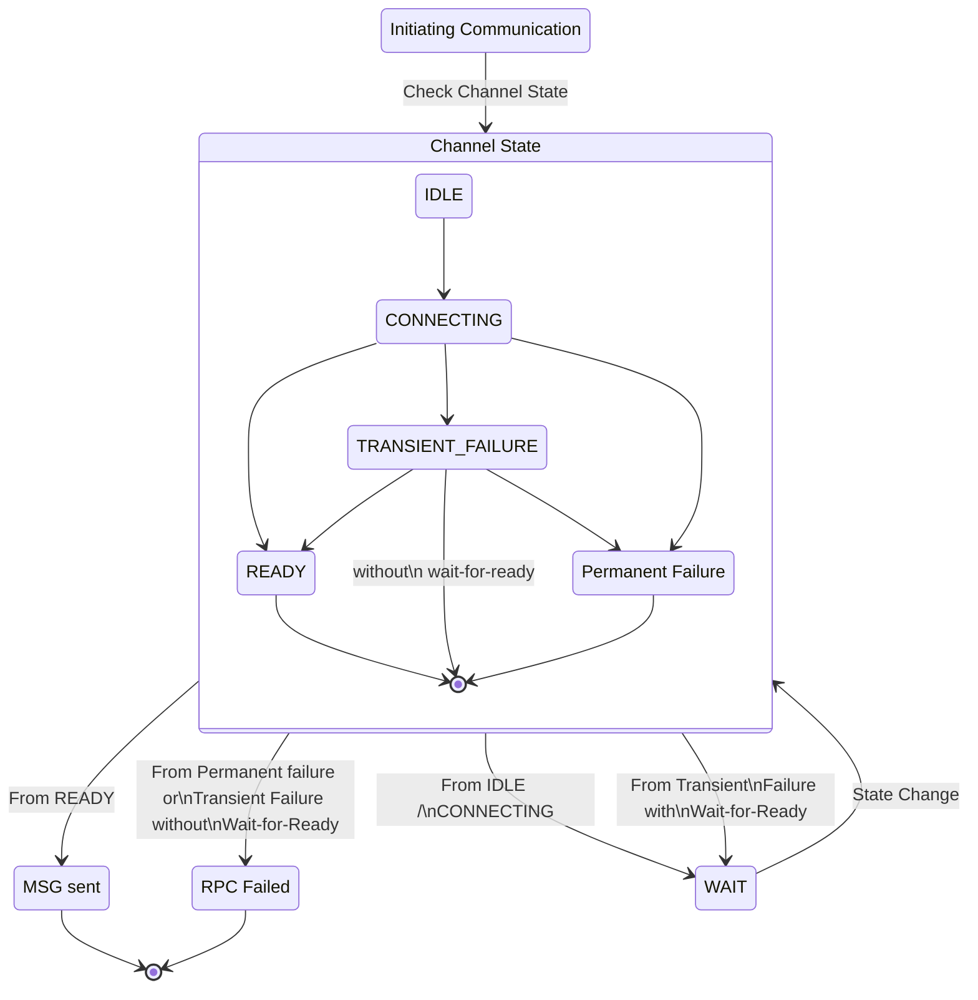

### 概述

这是一个可以在存根上使用的功能，它会导致 RPC 在发送请求之前等待服务端变得可用。  这允许强大的批处理工作流程，因为暂时的服务端问题不会导致故障。截止时间仍然适用，因此如果超过截止时间，等待将被中断。

当创建RPC时通道连接服务端失败，如果没有Wait-for-Ready会立即返回失败；使用等待就绪，它将简单地排队直到连接准备好。  默认为**无**等待就绪。

有关详细语义，请参阅[this][grpc doc]。

### 如何使用等待就绪

您可以为存根指定是否应使用 Wait-for-Ready，它将在创建 RPC 时自动传递。
除了服务端未准备好之外，RPC 仍然可能因其他原因而失败，因此错误处理仍然是必要的。
下面显示了当客户端向服务端发送消息时发生的事件序列，具体取决于通道状态以及是否设置了 Wait-for-Ready。

以下是基于状态的视图

### 替代方案

- 循环（使用指数退避）直到 RPC 停止返回瞬态故障。
- 为了提高效率，可以将其与实现 `onReady` 处理程序结合起来
_（对于支持此功能的语言）_。
- 接受可能通过等待避免的失败，因为你想
快速失败

### 语言支持

|语言|例子|
|----------|-------------------|
|Java|[Java 示例]|
|Go|[Go 示例]|
|Python|[Python 示例]|

[Java 示例]: https://github.com/grpc/grpc-java/blob/master/examples/src/main/java/io/grpc/examples/waitforready/WaitForReadyClient.java
[Go 示例]: https://github.com/grpc/grpc-go/tree/master/examples/features/wait_for_ready
[Python 示例]: https://github.com/grpc/grpc/tree/master/examples/python/wait_for_ready
[grpc doc]: https://github.com/grpc/grpc/blob/master/doc/wait-for-ready.md
