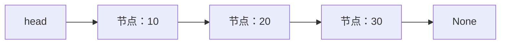

# 2.1. 数组与链表的访问模型

先修建议：[列表、元组、集合与字典](./collections)。

数组按位置访问，链表通过节点连接访问。学习它们不是为了替代内置容器，而是理解为什么某些操作很快、另一些操作要遍历或搬移。

## 动态序列与同类型数组 {#concept-1}

Python list 保存对象引用，适合一般变长序列；array.array 保存指定类型的基本值，适合有明确数值类型的紧凑序列。大规模数值计算通常复用 NumPy，不为课程手写数值数组库。

```python
from array import array

values = [10, 20, 30]
assert values[1] == 20
numbers = array("i", [1, 2, 3])
assert numbers.tolist() == [1, 2, 3]
values.insert(1, 99)
assert values == [10, 99, 20, 30]
```

按索引访问 list 通常 O(1)，在中间插入或头部删除可能移动后续引用，通常 O(n)；尾部 append 通常是摊还 O(1)。复杂度描述规模趋势，不表示每次操作恰好相同耗时。

## 链表按连接找下一项 {#concept-2}



最小教学模型用字典表示节点，不引入完整链表框架：

```python
head = {"value": 10, "next": {"value": 20, "next": None}}
current = head
seen = []
while current is not None:
    seen.append(current["value"])
    current = current["next"]
assert seen == [10, 20]
head = {"value": 5, "next": head}
assert head["next"]["value"] == 10
```

头部插入改变连接，不移动已有节点；但要找第 k 项仍需沿连接走 k 步。所谓“链表插入 O(1)”以已知插入位置节点为条件，定位位置可能是 O(n)。节点还需要连接和分配空间，不是任何时候都比 list 好。

## 选择依据 {#concept-3}

| 主要需求 | 起点 |
| --- | --- |
| 随机索引和批量遍历 | list，数值数组看 array/NumPy。 |
| 两端进出 | collections.deque。 |
| 理解节点和连接 | 本节最小模型，只用于教学。 |
| 业务中复杂链结构 | 优先成熟库或已有数据模型，不造通用链表。 |

## 动手练习与验收 {#lab}

1. 说明“已知节点后插入”和“按位置查找再插入”的成本差别。
2. 遍历空链、单节点和三节点，断言访问顺序。
3. 给 list 头部删除和 deque.popleft 做独立实验，后续基准应固定规模再比较。

依据：[序列类型](https://docs.python.org/3/library/stdtypes.html#sequence-types-list-tuple-range)、[array](https://docs.python.org/3/library/array.html)、[deque](https://docs.python.org/3/library/collections.html#collections.deque)。
