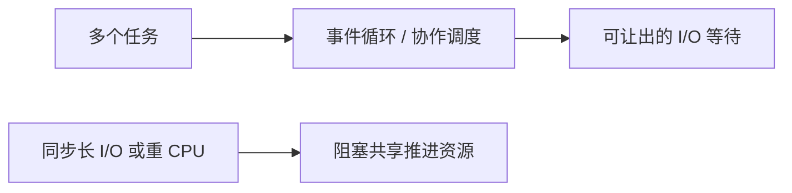

# 8.5. gevent、aiohttp、Tornado 与 Sanic

先修建议：[框架路线、WSGI 与 ASGI](./frameworks)。

原图异步分支包括 gevent、aiohttp、Tornado 和 Sanic。先区分 greenlet 与 asyncio，再认识库提供客户端还是服务端，以及哪些操作能让其他任务继续推进。

## gevent：greenlet 协作模型 {#concept-1}

独立环境安装 gevent，以下示例使用其自身的协作等待：

```python
import gevent

results = []
def work(value):
    gevent.sleep(0.001)
    results.append(value * value)

jobs = [gevent.spawn(work, n) for n in range(3)]
gevent.joinall(jobs, raise_error=True)
assert sorted(results) == [0, 1, 4]
```

这不是原生 asyncio 协程。某些同步库需 monkey patch 才能协作，patch 顺序与影响是进程范围行为，按库文档在隔离脚本/既有框架中处理，不随意对任意项目全局打补丁。

## aiohttp：HTTP 客户端和服务端 {#concept-2}

安装 aiohttp，以下定义一个服务，作为独立脚本运行会监听本机：

```python
from aiohttp import web

async def hello(request):
    return web.json_response({"message": "Python 课程"})

app = web.Application()
app.router.add_get("/hello", hello)
if __name__ == "__main__":
    web.run_app(app, host="127.0.0.1", port=8080)
```

客户端使用 ClientSession，在 async with 中管理会话，检查状态、限制响应和设置 timeout。Session 复用连接，不能每次请求都建一套不受控连接。异步请求并不替代字段校验和重试契约。

## Tornado 与 Sanic 的路由入口 {#concept-3}

Tornado 使用 RequestHandler、Application 和 asyncio/IOLoop 协作。片段需放在已配置应用中：

```python
import tornado.web

class Hello(tornado.web.RequestHandler):
    async def get(self):
        self.write({"message": "Python 课程"})

application = tornado.web.Application([(r"/hello", Hello)])
```

Sanic 的定义示例，独立脚本运行会启动本机服务：

```python
from sanic import Sanic
from sanic.response import json

app = Sanic("python_course")
@app.get("/hello")
async def hello(request):
    return json({"message": "Python 课程"})

if __name__ == "__main__":
    app.run(host="127.0.0.1", port=8000)
```

分别按维护者文档配置服务生命周期、worker、超时与测试工具，不把不同框架的请求对象、中间件和上下文直接混用。

## 阻塞与背压 {#concept-4}



限制活动请求、队列长度与总预算，取消后关闭连接和等待后台任务。CPU 工作通常移到进程/任务服务或成熟库，不能因为 def 改为 async def 就期待并行加速。

## 动手练习与验收 {#lab}

1. 对同一 JSON 接口检查状态、字段、未知路径和错误场景。
2. 将同步 sleep 放入异步入口，观察阻塞，再改为合适协作等待。
3. 在 gevent 和 asyncio 中分别说明取消、错误收拢与资源释放方案。

依据：[gevent](https://www.gevent.org/)、[aiohttp](https://docs.aiohttp.org/en/stable/)、[Tornado](https://www.tornadoweb.org/en/stable/)、[Sanic](https://sanic.dev/en/)。
