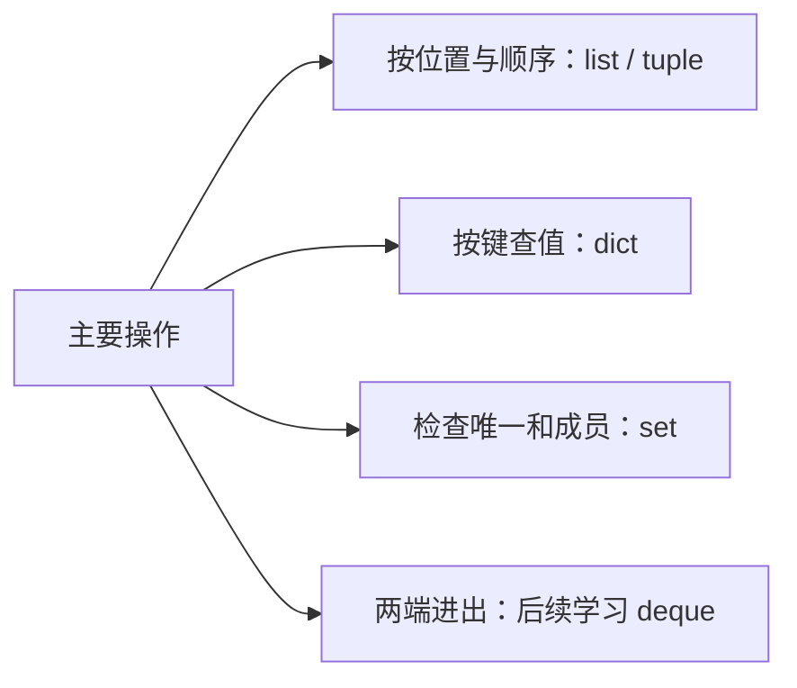

# 1.5. 列表、元组、集合与字典

先修建议：[变量、数据类型与类型转换](./variables)、[条件、循环与终止条件](./control-flow)。

容器选型先看访问方式：是否有顺序，是否允许重复，按位置还是按键查找，是否需要原地修改。内置容器已经能处理许多任务，不必先建立自己的集合框架。

## 四种内置容器 {#concept-1}

| 类型 | 适合 | 注意 |
| --- | --- | --- |
| list | 有序、变长序列 | 可变，复制是浅复制；头部删除可能移动元素。 |
| tuple | 固定组合或不可重新赋值的序列 | 可包含可变对象，外层不可变不等于深层不可变。 |
| set | 唯一性、成员查询、集合运算 | 元素需可哈希，不依赖遍历顺序。 |
| dict | 按键映射值 | 键需可哈希，保留插入顺序但不自动按键排序。 |

```python
names = ["Go", "Python", "Python"]
assert names[1:] == ["Python", "Python"]
assert set(names) == {"Go", "Python"}
location = ("上海", 8)
city, hour = location
assert city == "上海" and hour == 8
counts = {"Python": 2, "Go": 1}
assert counts.get("Rust", 0) == 0
```

## 修改、返回值与副本 {#concept-2}

```python
items = [1, 2]
result = items.append(3)
assert result is None
assert items == [1, 2, 3]
rows = [[1], [2]]
copied = rows.copy()
copied[0].append(9)
assert rows == [[1, 9], [2]]
```

append 等原地修改方法通常返回 None，不能写 `items = items.append(...)` 并期待新列表。浅复制只复制外层引用；需要逐层独立时明确复制深度，复杂对象可用 copy.deepcopy，但仍应理解共享语义。

## 查找与聚合 {#concept-3}

```python
from collections import Counter

words = "Python Go Python".split()
counts = Counter(words)
assert counts["Python"] == 2
assert counts["Rust"] == 0
assert sorted(counts.items()) == [("Go", 1), ("Python", 2)]
assert {1, 2} & {2, 3} == {2}
assert {1, 2} - {2, 3} == {1}
```

`dict[key]` 缺失抛 KeyError，get 可提供默认。需要区分缺失与合法 None 时用 `key in mapping` 或专门哨兵。Counter 复用已有计数方案，输出排序由接口契约决定。

## 数据结构的成本 {#concept-4}



list 不是 C 意义上的同类型值数组，而是保存对象引用的动态序列。成员查询大集合时反复扫描 list 与使用 set 的成本不同；算法单元将通过实验进一步解释。

## 动手练习与验收 {#lab}

1. 按第一次出现顺序去重，测试空输入和重复项。
2. 比较 dict 插入顺序与 sorted(keys)，说明什么时候必须排序。
3. 对嵌套列表说明“外层复制了，内部为何仍共享”。

依据：[数据结构教程](https://docs.python.org/zh-cn/3/tutorial/datastructures.html)、[collections](https://docs.python.org/3/library/collections.html)。
