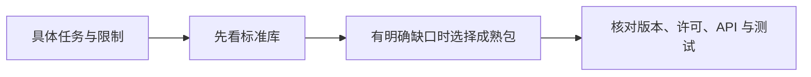

# 6.3. 常用包与技术选型

先修建议：[PyPI、pip、Conda、uv 与 Poetry](./package-managers)。

原图的 Common Packages 没限定一套必须全部安装的包。本节按职责选成熟方案，为后续框架、测试和应用项目提供明确入口。

## 从问题选工具 {#concept-1}

| 需求 | 起点 | 继续确认 |
| --- | --- | --- |
| HTTP 客户端 | 标准 urllib；项目用 HTTPX/Requests | 超时、重试、响应和连接寿命。 |
| 数据验证 | Pydantic | 转换、严格性、未知字段和版本。 |
| 表格 / 数值 | pandas / NumPy | 规模、缺失值、精度与内存。 |
| 测试 | unittest / pytest | 隔离、断言和外部边界。 |
| 数据库 | sqlite3，或成熟驱动/ORM | 参数化查询、事务、约束和迁移。 |
| CLI、日志、时间、路径 | argparse、logging、datetime、pathlib | 标准库通常足够，不先加入框架。 |

同一类别优先一种主方案，避免新手把多个 ORM、HTTP 客户端和配置库叠在一起。包越多不代表课程掌握得越完整，每项依赖应能解释用途。

## 如何判断包是否合适 {#concept-2}

查维护者文档、发布版本、支持 Python 范围、许可证、依赖图和示例。名称相似不证明同一项目；安全与升级决策要结合真实调用。学历史课程时核对过时 API，不因为代码能在视频里运行就沿用同样环境。

应用细节见 [HTTP](./http)、[数据库](./databases)、[数据分析](./data)；这些课程属于路线补充，不把它们伪称原图独立节点。

## 动手练习与验收 {#lab}

1. 给一个小任务只选必要依赖，写明每项职责。
2. 查一个包的官方 API、Python 要求与许可，再运行最小示例。
3. 去掉没有实际用途的同类依赖，确认行为测试仍通过。

依据：[PyPI](https://pypi.org/)、[HTTPX](https://www.python-httpx.org/)、[pandas](https://pandas.pydata.org/docs/)、[NumPy](https://numpy.org/doc/)。
