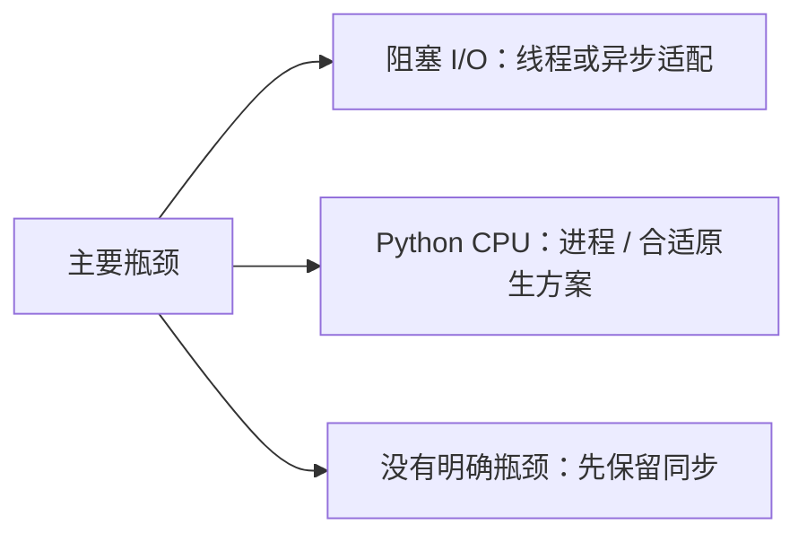

# 9.1. 并发模型、GIL 与选择依据

先修建议：[函数、内置函数与作用域](./functions)、[异常、异常链与清理](./exceptions)。

并发让任务交错推进，并行让任务在多个执行资源上同时工作。性能收益取决于等待、CPU 工作、数据传递和依赖条件，不能用线程数代替瓶颈分析。

## 按负载选模型 {#concept-1}

| 工作 | 起点 | 关键成本 |
| --- | --- | --- |
| 少量顺序操作 | 同步程序 | 最容易验证，先确认确有等待瓶颈。 |
| 多个阻塞 I/O | 有界线程池 | 共享状态、库线程安全和连接上限。 |
| Python CPU 密集工作 | 进程或合适原生实现 | 序列化、启动、内存与任务粒度。 |
| 大量支持异步的 I/O | asyncio / 匹配框架 | 阻塞调用、背压、预算和取消。 |



## GIL 的范围 {#concept-2}

常规启用 GIL 的 CPython 通常限制 Python 字节码在线程中同时执行；某些 I/O 和原生扩展会释放 GIL。GIL 不保证多步业务不变量安全，也不保证所有线程任务都无收益。

从 3.13 开始有自由线程构建，可关闭 GIL，实际状态、依赖兼容性和性能仍需核对。不是“所有 Python 都有 GIL”，也不是“新版本自动没有 GIL”。

```python
import sys
import sysconfig

supports_free_threading = sysconfig.get_config_var("Py_GIL_DISABLED") == 1
status = sys._is_gil_enabled() if hasattr(sys, "_is_gil_enabled") else None
assert isinstance(supports_free_threading, bool)
print("自由线程构建支持：", supports_free_threading)
print("运行时 GIL 状态：", status)
```

3.12 中运行时状态 API 可能不存在，None 表示这里未获取，而不是断言没有 GIL。某些扩展在自由线程构建中也可能重新启用 GIL，按官方说明检查。

## 生命周期先于加速 {#concept-3}

每个任务应说明谁启动、谁等待、如何反馈失败、怎样取消、何时释放资源。限连接数不等于限任务数，线程/进程/协程都不能无界创建。退出时等待所需工作，后台任务不能靠 sleep 猜测结束。

## 动手练习与验收 {#lab}

1. 给一个 I/O 和一个 CPU 任务写出选型与测量计划。
2. 确认当前解释器构建与 GIL 条件，不把其他机器结论照搬。
3. 为任务生命周期列出成功、失败、超时和关闭行为。

依据：[自由线程 Python](https://docs.python.org/3/howto/free-threading-python.html)、[threading](https://docs.python.org/3/library/threading.html)、[并发执行](https://docs.python.org/3/library/concurrency.html)。
