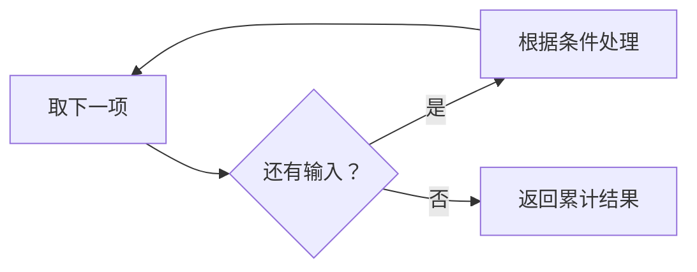

# 1.4. 条件、循环与终止条件

先修建议：[变量、数据类型与类型转换](./variables)。

控制流决定哪些语句执行、执行几次。写循环时同时明确已经处理的输入、每轮如何推进和何时结束，避免只会写语法却无法说明结果。

## 条件与短路 {#concept-1}

```python
def shipping(total):
    if total < 0:
        raise ValueError("金额不能为负")
    if total >= 100:
        return 0
    elif total >= 50:
        return 5
    return 10

assert shipping(120) == 0
assert shipping(60) == 5
assert shipping(20) == 10
```

条件按顺序选择，宽条件放在前面可能遮住后面的细条件。and/or 短路并返回某个操作数，不一定返回 bool；默认值表达要考虑 0 是否为合法输入。`match` 是结构匹配，简单范围判断仍用 if 更直接。

## for、range、while {#concept-2}

```python
values = [3, -1, 0, 8]
positive = []
for value in values:
    if value <= 0:
        continue
    positive.append(value)
assert positive == [3, 8]
assert list(range(1, 6, 2)) == [1, 3, 5]
```

range 的 stop 不包含，step 不能为零。for 从可迭代对象取下一项；while 根据条件重复，需让状态持续接近终止条件。用 enumerate 得索引，zip 对齐输入，别无条件手写索引循环。



## break、continue 与循环 else {#concept-3}

```python
def first_even(values):
    for value in values:
        if value % 2 == 0:
            found = value
            break
    else:
        return None
    return found

assert first_even([1, 3, 4, 6]) == 4
assert first_even([1, 3]) is None
assert first_even([]) is None
```

循环 else 在没有通过 break 退出时运行，不是“最后一个 if 的 else”。break 只退出最内层循环；需要退出多个层级时可让负责搜索的函数 return。

## 遍历时修改的边界 {#concept-4}

不要在遍历同一列表时随意删除元素，索引移动可能跳项；先生成新结果或遍历快照。字典迭代期间改变大小会失败。for 中给循环变量赋新值不会自动替换原列表元素，按索引修改或返回新列表更明确。

## 动手练习与验收 {#lab}

1. 测试 first_even 的空输入、无结果和第一项命中。
2. 给 while 分页模拟增加最大轮数和重复游标检测。
3. 把删除负数改成过滤新列表，解释为什么不修改原遍历对象。

依据：[控制流教程](https://docs.python.org/zh-cn/3/tutorial/controlflow.html)、[复合语句](https://docs.python.org/3/reference/compound_stmts.html)。
