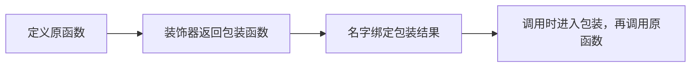

# 4.2. 装饰器、wraps 与函数包装

先修建议：[Lambda、函数值与闭包](./lambdas)。

装饰器在函数定义后把它交给另一个可调用对象，得到新的绑定。先理解包装发生时机，再处理参数、返回值和元数据。

## 包装一段行为 {#concept-1}

```python
from functools import wraps

calls = []
def record_call(function):
    @wraps(function)
    def wrapped(*args, **kwargs):
        calls.append(function.__name__)
        return function(*args, **kwargs)
    return wrapped

@record_call
def add(a, b):
    """返回两个值的和。"""
    return a + b

assert add(2, 3) == 5
assert calls == ["add"]
assert add.__name__ == "add"
assert add.__doc__ == "返回两个值的和。"
```

`@record_call` 在这里等价于定义后 `add = record_call(add)`。调用 add 时才执行 wrapped 的记录动作；装饰过程不是每次调用都重新发生。wraps 保留名字、文档与原函数关联，减少调试和工具识别问题。



## 多个装饰器与成熟工具 {#concept-2}

堆叠时从最靠近函数的装饰器向外应用，调用时按包装结构进入。日志、计时和认证可能受顺序影响，先画嵌套关系再测试。缓存优先使用 functools.cache/lru_cache，不手写通用缓存框架；参数需可哈希，缓存结果可变性和生命周期也要说明。

装饰器不应偷偷丢弃返回值、吞掉异常或改变调用契约。async 函数包装需要保持异步等待与取消语义，不能把同步 wrapper 无条件套到所有协程上。

## 动手练习与验收 {#lab}

1. 给包装器测试正常结果、异常传播、关键字参数和元数据。
2. 堆叠两个记录装饰器，预测定义与调用的顺序。
3. 用 lru_cache 包装纯计算，说明为什么含副作用操作不适合默认缓存。

依据：[functools.wraps](https://docs.python.org/3/library/functools.html#functools.wraps)、[装饰器语义](https://docs.python.org/3/reference/compound_stmts.html#function-definitions)。
