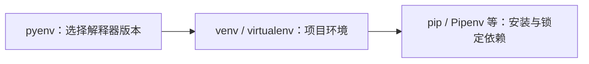

# 10.1. Pipenv、virtualenv 与 pyenv

先修建议：[PyPI、pip、Conda、uv 与 Poetry](./package-managers)。

版本管理决定使用哪一个 Python，环境隔离决定依赖装到哪里，锁定决定重建哪些版本。Pipenv、virtualenv、pyenv 分别参与不同层次。

## 三个层次 {#concept-1}



| 方案 | 责任 | 不应混淆 |
| --- | --- | --- |
| venv | 标准库环境隔离 | 不替你记录完整项目锁。 |
| virtualenv | 环境创建工具 | 不等于解释器版本管理。 |
| pyenv | 选择/安装解释器版本 | 不替你定义应用依赖。 |
| Pipenv | 项目环境与 Pipfile/锁工作流 | 与 Poetry/uv 等选一套主要流程。 |

## virtualenv 与 Pipenv {#concept-2}

在独立练习目录按官方安装工具：

```sh
python -m virtualenv .venv
# Pipenv 工作流在另一目录使用
pipenv --python 3.12
pipenv install httpx
pipenv run python -c "import sys; print(sys.executable)"
pipenv sync
```

命令要求相应解释器/工具已安装，版本范围以当前文档为准。Pipfile 描述需求，锁文件记录解析；同步与更新不是同一个动作。

## pyenv 与编辑器 {#concept-3}

pyenv local 选择当前项目解释器版本，具体版本号先按受支持范围与依赖需求确定。shell shim、编辑器与环境解释器可能不同，用 sys.executable 和 python --version 核对。不要复制 `.venv` 到另一平台当作部署。

## 动手练习与验收 {#lab}

1. 给一个项目写解释器、环境、锁和运行入口的完整说明。
2. 在新环境重建并运行测试，确认没有依赖系统偶然安装的包。
3. 解释为什么 pyenv local 和虚拟环境激活解决不同问题。

依据：[virtualenv](https://virtualenv.pypa.io/en/latest/)、[Pipenv](https://pipenv.pypa.io/en/latest/)、[pyenv](https://github.com/pyenv/pyenv)、[venv](https://docs.python.org/3/library/venv.html)。
