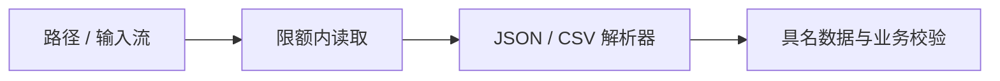

# 1.8. 文件、JSON、CSV 与标准库 I/O

先修建议：[异常、异常链与清理](./exceptions)。

文件是字节来源，解析器把字节或文本变成数据，业务再验证数据能否使用。本节是原路线的应用补充，为后续上下文管理器和完整项目建立 I/O 经验。

## 路径与资源生命周期 {#concept-1}

```python
from pathlib import Path
from tempfile import TemporaryDirectory

with TemporaryDirectory() as directory:
    path = Path(directory) / "notes.txt"
    path.write_text("学习 Python\n", encoding="utf-8")
    with path.open(encoding="utf-8") as source:
        assert source.readline() == "学习 Python\n"
```

明确编码，文本与二进制模式分开。with 在退出时关闭文件，资源协议后续独立讲解；小文件可 read_text，大输入考虑逐行或分块，不能无限读入内存。



## JSON 与 CSV {#concept-2}

```python
import csv
import io
import json

record = json.loads('{"title":"学习 Python","done":false}')
assert record["done"] is False
assert json.loads(json.dumps(record, ensure_ascii=False)) == record
rows = list(csv.DictReader(io.StringIO('name,note\nPython,"语言,工具"\n')))
assert rows == [{"name": "Python", "note": "语言,工具"}]
```

JSON 解析成功不等于字段与范围合法，外部边界用明确模型和校验。CSV 可能含引号、逗号和换行，复用 csv 而不是 split(',')。金额、日期和缺失值各有独立契约。

## 时间、日志与命令入口 {#concept-3}

日期用 datetime/date，精确金额用 Decimal 或整数分，路径用 pathlib，参数用 argparse，结构化事件用 logging。写输出文件时明确覆盖与原子替换需求，拒绝报告路径覆盖输入。异常由入口映射输出，退出码不由深层函数随意决定。

## 动手练习与验收 {#lab}

1. 从临时目录读取 UTF-8 文本，测试不存在的文件与错误编码。
2. 解析带逗号和换行的 CSV 字段，观察为何不能手工 split。
3. 给 JSON 添加缺字段、未知字段和过大输入，分别说明错误由哪层处理。

依据：[pathlib](https://docs.python.org/3/library/pathlib.html)、[json](https://docs.python.org/3/library/json.html)、[csv](https://docs.python.org/3/library/csv.html)。
