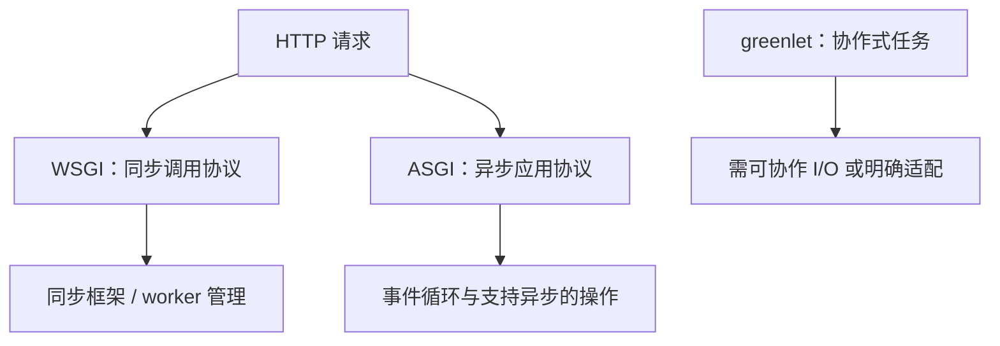

# 8.1. 框架路线、WSGI 与 ASGI

先修建议：[内置模块、自定义模块与导入](./modules)、[类、实例、方法与数据建模](./objects)、[pyproject.toml 与配置职责](./configuration)。

原图把框架按同步、异步、混合支持组织。本节保留全部名称，同时按维护者文档解释真实运行方式；这些类别不表示所有框架的 async 行为完全相同。

## WSGI、ASGI 与协作模型 {#concept-1}

async def 只定义协程，不能使同步数据库或 CPU 工作自动变成非阻塞。部署协议、框架入口、中间件和依赖调用共同决定请求模型。

## 原路线分支逐项对应 {#concept-2}

| 原分类 | 框架 | 真实角色与学习位置 |
| --- | --- | --- |
| Synchronous | Pyramid、Plotly Dash | 路由配置型 Web 框架 / 数据应用与回调，见[同步分支](./sync-frameworks)。 |
| Asynchronous | gevent | greenlet 协作模型，不等于 asyncio。 |
| Asynchronous | aiohttp | asyncio HTTP 客户端与服务端。 |
| Asynchronous | Tornado、Sanic | 异步网络/Web 框架，见[异步分支](./async-frameworks)。 |
| Synchronous + Asynchronous | FastAPI | ASGI 框架，sync/async 入口执行方式不同。 |
| Synchronous + Asynchronous | Django | 支持同步与 ASGI 异步路径，关注 ORM、中间件与适配。 |
| Synchronous + Asynchronous | Flask | 可支持 async 视图，但 WSGI worker 和请求生命周期仍需理解。 |

Flask async 视图不等于一个请求变成无界后台任务，不支持的扩展也需核对。Django 同样不能因为视图是 async 就假设每个依赖都安全异步；FastAPI 普通 def 路由与 async def 路由不是完全相同执行路径。

## 选择一个主方案 {#concept-3}

| 目标 | 先评估 |
| --- | --- |
| 类型明确的 API | FastAPI，配模型、OpenAPI 与测试。 |
| 含认证、管理后台、ORM 的完整应用 | Django。 |
| 小型或已有扩展体系的 WSGI 应用 | Flask / Pyramid。 |
| 交互式数据展示 | Dash。 |
| 异步 HTTP 客户端和网络应用 | aiohttp / Tornado / Sanic；按项目约束选择。 |

先定义请求契约、存储、身份、部署与测试，再选框架。认识所有分支不要求同一个项目同时使用八个框架。

## 动手练习与验收 {#lab}

1. 写一份同一接口在不同框架中的契约：状态、字段、错误与预算。
2. 判断一个同步数据库调用放入 async 视图后是否会阻塞，指出解决边界。
3. 为项目选择一种框架，说明为什么需要它及哪些能力仍需自行设计。

依据：[FastAPI async](https://fastapi.tiangolo.com/async/)、[Django async](https://docs.djangoproject.com/en/stable/topics/async/)、[Flask async](https://flask.palletsprojects.com/en/stable/async-await/)。
