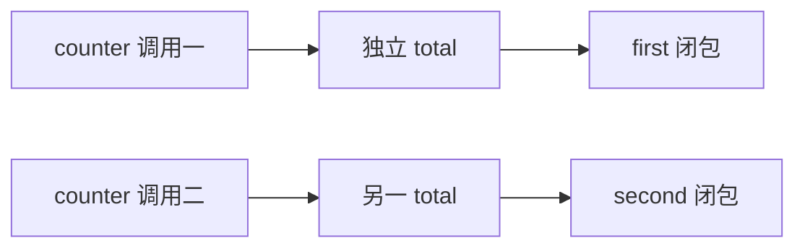

# 1.6. 函数、内置函数与作用域

先修建议：[列表、元组、集合与字典](./collections)、[条件、循环与终止条件](./control-flow)。

函数把操作定义成清楚的输入、输出与失败条件。参数绑定对象引用，重新绑定局部参数不会改变调用方名字，但修改共享对象可能影响调用方。

## 参数与返回值 {#concept-1}

```python
def average(values, *, digits=2):
    if not values:
        raise ValueError("至少需要一个值")
    return round(sum(values) / len(values), digits)

assert average([1, 2, 3]) == 2
assert average([1, 2], digits=1) == 1.5
```

`*` 后的参数必须按名字传入；`/` 前可声明仅位置参数；`*args` 与 `**kwargs` 接额外参数，但不是每个函数都需要。多个返回值实际通过 tuple 等对象返回，再由调用方解包。

## 默认参数只在定义时求值 {#concept-2}

```python
def add_tag(tag, tags=None):
    result = [] if tags is None else list(tags)
    result.append(tag)
    return result

assert add_tag("Python") == ["Python"]
assert add_tag("Go") == ["Go"]
source = ["基础"]
assert add_tag("测试", source) == ["基础", "测试"]
assert source == ["基础"]
```

如果默认值直接写 []，多次调用会共享同一默认列表。本例还选择复制调用方的外层列表，明确“返回新结果”的契约；要原地修改时应在命名和文档中说明。

## 作用域与闭包 {#concept-3}

名称通常按局部、外层函数、模块、内置查找。函数里赋值会使名字成为局部变量；global/nonlocal 修改外层绑定，需要确实共享状态时再使用。

```python
def counter():
    total = 0
    def next_value():
        nonlocal total
        total += 1
        return total
    return next_value

first, second = counter(), counter()
assert (first(), first(), second()) == (1, 2, 1)
```



同一闭包共享捕获变量，不同工厂调用各自独立；并发访问同一可变状态仍需同步。循环创建回调时留意延迟绑定，必要时用默认参数固定本轮值。

## 内置函数与副作用 {#concept-4}

len、sum、min/max、sorted、enumerate、zip、any/all 能表达常见任务。先认识返回值与输入是否被消费：sorted 返回新列表，list.sort 原地修改；迭代器可能只能消费一次。空输入的 max/min 要给 default 或明确失败契约。

## 动手练习与验收 {#lab}

1. 为平均值测试空输入、负数与指定精度。
2. 比较修改参数列表和把参数绑定到新列表的影响。
3. 创建循环回调，预测输出后用显式参数消除意外共享。

依据：[函数定义](https://docs.python.org/zh-cn/3/tutorial/controlflow.html#more-on-defining-functions)、[内置函数](https://docs.python.org/3/library/functions.html)。
