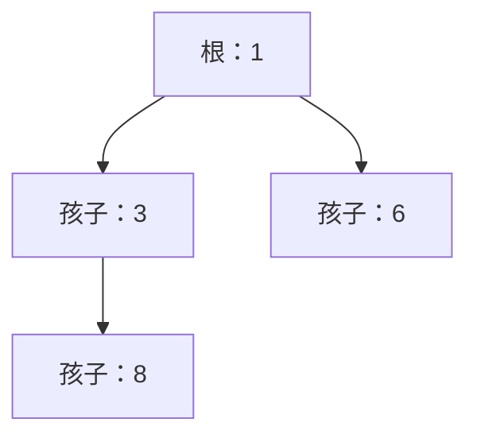

# 2.4. 堆与优先级队列

先修建议：[栈、队列与 deque](./stacks-queues)。

堆维护“根是当前最小项”的局部不变量，不把整个列表完全排序。适合重复取最小值、任务优先级和 Top-k，实际实现复用 heapq。

## 最小堆与数组索引 {#concept-1}

```python
import heapq

values = [8, 3, 6, 1]
heapq.heapify(values)
assert values[0] == 1
ordered = [heapq.heappop(values) for _ in range(len(values))]
assert ordered == [1, 3, 6, 8]
```

父索引 i 的孩子为 2i+1、2i+2；父值不大于孩子，兄弟之间不要求排序。heapify 建堆通常 O(n)，单次 push/pop 通常 O(log n)，直接按数组顺序读不是有序结果。



## 优先级相同时保持稳定 {#concept-2}

```python
import heapq
from itertools import count

sequence = count()
jobs = []
for name in ["先来的任务", "后来的任务"]:
    heapq.heappush(jobs, (1, next(sequence), {"name": name}))
assert heapq.heappop(jobs)[2]["name"] == "先来的任务"
```

元组先比较优先级，再比较唯一序号，避免平级时去比较不支持排序的 dict。更新优先级、删除任意项不是简单给列表某位置赋值；需要明确失效标记或重建策略，复杂调度复用成熟方案。

## Top-k 与版本边界 {#concept-3}

heapq.nsmallest/nlargest 可表达少量最小/最大结果。k 相对输入大小和键计算成本影响选型，先用标准库而不是手写所有排序。Python 3.14 新增部分最大堆 API，3.12 基线示例使用兼容的最小堆接口，查文档时注意版本标记。

## 动手练习与验收 {#lab}

1. 测试重复优先级、空堆和 k 大于输入长度。
2. 验证堆列表并不完全有序，说明为什么 pop 序列却有序。
3. 为任务优先级更新定义契约，不能只修改任意元素后继续认为堆有效。

依据：[heapq](https://docs.python.org/3/library/heapq.html)。
