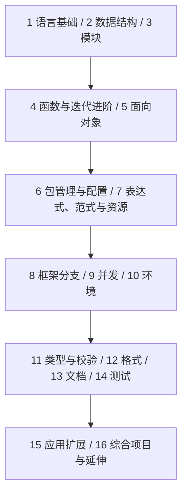

本课程逐项核对 [roadmap.sh Python](https://roadmap.sh/python)及[官方路线图](https://roadmap.sh/pdfs/roadmaps/python.pdf)，按知识层级组织为 **16 个单元、55 节课程**。从语言基础到数据结构、模块、对象、包管理、框架、并发、类型、文档与测试，每个主题有具体讲解、示例和练习。核对日期：2026-10-09。

语义以 [Python 官方文档](https://docs.python.org/zh-cn/3/tutorial/)为依据，用自己的中文解释。基础例子采用 Python 3.12+ 语法，较新 API 和第三方方案注明条件；框架是可选分支，不要求同一个项目安装全部工具。应用扩展与综合项目明确标注，不伪称原图独立节点。

## 课程路径

路径保留原路线的主题范围与层次，同时提供可读的课程顺序。测试可从第一个函数开始；框架先认识入口，异步和类型细节通过后续单元验证。熟悉其他语言的读者可按[原主题对照](./roadmap)跳到对应正文小节。

## 示例怎样运行

| 形式 | 使用方法 |
| --- | --- |
| 独立脚本 | 保存到所示 .py 文件，用项目解释器运行；assert 是明确行为检查。 |
| 双文件 / 包实验 | 按文件名与目录一起保存，不把不同模块粘成一个程序。 |
| 测试文件 | 按所选 unittest、doctest、pytest 或 tox 命令执行，确认确实发现测试。 |
| 片段和服务定义 | 文中说明依赖与上下文；会监听端口的示例在独立项目运行。 |

先预测结果，再运行与改变输入，最后完成异常和边界任务。图示帮助理解语义，不规定解释器私有内存布局。运行环境、依赖版本和失败行为都是交付说明的一部分。

## 1. 语言基础

先写出顺序程序，解释名字、对象、分支、容器与异常。

| 课程 | 学习任务 |
| --- | --- |
| [1.1. 安装、解释器与第一次运行](./toolchain) | 确认运行环境，创建虚拟环境，运行脚本并定位解释器。 |
| [1.2. 语法、缩进、输入与输出](./basics) | 从表达式和语句写出可复现的小程序。 |
| [1.3. 变量、数据类型与类型转换](./variables) | 理解名字绑定、可变对象、数字、文本、None 与转换边界。 |
| [1.4. 条件、循环与终止条件](./control-flow) | 使用 if、for、while、range 与控制转移处理有限输入。 |
| [1.5. 列表、元组、集合与字典](./collections) | 按顺序、唯一性、键查询和可变性选择内置容器。 |
| [1.6. 函数、内置函数与作用域](./functions) | 把操作表达成清楚的参数、返回值与副作用。 |
| [1.7. 异常、异常链与清理](./exceptions) | 区分失败类型，保留原因，让错误在合适边界处理。 |
| [1.8. 文件、JSON、CSV 与标准库 I/O](./files-errors) | 为后续项目补充流式输入、数据解析与资源边界。 |

## 2. 数据结构与算法

从访问方式、不变量与复杂度理解结构，实际工作复用标准库。

| 课程 | 学习任务 |
| --- | --- |
| [2.1. 数组与链表的访问模型](./arrays-linked) | 对照索引访问、节点连接、插入和内存代价。 |
| [2.2. 哈希表、键与复杂度](./hash-tables) | 理解 dict/set 的键约束、查找和冲突，不依赖私有布局。 |
| [2.3. 栈、队列与 deque](./stacks-queues) | 用 LIFO/FIFO 不变量组织待处理任务。 |
| [2.4. 堆与优先级队列](./heaps) | 用 heapq 维护最小值、稳定优先级与 Top-k。 |
| [2.5. 二叉搜索树与查找](./trees) | 解释左右子树规则、查找路径、退化与平衡。 |
| [2.6. 递归、调用栈与终止](./recursion) | 明确基本情况与缩小输入，比较递归和显式栈。 |
| [2.7. 排序算法、稳定性与二分](./sorting) | 对照插入、归并、快速排序的思路，并使用 sorted/bisect。 |

## 3. 模块

把内置模块、自定义模块与导入路径连成可运行项目。

| 课程 | 学习任务 |
| --- | --- |
| [3.1. 内置模块、自定义模块与导入](./modules) | 组织单文件、包入口和模块搜索路径。 |

## 4. 函数与迭代进阶

学习原图的 Lambda、装饰器、迭代器和正则主题。

| 课程 | 学习任务 |
| --- | --- |
| [4.1. Lambda、函数值与闭包](./lambdas) | 用短函数表达排序规则，不把复杂流程藏进表达式。 |
| [4.2. 装饰器、wraps 与函数包装](./decorators) | 理解装饰发生时机、参数转发和元数据保留。 |
| [4.3. 迭代协议、惰性与耗尽](./iterators) | 理解 iter、next、StopIteration 与资源寿命。 |
| [4.4. 正则表达式与文本边界](./regex) | 匹配、提取、分组与预编译，不用正则替代结构化解析器。 |

## 5. 面向对象

定义状态与行为，理解继承契约和 Python 的特殊方法协议。

| 课程 | 学习任务 |
| --- | --- |
| [5.1. 类、实例、方法与数据建模](./objects) | 区分实例状态和类状态，选择 dataclass、组合和接口。 |
| [5.2. 继承、super 与替代关系](./inheritance) | 在保持行为契约的前提下复用类型，理解 MRO。 |
| [5.3. 方法类型、属性与 Dunder 协议](./dunder) | 让对象参与表示、长度、迭代与比较等内置协议。 |

## 6. 包管理与项目配置

区分包索引、安装工具、依赖管理、配置和常用生态包。

| 课程 | 学习任务 |
| --- | --- |
| [6.1. PyPI、pip、Conda、uv 与 Poetry](./package-managers) | 区分包索引、安装、锁定、环境和非 Python 依赖。 |
| [6.2. pyproject.toml 与配置职责](./configuration) | 声明项目元数据、依赖、构建和工具配置，分离运行凭据。 |
| [6.3. 常用包与技术选型](./common-packages) | 为 HTTP、数据、验证、日志和测试选成熟方案。 |

## 7. 表达式、范式与资源

把推导式、生成器、编程范式与上下文管理器放回具体任务。

| 课程 | 学习任务 |
| --- | --- |
| [7.1. 列表推导式与集合转换](./comprehensions) | 把映射、过滤和嵌套的输入输出关系写清楚。 |
| [7.2. 生成器表达式、yield 与流式计算](./generators) | 通过惰性求值、一次性消费和资源管理减少中间集合。 |
| [7.3. 过程式、面向对象与函数式](./paradigms) | 围绕状态、职责和副作用选择表达方式。 |
| [7.4. 上下文管理器与资源协议](./context-managers) | 理解 with、enter/exit、contextmanager 和异常传播。 |

## 8. 框架

按原图覆盖全部框架，选择适合应用和执行模型的一种主要方案。

| 课程 | 学习任务 |
| --- | --- |
| [8.1. 框架路线、WSGI 与 ASGI](./frameworks) | 核对原图分类，并按真实运行模型区分各方案。 |
| [8.2. FastAPI 与接口开发](./web) | 请求模型、响应、依赖、错误、测试和生命周期。 |
| [8.3. Django 与 Flask](./django-flask) | 用完整框架或轻量框架实现相同契约，理解 async 支持。 |
| [8.4. Pyramid 与 Plotly Dash](./sync-frameworks) | 分别理解路由配置与数据应用回调。 |
| [8.5. gevent、aiohttp、Tornado 与 Sanic](./async-frameworks) | 对照 greenlet 与 asyncio，识别客户端/服务端和阻塞边界。 |

## 9. 并发

按负载选择线程、进程或异步，管理共享状态、预算和取消。

| 课程 | 学习任务 |
| --- | --- |
| [9.1. 并发模型、GIL 与选择依据](./concurrency) | 区分并发和并行，注明常规与自由线程 CPython 条件。 |
| [9.2. 线程、锁与有界执行器](./threading) | 维护共享不变量并限制 I/O 任务规模。 |
| [9.3. 进程、序列化与主入口](./multiprocessing) | 为 CPU 工作建立可传递任务，测量通信与内存成本。 |
| [9.4. 异步、TaskGroup、超时与取消](./asyncio) | 在事件循环内协作推进任务，收拢失败与资源。 |

## 10. 环境管理

分清解释器版本与项目环境，能重建依赖而不复制环境目录。

| 课程 | 学习任务 |
| --- | --- |
| [10.1. Pipenv、virtualenv 与 pyenv](./environments) | 区分版本选择、环境隔离和依赖锁定。 |

## 11. 类型与校验

区分静态类型检查与外部数据的运行时校验。

| 课程 | 学习任务 |
| --- | --- |
| [11.1. typing、mypy、Pyright 与 Pyre](./typing) | 用标注表达接口，静态发现不匹配，核对检查器工作流。 |
| [11.2. Pydantic 与运行时数据校验](./validation) | 为外部数据定义字段、严格性与错误契约。 |

## 12. 代码格式

使用 Ruff、Black 或 YAPF 的明确工作流，避免互相改写。

| 课程 | 学习任务 |
| --- | --- |
| [12.1. Ruff、Black、YAPF 与质量流程](./formatting) | 格式化、静态规则与测试分别验证不同问题。 |

## 13. 文档

用 docstring、Sphinx 与可执行示例表达公开接口。

| 课程 | 学习任务 |
| --- | --- |
| [13.1. Docstring、Sphinx 与 API 文档](./documentation) | 让接口说明、示例和构建可以一起维护。 |

## 14. 测试

用行为断言、隔离和环境矩阵验证结果，说明旧工具的现状。

| 课程 | 学习任务 |
| --- | --- |
| [14.1. pytest、隔离、参数化与替身](./testing) | 先固定可观察行为，再进行实现和重构。 |
| [14.2. unittest、doctest 与 nose 的位置](./unittest-doctest) | 运行标准库测试与示例，解释旧测试体系迁移。 |
| [14.3. tox 与多环境测试](./tox) | 为工具链和依赖建立可复现环境矩阵。 |

## 15. 应用扩展

补充原图 Common Packages 与项目所需的 HTTP、SQL 和表格实践。

| 课程 | 学习任务 |
| --- | --- |
| [15.1. HTTPX、调用预算与采集](./http) | 补充可靠 HTTP 调用、响应校验与有限重试。 |
| [15.2. SQL、SQLite 与事务](./databases) | 补充持久化、约束、参数化查询与迁移。 |
| [15.3. pandas、自动化与性能](./data) | 补充数据契约、聚合、可复现分析与测量。 |

## 16. 综合项目与延伸

用三个项目交付程序、服务与分析结果，并进入相关路线。

| 课程 | 学习任务 |
| --- | --- |
| [16.1. 实战：CSV 消费报告 CLI](./project-cli) | 完整源码、金额规则、错误定位与标准库测试。 |
| [16.2. 实战：任务管理 API](./project-api) | FastAPI + SQLite，持久化、分页、校验和接口测试。 |
| [16.3. 实战：月度消费分析](./project-data) | pandas 数据检查、聚合、金额核对与报告。 |
| [16.4. 综合实验、样本与交付](./projects) | 为各阶段写出输入契约和可重复验收。 |
| [16.5. 官方资料与后续路线](./resources) | 按具体问题查资料，进入后端、运维或 AI/数据方向。 |

## 项目样本与验收

三个完整项目分别交付 CLI、持久化 API 与数据报告。使用合成样本，测试金额精度、输入定位、接口契约和聚合总额，不以一次正常运行代替失败路径检查。

- <a href="/python/data/expenses.csv" download>消费 CSV</a>与<a href="/python/data/invalid-expenses.csv" download>错误 CSV</a>：验证正常统计和第 3 行失败。
- <a href="/python/data/orders.csv" download>月度订单</a>：验证原始与汇总金额均为 18500 分。
- [算法样例](/python/data/algorithm-cases.json)与[接口用例](/python/data/task-cases.json)：覆盖空输入、重复、顺序与错误。

路线原词到正文小节的对应见[逐项对照](./roadmap)。[课程数据](/python/curriculum.json)保留单元、先修、官方依据、锚点和样本，后续可继续扩展解答与实验。
