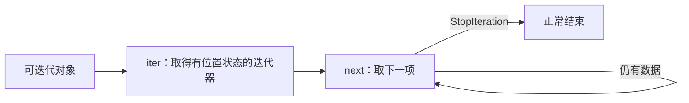

# 4.3. 迭代协议、惰性与耗尽

先修建议：[列表、元组、集合与字典](./collections)、[函数、内置函数与作用域](./functions)。

可迭代对象能提供迭代器，迭代器保存当前消费位置并给出下一项。列表可以反复创建新的迭代器；一个迭代器通常是一次性消费的状态对象。

## iter、next 与耗尽 {#concept-1}

```python
values = [10, 20]
iterator = iter(values)
assert next(iterator) == 10
assert next(iterator) == 20
assert next(iterator, "结束") == "结束"
assert list(iterator) == []
assert list(values) == [10, 20]
```

没有默认值的 next 在耗尽时抛 StopIteration，for 循环把耗尽作为正常结束处理。重复消费同一个迭代器不会自动回到开头；如果需要重放，创建新的迭代器或在明确规模内保存结果。



## 惰性组合与资源 {#concept-2}

```python
from itertools import islice

squares = map(lambda n: n*n, range(10))
assert list(islice(squares, 3)) == [0, 1, 4]
assert next(squares) == 9
```

map/islice 逐项推进，不会先生成所有结果。惰性也意味着异常和副作用在消费时才发生；传到函数边界的不是一份已经成功计算完的列表。

文件、网络和生成器可能持有资源，消费者提前结束要有明确关闭协议。自定义 __iter__/__next__ 在 Dunder 单元学习；生成器表达式与 yield 在后续课程独立讲，不把三个概念混成同一词。

## 动手练习与验收 {#lab}

1. 两次消费同一迭代器，写出第二次为空的断言。
2. 使用 islice 处理无限计数来源，限制数量后应结束。
3. 对需要重复遍历的接口说明接受 iterable 还是 iterator，解释内存和资源代价。

依据：[迭代器类型](https://docs.python.org/3/library/stdtypes.html#iterator-types)、[itertools](https://docs.python.org/3/library/itertools.html)。
