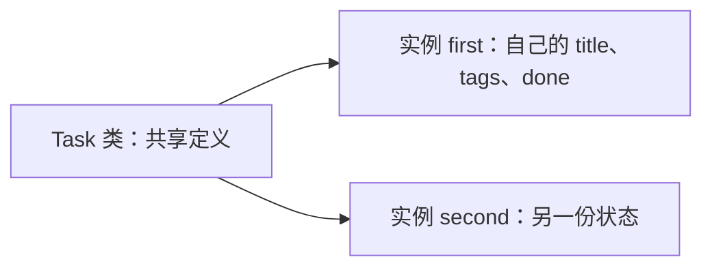

# 5.1. 类、实例、方法与数据建模

先修建议：[函数、内置函数与作用域](./functions)、[列表、元组、集合与字典](./collections)。

类组织实例状态与操作，实例保存某一次具体数据。先分清对象自己的字段和所有对象共享的类字段，再选择普通类或 dataclass。

## 实例与方法 {#concept-1}

```python
class Task:
    def __init__(self, title):
        self.title = title
        self.tags = []
        self.done = False

    def complete(self):
        self.done = True

first, second = Task("学习"), Task("练习")
first.tags.append("Python")
first.complete()
assert first.done and not second.done
assert second.tags == []
```

self 是实例方法首参数的惯例名称。__init__ 初始化实例，不返回一个新实例；类对象本身也有属性。把可变列表放在类体里会让多个实例共享，下面对照模型解释。



## dataclass 与数据边界 {#concept-2}

```python
from dataclasses import dataclass, field

@dataclass
class Record:
    title: str
    tags: list[str] = field(default_factory=list)

first, second = Record("一"), Record("二")
first.tags.append("基础")
assert second.tags == []
```

default_factory 为每个实例生成新的默认对象。frozen 限制字段赋值，不保证深层不可变；外部输入校验由验证模型负责，dataclass 的类型注解不自动验证 JSON。

## 属性和职责 {#concept-3}

简单派生属性可用 property，耗时 I/O 更适合明确方法。classmethod 可表达替代构造，staticmethod 不接实例或类状态；独立函数能清楚表达时无需强行放类里。组合让对象包含协作者，继承在下一节讨论替代关系。

## 动手练习与验收 {#lab}

1. 比较实例列表与类列表，测试修改是否传播到另一个实例。
2. 为记录定义不变量，明确何时校验，不能靠注解假设已验证。
3. 用组合注入读取器，不为每种输入建立多层继承。

依据：[类教程](https://docs.python.org/zh-cn/3/tutorial/classes.html)、[dataclasses](https://docs.python.org/3/library/dataclasses.html)。
