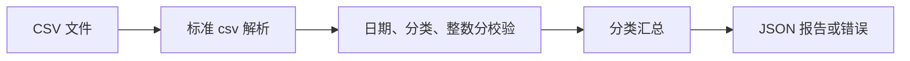

# 16.1. 实战：CSV 消费报告 CLI

先修建议：[文件、JSON、CSV 与标准库 I/O](./files-errors)、[pytest、隔离、参数化与替身](./testing)。

本项目把语言基础与工程实践知识串起来：读取账单 CSV，按分类汇总金额，并输出 JSON 报告。先完成单文件版本，之后再按[模块、包与项目结构](./modules)拆包。仅依赖标准库，适合第一次完整交付。

## 沿一条输入记录阅读项目 {#concept-1}

CSV 解析、日期/金额校验、按分类聚合和输出是不同责任。金额转成整数分后再加总，错误保留行号，入口决定 stderr 与退出码。



使用课程合成样本验证，不读取真实个人账单。改变输入规则时同步修改样本和断言，不能只观察一份正常报告。

## 需求与输入约定 {#concept-2}

输入字段为 `date,category,amount`。日期必须为 ISO 日期，分类去掉首尾空格后不能为空，金额为非负十进制数且最多精确到分；空文件、缺列和无效行都给出定位信息。金额聚合用整数分，避免浮点误差。此项目只处理支出，退款等负数应在后续扩展中定义单独规则。

```csv
date,category,amount
2026-01-02,图书,39.90
2026-01-03,课程,100.00
2026-01-05,图书,20.10
```

保存为 `expenses.csv`。字段名和顺序必须与样本一致；程序会拒绝带空格或缺失的字段名，便于发现上游格式问题。

## 完整实现 {#concept-3}

保存为 `report.py`：

```python
import argparse
import csv
import json
import sys
from datetime import date
from decimal import Decimal, InvalidOperation
from pathlib import Path

def parse_cents(text: str) -> int:
    try:
        amount = Decimal(text.strip())
    except InvalidOperation as error:
        raise ValueError("金额格式错误") from error
    if not amount.is_finite() or amount < 0 or amount > Decimal("1000000000"):
        raise ValueError("金额必须在 0 到 10 亿之间")
    cents = amount * 100
    if cents != cents.to_integral_value():
        raise ValueError("金额最多精确到分")
    return int(cents)

def summarize(path: Path) -> dict[str, int]:
    totals: dict[str, int] = {}
    with path.open(encoding="utf-8-sig", newline="") as source:
        reader = csv.DictReader(source)
        if reader.fieldnames != ["date", "category", "amount"]:
            raise ValueError("字段必须依次为 date,category,amount")
        for row in reader:
            try:
                if None in row or any(value is None for value in row.values()):
                    raise ValueError("列数不匹配")
                date.fromisoformat(row["date"])
                category = row["category"].strip()
                if not category:
                    raise ValueError("分类不能为空")
                cents = parse_cents(row["amount"])
            except ValueError as error:
                raise ValueError(f"第 {reader.line_num} 行：{error}") from error
            totals[category] = totals.get(category, 0) + cents
    return dict(sorted(totals.items()))

def main() -> int:
    parser = argparse.ArgumentParser(description="按分类汇总消费 CSV，金额单位为分")
    parser.add_argument("input", type=Path, help="账单 CSV 路径")
    parser.add_argument("--output", type=Path, help="写入 JSON 文件，默认打印")
    args = parser.parse_args()
    try:
        report = summarize(args.input)
        text = json.dumps(report, ensure_ascii=False, indent=2) + "\n"
        if args.output:
            if args.output.resolve() == args.input.resolve():
                raise ValueError("输出路径不能覆盖输入文件")
            args.output.write_text(text, encoding="utf-8")
        else:
            print(text, end="")
    except (OSError, ValueError, csv.Error, UnicodeError) as error:
        print(f"生成失败：{error}", file=sys.stderr)
        return 1
    return 0

if __name__ == "__main__":
    raise SystemExit(main())
```

`utf-8-sig` 同时兼容普通 UTF-8 和带 BOM 的表格导出。日期只校验不参与本项目聚合。文件读写由入口处理，金额解析与聚合可以单独测试。输出路径存在时会覆盖旧报告，运行前应选择专门的报告文件。

## 运行与预期结果 {#concept-4}

```sh
python report.py expenses.csv
python report.py expenses.csv --output report.json
python report.py --help
```

报告的单位统一为**分**，上述输入应得到：

```json
{
  "图书": 6000,
  "课程": 10000
}
```

只有表头而没有记录时输出 `{}`；完全空文件缺少表头，会失败。失败返回码为 1，命令行参数错误由 argparse 返回 2，成功返回 0。

## 自动验证 {#concept-5}

保存为 `test_report.py`，不需要安装第三方测试依赖：

```python
import unittest
from pathlib import Path
from tempfile import TemporaryDirectory
from report import parse_cents, summarize

class ReportTests(unittest.TestCase):
    def test_amount(self):
        self.assertEqual(parse_cents("39.90"), 3990)
        for invalid in ["-1", "0.001", "NaN", "Infinity", "abc"]:
            with self.subTest(value=invalid), self.assertRaises(ValueError):
                parse_cents(invalid)

    def test_csv(self):
        with TemporaryDirectory() as directory:
            path = Path(directory) / "expenses.csv"
            path.write_text(
                'date,category,amount\n2026-01-02,"书,刊",39.90\n'
                '2026-01-05,"书,刊",20.10\n', encoding="utf-8"
            )
            self.assertEqual(summarize(path), {"书,刊": 6000})
            path.write_text("date,category,amount\n2026-01-02,图书,bad\n", encoding="utf-8")
            with self.assertRaisesRegex(ValueError, "第 2 行"):
                summarize(path)

if __name__ == "__main__":
    unittest.main()
```

运行 `python -m unittest -v`。这里展示标准库测试以保证项目零依赖；团队项目可按[测试、调试与代码质量](./testing)迁移到 pytest。

## 交付与升级 {#concept-6}

验收时检查：正常金额总和为 16000 分，带逗号分类可读取，错误行号准确，输入文件未被覆盖，空数据和缺列行为符合约定。README 应说明编码、日期、金额单位、安装和退出码。

第一轮升级增加 `--month` 过滤；第二轮按[模块、包与项目结构](./modules)拆包并添加命令行入口；第三轮对重要输出采用临时文件加替换策略。每次升级先定义行为与测试，不为尚未出现的需求建立通用报表引擎。

参考：[csv](https://docs.python.org/3/library/csv.html)、[decimal](https://docs.python.org/3/library/decimal.html)、[argparse](https://docs.python.org/3/library/argparse.html)。

## 课程验收 {#lab}

按本文给定输入复现结果，增加一个失败输入，说明错误、资源和交付条件。
