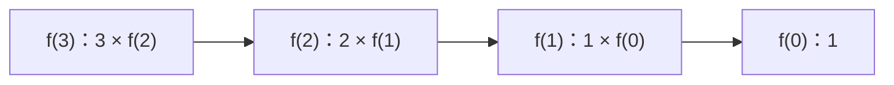

# 2.6. 递归、调用栈与终止

先修建议：[函数、内置函数与作用域](./functions)、[二叉搜索树与查找](./trees)。

递归把问题交给更小的同类问题。需要两个保证：有基本情况，每次调用向基本情况靠近。没有这两个条件，函数只是不断增加调用栈。

## 基本情况与缩小输入 {#concept-1}

```python
def factorial(n):
    if n < 0:
        raise ValueError("n 不能为负")
    if n == 0:
        return 1
    return n * factorial(n - 1)

assert factorial(0) == 1
assert factorial(5) == 120
```

factorial(3) 等待 factorial(2)，后者等待 factorial(1)，直到 0 返回 1，再逐层计算。这里给小规模教学输入；Python 不保证尾调用优化，大深度要改循环或显式栈。



## 树的中序遍历 {#concept-2}

```python
def inorder(node):
    if node is None:
        return []
    value, left, right = node
    return inorder(left) + [value] + inorder(right)

tree = (8, (3, None, None), (10, (9, None, None), None))
assert inorder(tree) == [3, 8, 9, 10]
```

教学写法清楚展示左右结构，但列表拼接可能增加复制成本；后续可用生成器 yield from 或显式栈减少中间结果。写复杂度时计入结果构造，不只数递归调用次数。

## 递归限额不是扩容建议 {#concept-3}

RecursionError 表示深度等条件触发限制，不应先无限调大递归上限掩盖缺少终止。文件树或任意外部数据应限制深度与数量，避免循环引用。数学计算优先 math.factorial 等成熟实现，重复子问题再按需求考虑缓存。

## 动手练习与验收 {#lab}

1. 画出 factorial(3) 的调用和返回顺序。
2. 用迭代方式实现同一任务，测试 0、1、5 与非法输入。
3. 将 inorder 改为显式栈，说明栈中保存的是哪些尚未处理节点。

依据：[递归限制](https://docs.python.org/3/library/sys.html#sys.getrecursionlimit)、[math](https://docs.python.org/3/library/math.html)。
