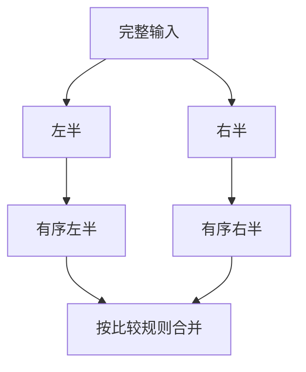

# 2.7. 排序算法、稳定性与二分

先修建议：[递归、调用栈与终止](./recursion)、[列表、元组、集合与字典](./collections)。

排序先定义比较依据、相同键的顺序以及是否允许修改原输入，再选择算法。业务通常使用 sorted/list.sort，算法学习帮助理解成本和稳定性，不替代成熟实现。

## 稳定排序与 key {#concept-1}

```python
records = [{"name": "先", "score": 2}, {"name": "低", "score": 1}, {"name": "后", "score": 2}]
ordered = sorted(records, key=lambda item: item["score"])
assert [item["name"] for item in ordered] == ["低", "先", "后"]
assert records[0]["name"] == "先"  # sorted 没改输入
```

相同 score 的“先”和“后”保留原相对顺序，这叫稳定。list.sort 原地修改并返回 None；多字段顺序可用 tuple key，昂贵键计算应考虑标准 key 的调用行为。

## 算法思路与成本 {#concept-2}

| 思路 | 核心动作 | 典型边界 |
| --- | --- | --- |
| 插入排序 | 把新项插入已排序前缀 | 小/近有序输入易理解，一般最坏 O(n²)。 |
| 归并排序 | 分开排序，再合并两个有序序列 | 通常 O(n log n)，需考虑额外存储。 |
| 快速排序 | 选枢轴分区后处理子区间 | 常见平均 O(n log n)，不良分区可 O(n²)，普通实现不稳定。 |
| Python 内置排序 | 利用已有有序片段的稳定算法 | 保留官方稳定性保证，不把实现细节当自制排序要求。 |



图示归并的分治思路，不表示 sorted 必须按这个单一示例执行。比较排序的分析还要考虑键计算与数据分布，不能只按语法层数判断复杂度。

## 二分查找不自动让插入便宜 {#concept-3}

```python
from bisect import bisect_left, insort

values = [1, 3, 5]
position = bisect_left(values, 3)
assert position == 1 and values[position] == 3
insort(values, 4)
assert values == [1, 3, 4, 5]
```

二分需要输入已排序。定位通常 O(log n)，向 list 插入仍可能 O(n) 移动；返回插入位置也不等于找到了目标，需检查边界和值。

## 动手练习与验收 {#lab}

1. 测试相同键、多字段、空输入与逆序输入，确认稳定性和输入是否改变。
2. 手工完成一次插入和一次归并，不为生产工具重写排序库。
3. 写安全的二分成员判断，测试最小值、最大值、缺失值和空列表。

依据：[官方排序指南](https://docs.python.org/3/howto/sorting.html)、[bisect](https://docs.python.org/3/library/bisect.html)。
