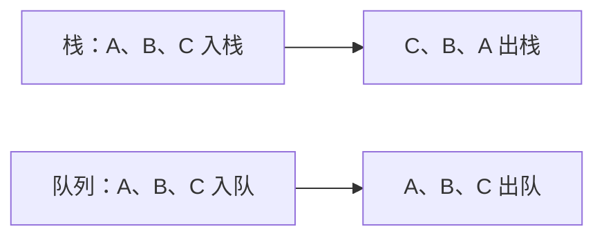

# 2.3. 栈、队列与 deque

先修建议：[列表、元组、集合与字典](./collections)。

栈和队列按不同规则取出待处理项：栈后进先出，队列先进先出。先选处理顺序，再选容器；队列容量和并发安全另有协议。

## LIFO 与 FIFO {#concept-1}

```python
from collections import deque

stack = []
stack.append("先进入")
stack.append("后进入")
assert stack.pop() == "后进入"
queue = deque(["先进入", "后进入"])
assert queue.popleft() == "先进入"
assert list(queue) == ["后进入"]
```

list 的尾部操作适合栈；deque 两端操作适合队列。反复 list.pop(0) 要移动后续元素，不是大队列默认选择。



## 用栈维护括号匹配的不变量 {#concept-2}

```python
def balanced(text):
    stack = []
    for char in text:
        if char == "(":
            stack.append(char)
        elif char == ")":
            if not stack:
                return False
            stack.pop()
    return not stack

assert balanced("(a+(b))")
assert not balanced("(()")
assert not balanced(")(")
assert balanced("")
```

stack 表示尚未匹配的左括号。右括号出现却没有左括号时立即失败，最后必须排空。本例只研究一种括号，不是通用语法解析器；完整语言或结构化格式复用专用解析器。

按优先级取下一项属于同一原路线节点中的“堆”，见[堆与优先级队列](./heaps)。

## 并发和限额 {#concept-3}

deque(maxlen=n) 在满时可淘汰旧项，适合滑动历史，不等于阻塞工作队列。线程间任务交接可用 queue.Queue，异步任务用 asyncio.Queue，并明确入队预算、处理完成和退出协议。多个单独容器操作合成的不变量不自动线程安全。

## 动手练习与验收 {#lab}

1. 扩展括号例子支持三种括号，说明匹配与顺序的不变量。
2. 测试空队列取出失败，按接口选择报错还是返回缺失结果。
3. 解释 maxlen 淘汰与阻塞队列满额等待的区别。

依据：[deque](https://docs.python.org/3/library/collections.html#collections.deque)、[queue](https://docs.python.org/3/library/queue.html)、[asyncio.Queue](https://docs.python.org/3/library/asyncio-queue.html)。
