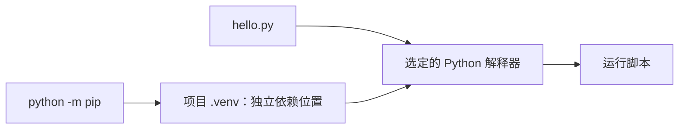

# 1.1. 安装、解释器与第一次运行

先建立“这个脚本由哪个解释器运行”的概念。编辑器、终端命令、虚拟环境和安装工具都可能指向不同位置；确认位置比反复重装依赖更有效。

## 安装与解释器位置 {#concept-1}

从 [Python 官方下载页](https://www.python.org/downloads/)选择受支持版本。基础示例以 Python 3.12+ 为语法基线；依赖与平台另按工具实际要求。macOS/Linux 通常先用 python3，Windows 可用 py -3；下文在项目环境内统一写 python。

```sh
python3 --version
python3 -m venv .venv
# macOS / Linux
source .venv/bin/activate
# Windows PowerShell 对应命令：.venv\Scripts\Activate.ps1
python -c "import sys; print(sys.executable)"
python -m pip --version
```

激活只是方便改变命令查找，不是环境存在的前提。也可直接用 `.venv/bin/python` 或 Windows 的 `.venv\Scripts\python.exe`。无需为此修改系统安全策略，不覆盖系统自带解释器。



## 第一次运行 {#concept-2}

保存为 hello.py，执行 `python hello.py`：

```python
message = "你好，Python"
print(message)
assert message.startswith("你好")
```

交互解释器用于探索表达式，脚本用于保存流程。`>>>` 是交互提示符，不能直接复制进源码。编辑器选择同一项目解释器，`.venv` 和 `__pycache__` 不作为可移植产物提交。

## 导入失败先检查哪里 {#concept-3}

| 现象 | 先检查 |
| --- | --- |
| 终端能导入，编辑器不能 | 编辑器的 sys.executable。 |
| pip 显示安装却仍找不到 | pip 是否属于当前 python。 |
| 标准库模块导入异常 | 当前文件是否名为 json.py、typing.py 等。 |
| 复制环境到别的机器失效 | 环境包含平台路径，应按依赖清单重建。 |

使用 `python -m pip show 包名` 定位安装。完整的 uv、Conda、Poetry、Pipenv、virtualenv、pyenv 分工在后续专门课程，不需要第一天全部安装。

## 动手练习与验收 {#lab}

1. 在新目录创建环境并运行 hello.py，指出解释器和依赖目录。
2. 不激活环境，直接用环境解释器运行同一脚本。
3. 故意选择另一个解释器，观察导入差异，再恢复正确环境。

依据：[Python 使用说明](https://docs.python.org/3/using/index.html)、[venv](https://docs.python.org/3/library/venv.html)。
