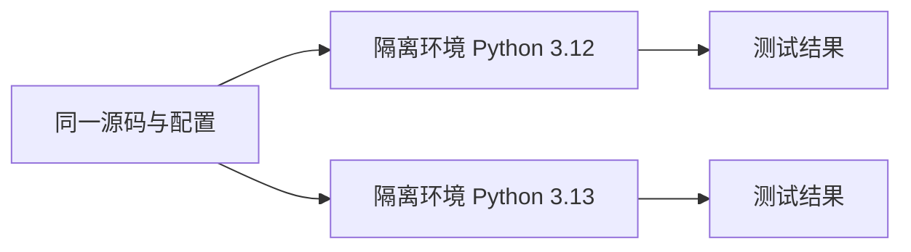

# 14.3. tox 与多环境测试

先修建议：[pytest、隔离、参数化与替身](./testing)、[Pipenv、virtualenv 与 pyenv](./environments)。

tox 为同一项目在多个隔离环境执行检查。它管理测试环境与命令，不替你保证测试断言正确，也不把缺失解释器变成已经通过的环境。

## 最小配置 {#concept-1}

项目已有 pricing.py 与 pytest 测试时，保存 tox.ini：

```ini
[tox]
envlist = py312,py313

[testenv]
skip_install = true
deps = pytest
commands = python -m pytest -q
```

安装 tox 后执行 `python -m tox`。这里 skip_install 用于根目录的教学模块；可安装包应按真实构建流程安装后测试。py312/py313 要求对应解释器存在或由已配置方案提供。



## 环境矩阵怎样解释 {#concept-2}

| 情况 | 判定 |
| --- | --- |
| 命令成功并执行预期测试 | 此环境通过。 |
| 解释器缺失 | 未验证，不说成通过。 |
| 依赖安装失败 | 环境准备失败，需要定位来源/兼容性。 |
| 发现零个测试 | 不等于行为已验证，检查发现规则。 |

工具与测试依赖记录版本，CI 和本地保持同一入口。按当前 tox 主版本核对配置；新增环境先明确项目支持范围，不只是把所有 Python 版本都列进去。

## 动手练习与验收 {#lab}

1. 在当前可用版本运行一个环境，确认发现和执行测试数量。
2. 将测试改坏，tox 必须反映失败而不是忽略命令返回值。
3. 写清项目支持版本和未验证版本，保留原始执行记录。

依据：[tox](https://tox.wiki/en/stable/)、[打包与兼容范围](https://packaging.python.org/en/latest/)。
